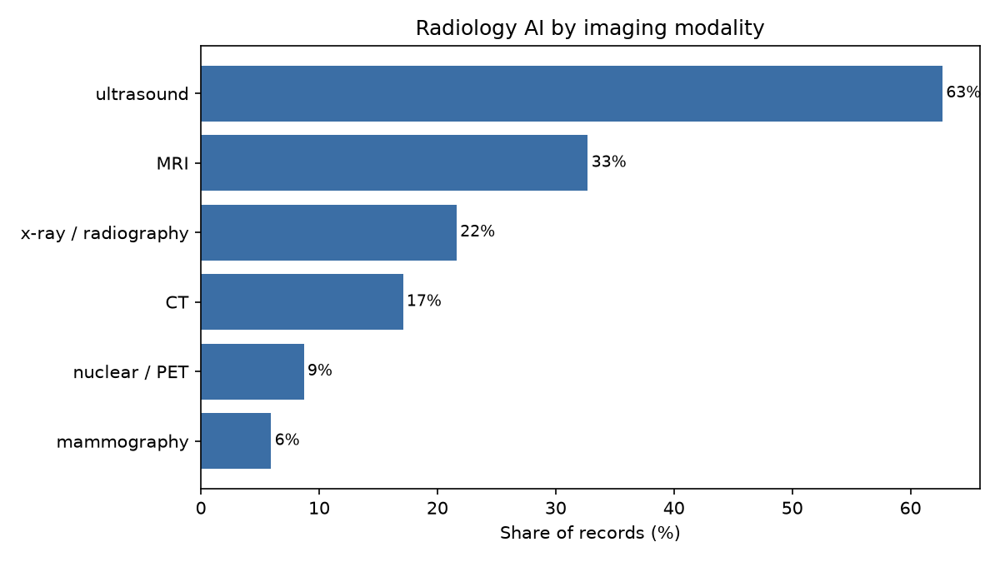
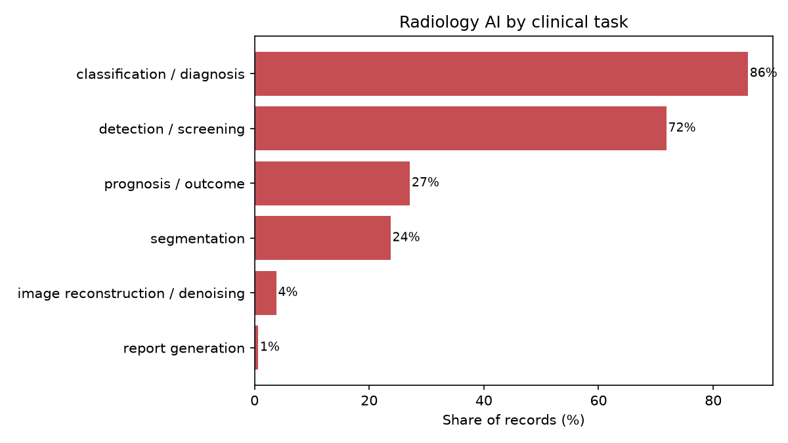
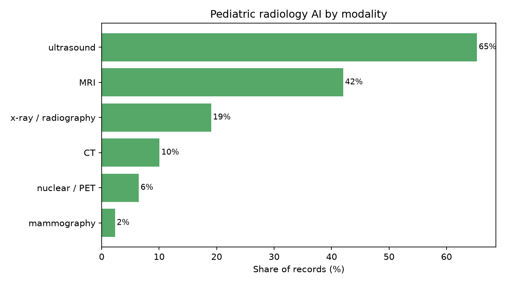
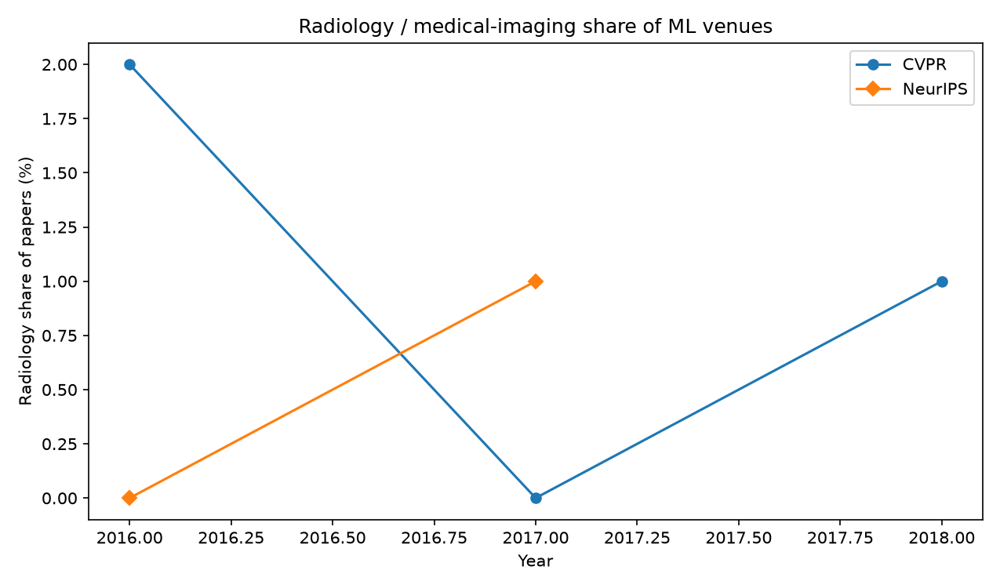
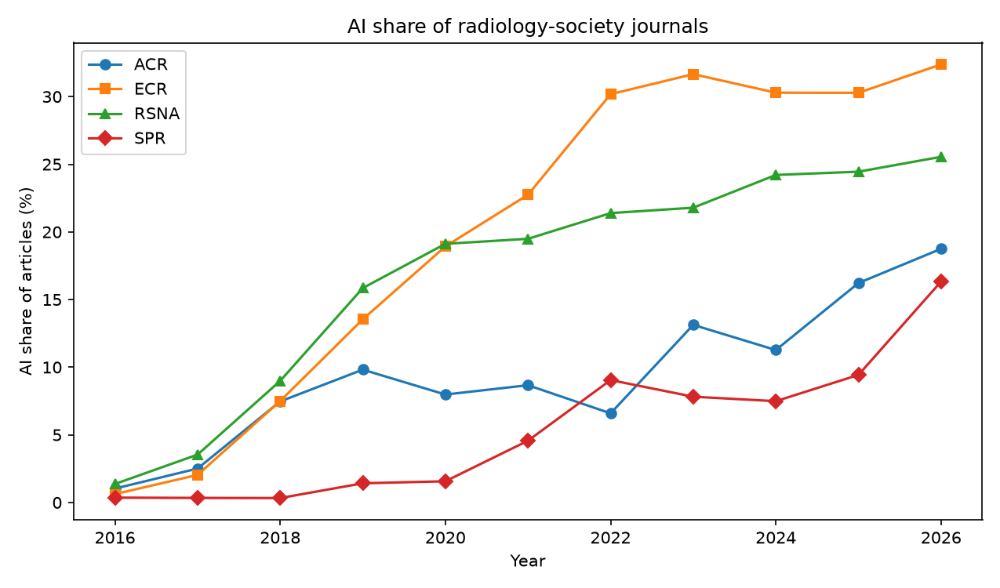

# Radiology AI: How Popular, and How Much Is Pediatric?

_Auto-generated from PubMed, PatentsView, DBLP, GitHub, and OpenAlex pulls. Counts reflect indexed records at collection time and undercount the most recent year (indexing/grant lag)._

## Headline

- Radiology-AI publications grew from the 2008 baseline to **27011** records in 2025 (compound growth ≈ **23%/yr**).
- The AI share of all radiology publishing rose from **0.8%** to **11.3%**.
- Pediatric work is **11.0%** of radiology AI in 2025 — a small but growing slice (**2980** records).

## Publication trend (PubMed)

**How obtained.** For each year 2008-2025, PubMed E-utilities (`esearch`, `[pdat]` date facet) returned the record count for four boolean queries: all radiology, radiology AND AI, pediatric radiology, and pediatric radiology AND AI. The shares are ratios of those counts. The exact query strings:

```text
all_radiology:
  (radiology OR radiological OR radiograph* OR "medical imaging" OR tomography OR "magnetic resonance" OR MRI OR "computed tomography" OR CT OR ultrasound OR mammograph* OR "chest x-ray" OR radiograph)
radiology_ai:
  (radiology OR radiological OR radiograph* OR "medical imaging" OR tomography OR "magnetic resonance" OR MRI OR "computed tomography" OR CT OR ultrasound OR mammograph* OR "chest x-ray" OR radiograph) AND ("artificial intelligence" OR "machine learning" OR "deep learning" OR "convolutional neural network" OR "neural network" OR "computer-aided diagnosis" OR radiomics OR "computer vision")
pediatric_radiology_ai:
  (radiology OR radiological OR radiograph* OR "medical imaging" OR tomography OR "magnetic resonance" OR MRI OR "computed tomography" OR CT OR ultrasound OR mammograph* OR "chest x-ray" OR radiograph) AND ("artificial intelligence" OR "machine learning" OR "deep learning" OR "convolutional neural network" OR "neural network" OR "computer-aided diagnosis" OR radiomics OR "computer vision") AND (pediatric* OR paediatric* OR child* OR infant* OR neonat* OR adolescen* OR "children's hospital")
```

| Year | All radiology | Radiology AI | AI share | Pediatric rad-AI | Pediatric share of rad-AI |
|---:|---:|---:|---:|---:|---:|
| 2008 | 99964 | 802 | 0.8% | 63 | 7.9% |
| 2009 | 106437 | 788 | 0.7% | 59 | 7.5% |
| 2010 | 114610 | 616 | 0.5% | 51 | 8.3% |
| 2011 | 124890 | 559 | 0.4% | 66 | 11.8% |
| 2012 | 134258 | 630 | 0.5% | 66 | 10.5% |
| 2013 | 142799 | 752 | 0.5% | 79 | 10.5% |
| 2014 | 152249 | 856 | 0.6% | 122 | 14.3% |
| 2015 | 161552 | 1004 | 0.6% | 150 | 14.9% |
| 2016 | 169194 | 1295 | 0.8% | 175 | 13.5% |
| 2017 | 175723 | 1941 | 1.1% | 244 | 12.6% |
| 2018 | 181399 | 3293 | 1.8% | 405 | 12.3% |
| 2019 | 188971 | 5403 | 2.9% | 607 | 11.2% |
| 2020 | 221322 | 8739 | 3.9% | 860 | 9.8% |
| 2021 | 240419 | 12629 | 5.3% | 1135 | 9.0% |
| 2022 | 225791 | 15487 | 6.9% | 1237 | 8.0% |
| 2023 | 213818 | 17211 | 8.0% | 1478 | 8.6% |
| 2024 | 223048 | 20806 | 9.3% | 2176 | 10.5% |
| 2025 | 239586 | 27011 | 11.3% | 2980 | 11.0% |


## Where the AI work sits, by modality

**How obtained.** The radiology-AI query above was intersected with each modality's term group (PubMed, summed over 2008-2025). Modalities overlap, so the fraction is the share of radiology-AI records that mention that modality and need not sum to 100%.

| Modality | Radiology-AI records | Share of radiology AI |
|:--|---:|---:|
| ultrasound | 75141 | 62.7% |
| MRI | 39209 | 32.7% |
| x-ray / radiography | 25911 | 21.6% |
| CT | 20472 | 17.1% |
| nuclear / PET | 10441 | 8.7% |
| mammography | 7119 | 5.9% |



## Where the AI work sits, by clinical task

**How obtained.** Same method as the modality table, intersecting the radiology-AI query with each task's term group.

| Task | Radiology-AI records | Share of radiology AI |
|:--|---:|---:|
| classification / diagnosis | 103130 | 86.1% |
| detection / screening | 86092 | 71.9% |
| prognosis / outcome | 32486 | 27.1% |
| segmentation | 28458 | 23.8% |
| image reconstruction / denoising | 4558 | 3.8% |
| report generation | 774 | 0.7% |



## Pediatric radiology AI, by modality

**How obtained.** The pediatric-radiology-AI query intersected with each modality's term group (PubMed, summed over 2008-2025). Fraction is the share of pediatric radiology-AI records.

| Modality | Pediatric radiology-AI records | Share |
|:--|---:|---:|
| ultrasound | 7806 | 65.3% |
| MRI | 5026 | 42.0% |
| x-ray / radiography | 2278 | 19.1% |
| CT | 1205 | 10.1% |
| nuclear / PET | 773 | 6.5% |
| mammography | 278 | 2.3% |



## How much of RSNA's own output is about AI?

**How obtained.** Within RSNA's flagship journals (Radiology, RadioGraphics, Radiology: Artificial Intelligence; matched by PubMed journal abbreviation `[ta]`), the AI fraction is the share of each year's articles that also match the AI vocabulary — the most direct read on radiology's own engagement.

| Year | RSNA-journal articles | AI articles | AI share |
|---:|---:|---:|---:|
| 2008 | 708 | 8 | 1.1% |
| 2009 | 641 | 7 | 1.1% |
| 2010 | 704 | 4 | 0.6% |
| 2011 | 676 | 5 | 0.7% |
| 2012 | 719 | 4 | 0.6% |
| 2013 | 798 | 5 | 0.6% |
| 2014 | 746 | 5 | 0.7% |
| 2015 | 838 | 6 | 0.7% |
| 2016 | 803 | 11 | 1.4% |
| 2017 | 763 | 27 | 3.5% |
| 2018 | 845 | 76 | 9.0% |
| 2019 | 839 | 133 | 15.8% |
| 2020 | 910 | 174 | 19.1% |
| 2021 | 1011 | 197 | 19.5% |
| 2022 | 996 | 213 | 21.4% |
| 2023 | 1028 | 224 | 21.8% |
| 2024 | 884 | 214 | 24.2% |
| 2025 | 859 | 210 | 24.4% |


## Conference and society attention to the domain

### Machine-learning / computer-vision venues — radiology share

**How obtained.** For each venue-year, a title sample (up to 100 papers) was pulled from DBLP and labelled with radiology / medical-imaging title keywords. The cell is the share of that venue's papers that are about medical imaging — a conservative lower bound, since title-only labelling misses papers that do not name a modality. ICCV is biennial (odd years).

_Coverage note: DBLP throttles automated access aggressively, so this run captured only a subset of venue-years; re-running `scripts/collect_conferences.py` while DBLP is idle fills in more. The consistent finding across the years that did return is that medical imaging is roughly 0-2% of these general ML/CV venues._

| Year | CVPR | ICCV | ICML | NeurIPS |
|---:|---:|---:|---:|---:|
| 2016 | 2.0% | – | 0.0% | 0.0% |
| 2017 | 0.0% | 0.0% | – | 1.0% |
| 2018 | 1.0% | – | – | – |



### Radiology societies — AI share of their journals

**How obtained.** RSNA, ACR, ECR, and SPR meetings have no machine-readable program, so each society's engagement with AI is proxied by the AI share of its flagship journals in PubMed (RSNA: Radiology/RadioGraphics/Radiology:AI; ACR: JACR; ECR: European Radiology/Insights into Imaging; SPR: Pediatric Radiology).

| Year | ACR | ECR | RSNA | SPR |
|---:|---:|---:|---:|---:|
| 2016 | 1.0% | 0.6% | 1.4% | 0.4% |
| 2017 | 2.5% | 2.0% | 3.5% | 0.3% |
| 2018 | 7.5% | 7.5% | 9.0% | 0.3% |
| 2019 | 9.8% | 13.5% | 15.8% | 1.4% |
| 2020 | 8.0% | 18.9% | 19.1% | 1.6% |
| 2021 | 8.7% | 22.8% | 19.5% | 4.6% |
| 2022 | 6.6% | 30.2% | 21.4% | 9.0% |
| 2023 | 13.1% | 31.7% | 21.8% | 7.8% |
| 2024 | 11.3% | 30.3% | 24.2% | 7.5% |
| 2025 | 16.2% | 30.3% | 24.4% | 9.4% |
| 2026 | 18.8% | 32.4% | 25.6% | 16.3% |



## Method notes

- **Queries** are defined in `pedrad_ai/config.py`; edit them to retune scope.
- **PubMed** counts use the `[pdat]` publication-date facet via E-utilities.
- **Recent-year undercount**: MEDLINE indexing and patent grants lag by months to years, so the final one or two years are low.
- **Conference labelling** of ML venues is title-only and conservative; radiology-society engagement is proxied by the AI share of each society's flagship journals (RSNA meetings have no machine-readable program).

