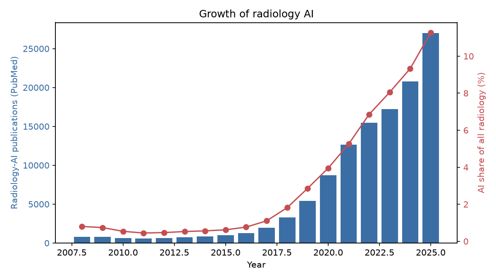
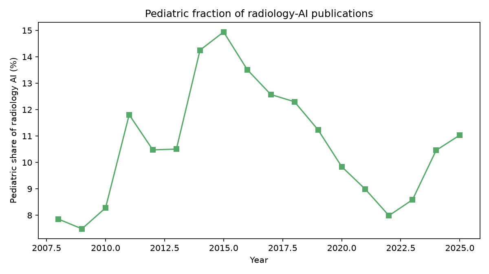
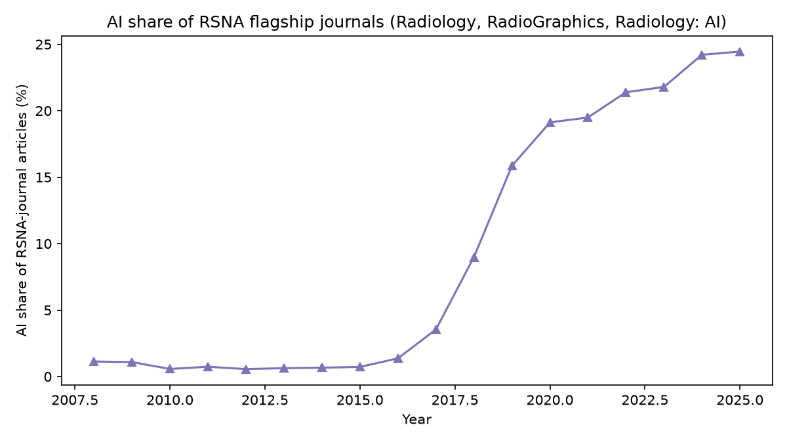

# Radiology AI: How Popular, and How Much Is Pediatric?

_Auto-generated from PubMed, PatentsView, DBLP, GitHub, and OpenAlex pulls. Counts reflect indexed records at collection time and undercount the most recent year (indexing/grant lag)._

## Headline

- Radiology-AI publications grew from the 2008 baseline to **27011** records in 2025 (compound growth ≈ **23%/yr**).
- The AI share of all radiology publishing rose from **0.8%** to **11.3%**.
- Pediatric work is **11.0%** of radiology AI in 2025 — a small but growing slice (**2980** records).

## Publication trend (PubMed)

| Year | All radiology | Radiology AI | AI share | Pediatric rad-AI | Pediatric share of rad-AI |
|---:|---:|---:|---:|---:|---:|
| 2008 | 99964 | 802 | 0.8% | 63 | 7.9% |
| 2009 | 106437 | 788 | 0.7% | 59 | 7.5% |
| 2010 | 114610 | 616 | 0.5% | 51 | 8.3% |
| 2011 | 124890 | 559 | 0.4% | 66 | 11.8% |
| 2012 | 134258 | 630 | 0.5% | 66 | 10.5% |
| 2013 | 142799 | 752 | 0.5% | 79 | 10.5% |
| 2014 | 152249 | 856 | 0.6% | 122 | 14.3% |
| 2015 | 161552 | 1004 | 0.6% | 150 | 14.9% |
| 2016 | 169194 | 1295 | 0.8% | 175 | 13.5% |
| 2017 | 175723 | 1941 | 1.1% | 244 | 12.6% |
| 2018 | 181399 | 3293 | 1.8% | 405 | 12.3% |
| 2019 | 188971 | 5403 | 2.9% | 607 | 11.2% |
| 2020 | 221322 | 8739 | 3.9% | 860 | 9.8% |
| 2021 | 240419 | 12629 | 5.3% | 1135 | 9.0% |
| 2022 | 225791 | 15487 | 6.9% | 1237 | 8.0% |
| 2023 | 213818 | 17211 | 8.0% | 1478 | 8.6% |
| 2024 | 223048 | 20806 | 9.3% | 2176 | 10.5% |
| 2025 | 239586 | 27011 | 11.3% | 2980 | 11.0% |

## Where the AI work sits, by modality

| Modality | Total radiology-AI records |
|:--|---:|
| ultrasound | 75141 |
| MRI | 39209 |
| x-ray / radiography | 25911 |
| CT | 20472 |
| nuclear / PET | 10441 |
| mammography | 7119 |

## Where the AI work sits, by clinical task

| Task | Total radiology-AI records |
|:--|---:|
| classification / diagnosis | 103130 |
| detection / screening | 86092 |
| prognosis / outcome | 32486 |
| segmentation | 28458 |
| image reconstruction / denoising | 4558 |
| report generation | 774 |

## Pediatric radiology AI, by modality

| Modality | Total pediatric radiology-AI records |
|:--|---:|
| ultrasound | 7806 |
| MRI | 5026 |
| x-ray / radiography | 2278 |
| CT | 1205 |
| nuclear / PET | 773 |
| mammography | 278 |

## How much of RSNA's own output is about AI?

_Share of articles in RSNA's flagship journals (Radiology, RadioGraphics, Radiology: Artificial Intelligence) that match the AI vocabulary — the most direct read on radiology's own engagement._

| Year | RSNA-journal articles | AI articles | AI share |
|---:|---:|---:|---:|
| 2008 | 708 | 8 | 1.1% |
| 2009 | 641 | 7 | 1.1% |
| 2010 | 704 | 4 | 0.6% |
| 2011 | 676 | 5 | 0.7% |
| 2012 | 719 | 4 | 0.6% |
| 2013 | 798 | 5 | 0.6% |
| 2014 | 746 | 5 | 0.7% |
| 2015 | 838 | 6 | 0.7% |
| 2016 | 803 | 11 | 1.4% |
| 2017 | 763 | 27 | 3.5% |
| 2018 | 845 | 76 | 9.0% |
| 2019 | 839 | 133 | 15.8% |
| 2020 | 910 | 174 | 19.1% |
| 2021 | 1011 | 197 | 19.5% |
| 2022 | 996 | 213 | 21.4% |
| 2023 | 1028 | 224 | 21.8% |
| 2024 | 884 | 214 | 24.2% |
| 2025 | 859 | 210 | 24.4% |

## Conference attention to the domain

_Each cell is from a 100-paper title sample per venue-year (DBLP), so the share is an estimate and the radiology share is a lower bound — title-only labelling misses papers whose titles do not name the modality._

| Venue | Year | Papers (true) | Radiology share | AI share |
|:--|---:|---:|---:|---:|
| NeurIPS | 2017 | 680 | 1.0% | 6.0% |
| MICCAI | 2025 | 1723 | 44.0% | 46.0% |
| CVPR | 2008 | 743 | 4.0% | 11.0% |
| ICCV | 2017 | 994 | 0.0% | 22.0% |
| ISBI | 2025 | 639 | 32.0% | 39.0% |

## Method notes

- **Queries** are defined in `pedrad_ai/config.py`; edit them to retune scope.
- **PubMed** counts use the `[pdat]` publication-date facet via E-utilities.
- **Recent-year undercount**: MEDLINE indexing and patent grants lag by months to years, so the final one or two years are low.
- **Title-only conference labelling** misses on-topic papers whose titles do not name the modality; the conference fractions are conservative.

