# Radiology AI: How Popular, and How Much Is Pediatric?

_Auto-generated from PubMed, PatentsView, DBLP, GitHub, and OpenAlex pulls. Counts reflect indexed records at collection time and undercount the most recent year (indexing/grant lag)._

## Headline

- Radiology-AI publications grew from the 2008 baseline to **20831** records in 2025 (compound growth ≈ **22%/yr**).
- The AI share of all radiology publishing rose from **0.8%** to **11.4%**.
- Pediatric work is **11.3%** of radiology AI in 2025 — a small but growing slice (**2348** records).
- 2026 year-to-date (collected 2026-09-07): **16481** radiology-AI records, of which **1897** (11.5%) are pediatric. Partial-year counts are not comparable to full years and lag indexing.

## Publication trend (PubMed)

**How obtained.** For each year 2008-2026, PubMed E-utilities (`esearch`, `[pdat]` date facet) returned the record count for four boolean queries: all radiology, radiology AND AI, pediatric radiology, and pediatric radiology AND AI. The shares are ratios of those counts. 2026 is a partial year (year-to-date at collection). The exact query strings:

```text
all_radiology:
  ((radiology OR radiological OR radiograph* OR "medical imaging" OR "diagnostic imaging"[tiab] OR "tomography, x-ray computed"[MeSH Terms] OR "tomography, emission-computed"[MeSH Terms] OR tomograph*[tiab] OR "magnetic resonance" OR MRI OR "computed tomography" OR CT[tiab] OR ultrasound[tiab] OR ultrasonograph*[tiab] OR sonograph*[tiab] OR echocardiograph*[tiab] OR "ultrasonography"[MeSH Terms] OR mammograph* OR "chest x-ray") NOT ("optical coherence"[tiab] OR fundus[tiab] OR retina*[tiab] OR dental[tiab] OR histopatholog*[tiab] OR "whole slide"[tiab] OR dermoscop*[tiab] OR endoscop*[tiab] OR colonoscop*[tiab] OR microscop*[tiab]))
radiology_ai:
  ((radiology OR radiological OR radiograph* OR "medical imaging" OR "diagnostic imaging"[tiab] OR "tomography, x-ray computed"[MeSH Terms] OR "tomography, emission-computed"[MeSH Terms] OR tomograph*[tiab] OR "magnetic resonance" OR MRI OR "computed tomography" OR CT[tiab] OR ultrasound[tiab] OR ultrasonograph*[tiab] OR sonograph*[tiab] OR echocardiograph*[tiab] OR "ultrasonography"[MeSH Terms] OR mammograph* OR "chest x-ray") NOT ("optical coherence"[tiab] OR fundus[tiab] OR retina*[tiab] OR dental[tiab] OR histopatholog*[tiab] OR "whole slide"[tiab] OR dermoscop*[tiab] OR endoscop*[tiab] OR colonoscop*[tiab] OR microscop*[tiab])) AND ("artificial intelligence" OR "machine learning" OR "deep learning" OR "convolutional neural network" OR "neural network" OR "computer-aided diagnosis" OR radiomics OR "computer vision")
pediatric_radiology_ai:
  ((radiology OR radiological OR radiograph* OR "medical imaging" OR "diagnostic imaging"[tiab] OR "tomography, x-ray computed"[MeSH Terms] OR "tomography, emission-computed"[MeSH Terms] OR tomograph*[tiab] OR "magnetic resonance" OR MRI OR "computed tomography" OR CT[tiab] OR ultrasound[tiab] OR ultrasonograph*[tiab] OR sonograph*[tiab] OR echocardiograph*[tiab] OR "ultrasonography"[MeSH Terms] OR mammograph* OR "chest x-ray") NOT ("optical coherence"[tiab] OR fundus[tiab] OR retina*[tiab] OR dental[tiab] OR histopatholog*[tiab] OR "whole slide"[tiab] OR dermoscop*[tiab] OR endoscop*[tiab] OR colonoscop*[tiab] OR microscop*[tiab])) AND ("artificial intelligence" OR "machine learning" OR "deep learning" OR "convolutional neural network" OR "neural network" OR "computer-aided diagnosis" OR radiomics OR "computer vision") AND (pediatric* OR paediatric* OR child* OR infant* OR neonat* OR adolescen* OR "children's hospital")
```

| Year | All radiology | Radiology AI | AI share | Pediatric rad-AI | Pediatric share of rad-AI |
|---:|---:|---:|---:|---:|---:|
| 2008 | 86812 | 715 | 0.8% | 58 | 8.1% |
| 2009 | 92281 | 723 | 0.8% | 58 | 8.0% |
| 2010 | 99121 | 557 | 0.6% | 48 | 8.6% |
| 2011 | 107921 | 492 | 0.5% | 62 | 12.6% |
| 2012 | 115476 | 569 | 0.5% | 63 | 11.1% |
| 2013 | 122316 | 680 | 0.6% | 72 | 10.6% |
| 2014 | 128775 | 769 | 0.6% | 113 | 14.7% |
| 2015 | 134828 | 873 | 0.6% | 134 | 15.3% |
| 2016 | 134488 | 1045 | 0.8% | 155 | 14.8% |
| 2017 | 137742 | 1556 | 1.1% | 203 | 13.0% |
| 2018 | 140927 | 2632 | 1.9% | 340 | 12.9% |
| 2019 | 144818 | 4342 | 3.0% | 515 | 11.9% |
| 2020 | 166142 | 6928 | 4.2% | 682 | 9.8% |
| 2021 | 177988 | 10174 | 5.7% | 947 | 9.3% |
| 2022 | 169514 | 12469 | 7.4% | 1038 | 8.3% |
| 2023 | 160988 | 13901 | 8.6% | 1227 | 8.8% |
| 2024 | 167690 | 16222 | 9.7% | 1695 | 10.4% |
| 2025 | 182492 | 20831 | 11.4% | 2348 | 11.3% |
| 2026 (YTD) | 138306 | 16481 | 11.9% | 1897 | 11.5% |

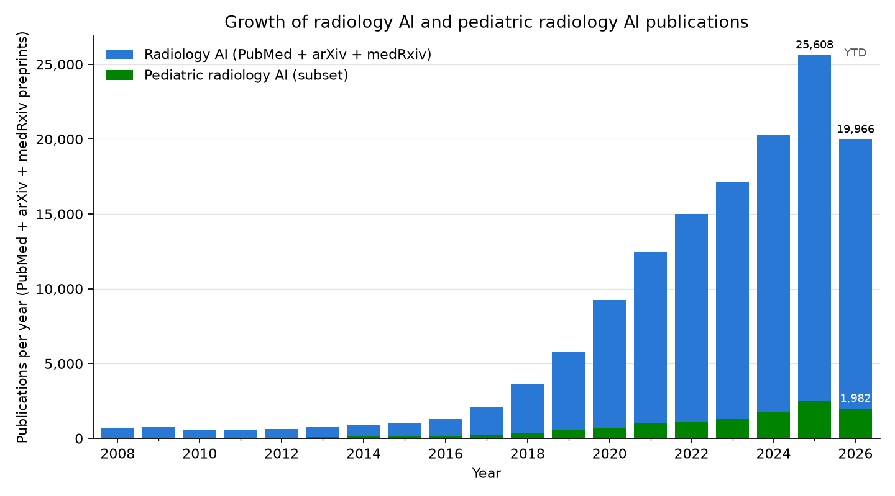

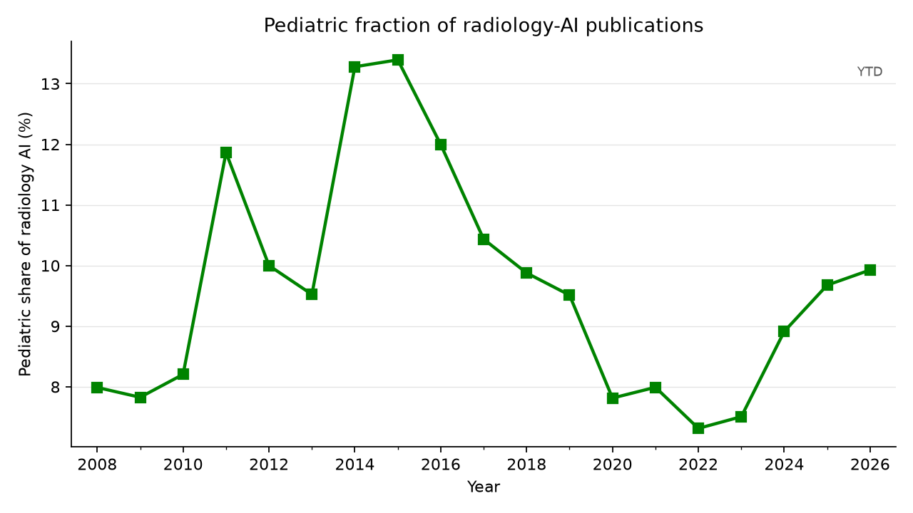

## Is the radiology-AI query sufficient?

**How obtained.** `scripts/validate_queries.py` runs three checks against PubMed: (1) *recall* on a hand-picked set of landmark radiology-AI papers (`config.GOLD_PAPERS`), each resolved from DOI to PMID and tested for membership in the query; (2) a *precision proxy*, comparing the headline query with a strict title/abstract-only variant of the same vocabulary and sampling the records that only the headline query returns; (3) a *term audit* of PubMed's automatic translation of each single-word term.

- Recall: 26/30 landmark papers retrieved (86.7%); pediatric subset 11/11.
  Missed: nnU-Net (Nat Methods 2021); Litjens DL survey (Med Image Anal 2017); MedSAM (Nat Commun 2024); Kermany OCT / chest X-ray (Cell 2018) (methods papers naming no modality, or cross-domain papers removed by the non-radiology-imaging exclusion).
- radiology_ai (2025): headline 20,831 records, strict 18,217; 76.3% of the headline count is confirmed by explicit title/abstract wording.
- pediatric_radiology_ai (2025): headline 2,348 records, strict 1,898; 71.8% of the headline count is confirmed by explicit title/abstract wording.
- Term audit: bare `ultrasound` is auto-mapped to the *diagnostic imaging* MeSH subheading and bare `tomography` to a tree that includes optical coherence tomography. Query version 1 therefore counted about two-thirds of radiology-AI papers as ultrasound; version 2 (current) fields every modality term and excludes ophthalmic, dental, pathology and endoscopic imaging.

Sample of records returned only by the headline (MeSH-expanded) query:

- Utilizing multimodal models to forecast Alzheimer's disease progression and clinical subtypes. (Health information science and systems)
- Spatial radiomics-based interpretable multimodal machine learning model enhances outcomes prediction for minor stroke: A multicenter cohort study. (Journal of advanced research)
- Evaluating the Performance and Fragility of Large Language Models on the Self-Assessment for Neurological Surgeons. (Neurosurgery)
- GN-Net: A Geometric and Neighborhood-Aware Network for Predicting Intracranial Aneurysm Rupture Risk and Assisting Clinical Decision-Making. (Interdisciplinary sciences, computational life sciences)
- Artificial intelligence in cerebral cavernous malformations: a scoping review. (Neurological research)
- Artificial Intelligence in Palliative Care: A Scoping Review of Current Applications, Challenges, and Future Directions. (The American journal of hospice & palliative care)
- The neurophysiological correlates of altruism: A scoping review of fMRI, EEG, and autonomic studies. (Cognitive, affective & behavioral neuroscience)
- Angiographic phenotypes predict FFR/iFR discordance in severe aortic stenosis: A cluster analysis. (Cardiovascular revascularization medicine : including molecular interventions)
- Academic Journal Podcast and Generative Artificial Intelligence: Introducing KJR SummaryCast. (Korean journal of radiology)
- Advancing Early Detection of Chronic Obstructive Pulmonary Disease Using Generative AI. (Radiology. Artificial intelligence)
- Quantitative Pharmacokinetic Mapping with AI: Toward More Generalizable Response Prediction in Breast Cancer MRI. (Radiology. Artificial intelligence)
- Artificial Intelligence-Based Multimodal Prediction of Postoperative Adjuvant Immunotherapy Benefit in Urothelial Carcinoma: Results From the Phase III, Multicenter, Randomized, IMvigor010 Trial. (MedComm)

## Where the AI work sits, by modality

**How obtained.** The radiology-AI query above was intersected with each modality's term group (PubMed, summed over 2008-2026). Modalities overlap, so the fraction is the share of radiology-AI records that mention that modality and need not sum to 100%.

| Modality | Radiology-AI records | Share of radiology AI |
|:--|---:|---:|
| MRI | 38950 | 34.8% |
| CT | 33368 | 29.8% |
| ultrasound | 13579 | 12.1% |
| x-ray / radiography | 11886 | 10.6% |
| nuclear / PET | 7578 | 6.8% |
| mammography | 3186 | 2.9% |

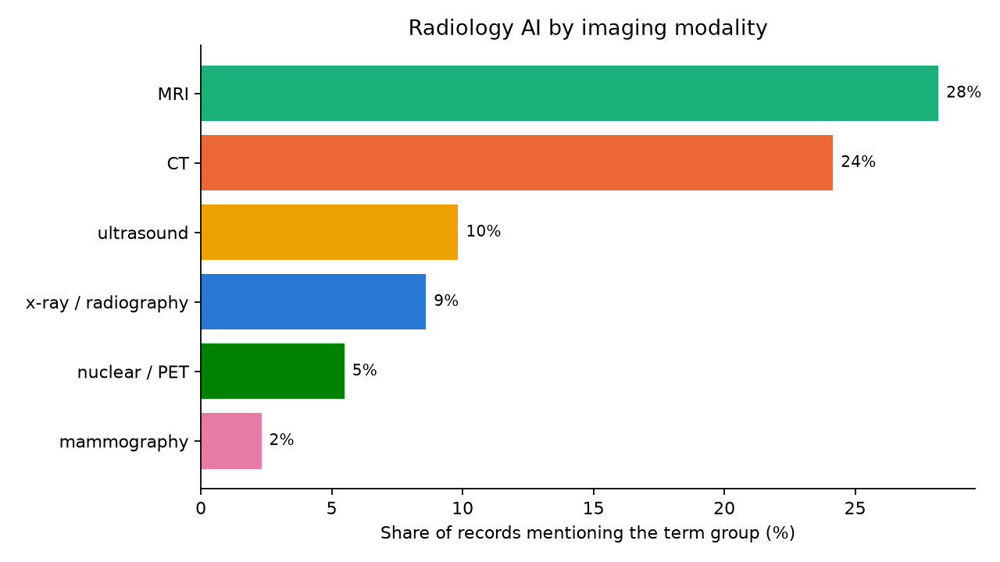

## Where the AI work sits, by clinical task

**How obtained.** Same method as the modality table, intersecting the radiology-AI query with each task's term group.

| Task | Radiology-AI records | Share of radiology AI |
|:--|---:|---:|
| detection / diagnosis | 52222 | 46.6% |
| outcome prediction | 29595 | 26.4% |
| segmentation | 26645 | 23.8% |
| measurement / quantification | 19489 | 17.4% |
| reconstruction / imputation | 16452 | 14.7% |
| workflow / non-interpretive | 14094 | 12.6% |
| foundation model / vision-language | 4912 | 4.4% |
| report generation / LLM | 3515 | 3.1% |
| agent / autonomous | 491 | 0.4% |

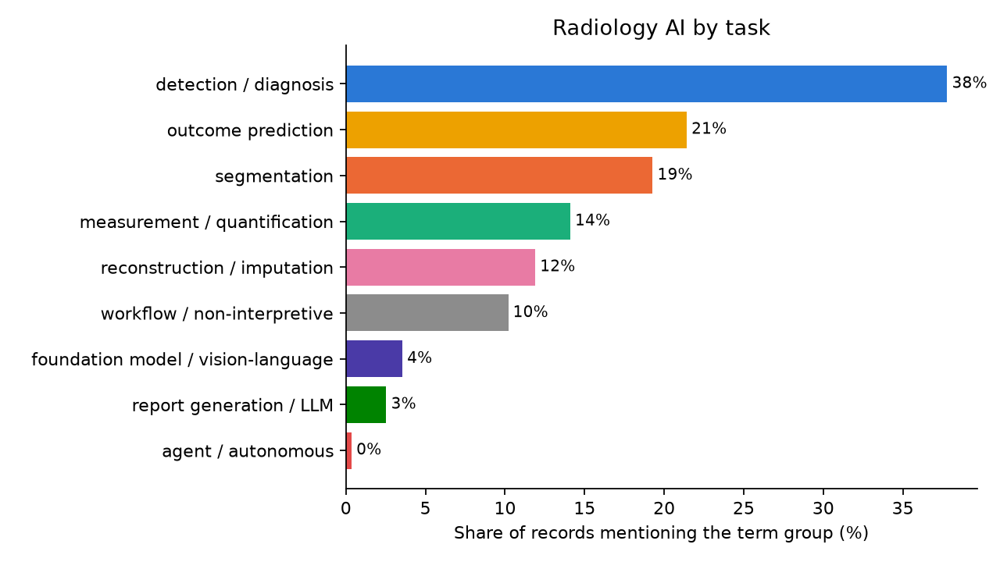

Task categories are organised by what the model *produces*:

- **detection / diagnosis** — is a finding present now, and which one (label or box): fracture, pneumonia, tumor; includes triage and screening
- **segmentation** — outline a structure or lesion (a mask)
- **measurement / quantification** — a number from the image: bone age, Cobb angle, organ volume, fetal biometry
- **outcome prediction** — a future risk, response, or survival estimate from the image (prognosis, radiomics signatures)
- **reconstruction / imputation** — a better or missing image: lower dose, faster scans, denoising, synthetic CT/MR
- **report generation / LLM** — text: draft, summarize, or extract from radiology reports
- **foundation model / vision-language** — a large pretrained model reused across tasks (segment-anything, self-supervised)
- **agent / autonomous** — multi-step actions taken without a human in the loop
- **workflow / non-interpretive** — protocoling, scheduling, ordering, decision support, education

### Modality by task, and task by modality

**How obtained.** Every modality term group was intersected with every task term group inside the radiology-AI query (PubMed, 2008-2026). Bars are the share of the corpus mentioning the modality (or task); segments are the composition of task (or modality) mentions inside it. Labels overlap, so segments are normalised to the bar.

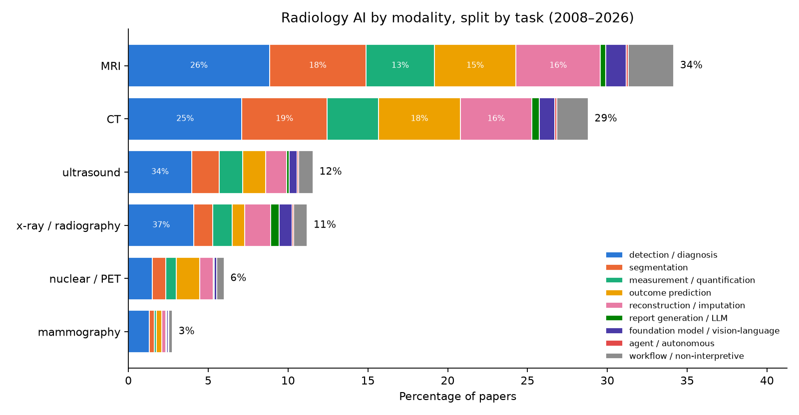

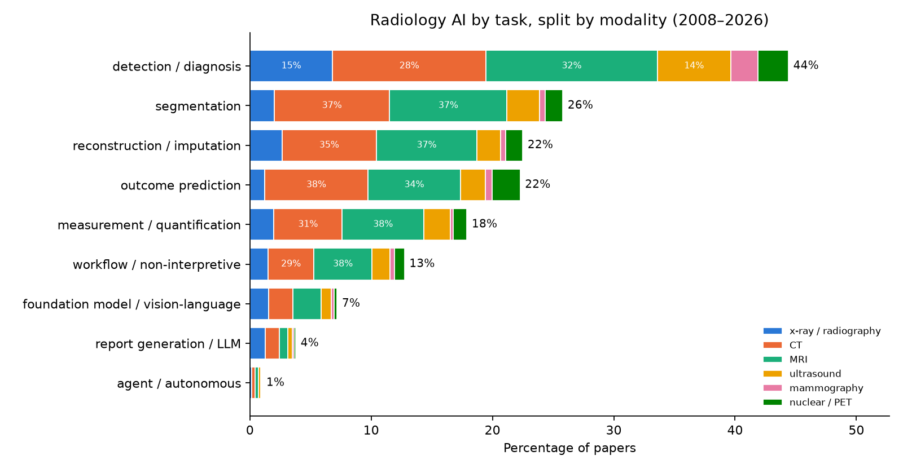

## Pediatric radiology AI, by modality

**How obtained.** The pediatric-radiology-AI query intersected with each modality's term group (PubMed, summed over 2008-2026). Fraction is the share of pediatric radiology-AI records.

| Modality | Pediatric radiology-AI records | Share |
|:--|---:|---:|
| MRI | 4985 | 42.8% |
| CT | 1959 | 16.8% |
| ultrasound | 1594 | 13.7% |
| x-ray / radiography | 1528 | 13.1% |
| nuclear / PET | 394 | 3.4% |
| mammography | 88 | 0.8% |

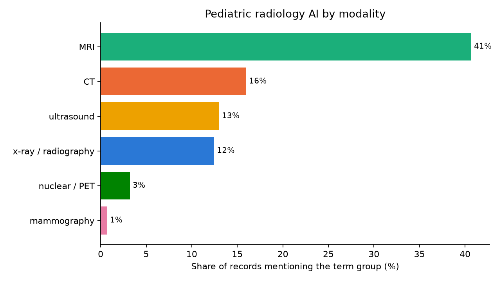

## Pediatric radiology AI, by task

| Task | Pediatric radiology-AI records | Share |
|:--|---:|---:|
| detection / diagnosis | 5355 | 46.0% |
| measurement / quantification | 2539 | 21.8% |
| outcome prediction | 2439 | 20.9% |
| segmentation | 2331 | 20.0% |
| workflow / non-interpretive | 1595 | 13.7% |
| reconstruction / imputation | 1208 | 10.4% |
| foundation model / vision-language | 389 | 3.3% |
| report generation / LLM | 322 | 2.8% |
| agent / autonomous | 41 | 0.4% |

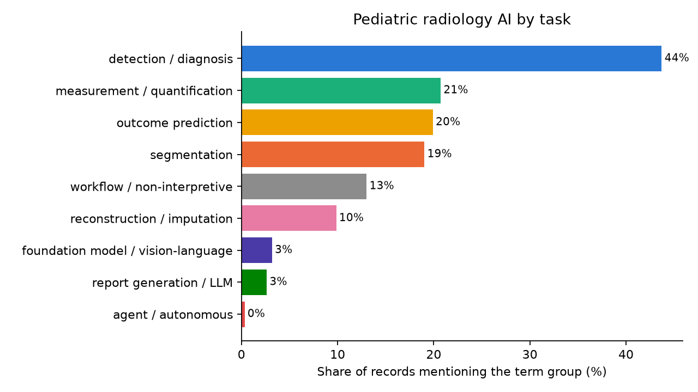

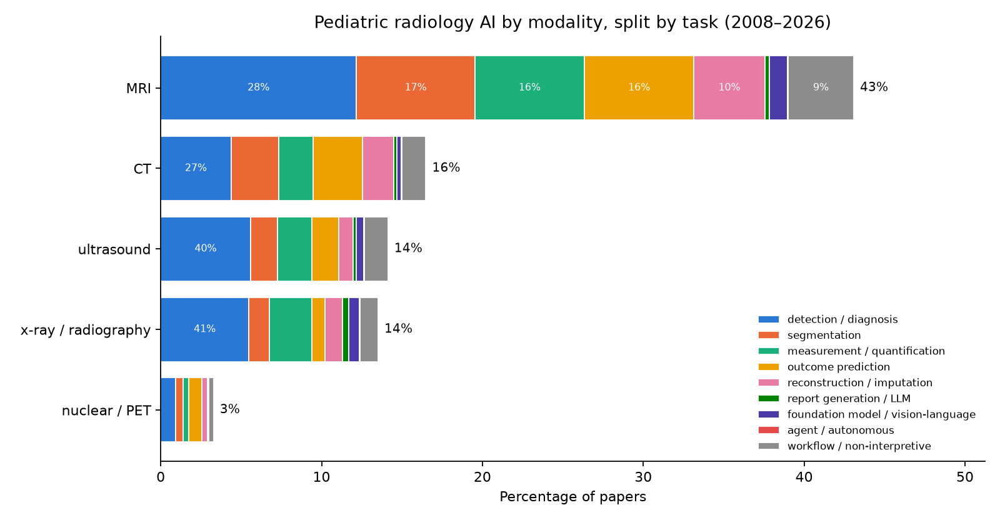

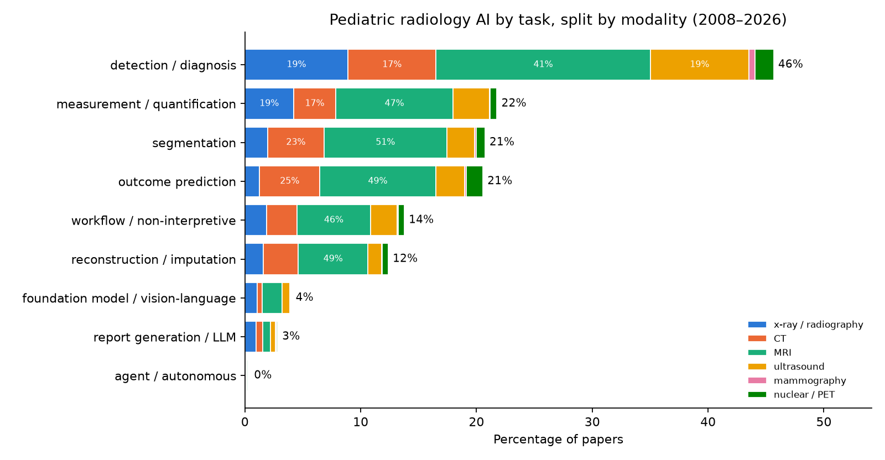

## How much of RSNA's own output is about AI?

**How obtained.** Within RSNA's flagship journals (Radiology, RadioGraphics, Radiology: Artificial Intelligence; matched by PubMed journal abbreviation `[ta]`), the AI fraction is the share of each year's articles that also match the AI vocabulary — the most direct read on radiology's own engagement.

| Year | RSNA-journal articles | AI articles | AI share |
|---:|---:|---:|---:|
| 2008 | 708 | 8 | 1.1% |
| 2009 | 641 | 7 | 1.1% |
| 2010 | 704 | 4 | 0.6% |
| 2011 | 676 | 5 | 0.7% |
| 2012 | 719 | 4 | 0.6% |
| 2013 | 798 | 5 | 0.6% |
| 2014 | 746 | 5 | 0.7% |
| 2015 | 838 | 6 | 0.7% |
| 2016 | 803 | 11 | 1.4% |
| 2017 | 763 | 27 | 3.5% |
| 2018 | 845 | 76 | 9.0% |
| 2019 | 839 | 133 | 15.8% |
| 2020 | 910 | 174 | 19.1% |
| 2021 | 1011 | 198 | 19.6% |
| 2022 | 996 | 214 | 21.5% |
| 2023 | 1028 | 226 | 22.0% |
| 2024 | 884 | 214 | 24.2% |
| 2025 | 859 | 210 | 24.4% |
| 2026 (YTD) | 612 | 150 | 24.5% |

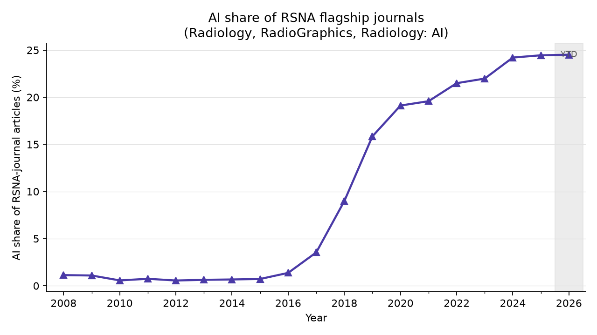

## Conference and society attention to the domain

### Machine-learning / computer-vision venues — radiology share

**How obtained.** For each venue-year, a title sample (up to 500 papers) was pulled from DBLP and labelled with radiology / medical-imaging title keywords. The cell is the share of that venue's papers that are about medical imaging — a conservative lower bound, since title-only labelling misses papers that do not name a modality. ICCV is biennial (odd years).

_Across every venue-year sampled, medical imaging is roughly 0-3% of these general ML/CV venues — a small, flat share of a rapidly growing whole._

| Year | CVPR | ICCV | ICLR | ICML | NeurIPS |
|---:|---:|---:|---:|---:|---:|
| 2016 | 1.0% | – | 0.0% | 0.0% | 0.0% |
| 2017 | 0.0% | 0.0% | 0.0% | 0.2% | 0.4% |
| 2018 | 0.2% | – | 0.0% | 0.0% | 0.0% |
| 2019 | 0.4% | 0.0% | 0.0% | 0.0% | 0.0% |
| 2020 | 1.2% | – | 0.0% | 0.0% | 0.6% |
| 2021 | 0.4% | 0.8% | 0.0% | 0.2% | 0.2% |
| 2022 | 0.4% | – | 0.2% | 0.0% | 0.4% |
| 2023 | 1.2% | 1.6% | 0.2% | 0.2% | 0.6% |
| 2024 | 2.4% | – | 0.2% | 0.0% | 0.8% |
| 2025 | 2.4% | 3.8% | 0.4% | 0.2% | 0.8% |

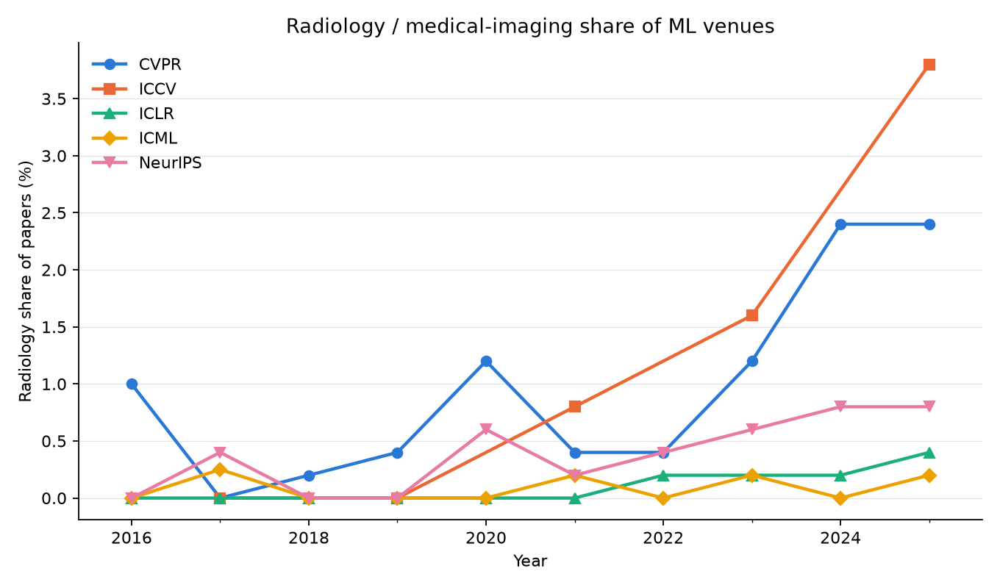

### Radiology societies — AI share of their journals

**How obtained.** RSNA, ACR, ECR, and SPR meetings have no machine-readable program, so each society's engagement with AI is proxied by the AI share of its flagship journals in PubMed (RSNA: Radiology/RadioGraphics/Radiology:AI; ACR: JACR; ECR: European Radiology/Insights into Imaging; SPR: Pediatric Radiology).

| Year | ACR | ECR | RSNA | SPR |
|---:|---:|---:|---:|---:|
| 2016 | 1.0% | 0.6% | 1.4% | 0.4% |
| 2017 | 2.5% | 2.0% | 3.5% | 0.3% |
| 2018 | 7.5% | 7.5% | 9.0% | 0.3% |
| 2019 | 9.8% | 13.5% | 15.8% | 1.4% |
| 2020 | 8.0% | 18.9% | 19.1% | 1.6% |
| 2021 | 8.7% | 22.8% | 19.6% | 4.6% |
| 2022 | 6.6% | 30.2% | 21.5% | 9.0% |
| 2023 | 13.1% | 31.7% | 22.0% | 7.8% |
| 2024 | 11.3% | 30.3% | 24.2% | 7.5% |
| 2025 | 16.2% | 30.3% | 24.4% | 9.4% |
| 2026 (YTD) | 20.0% | 31.8% | 24.5% | 16.0% |

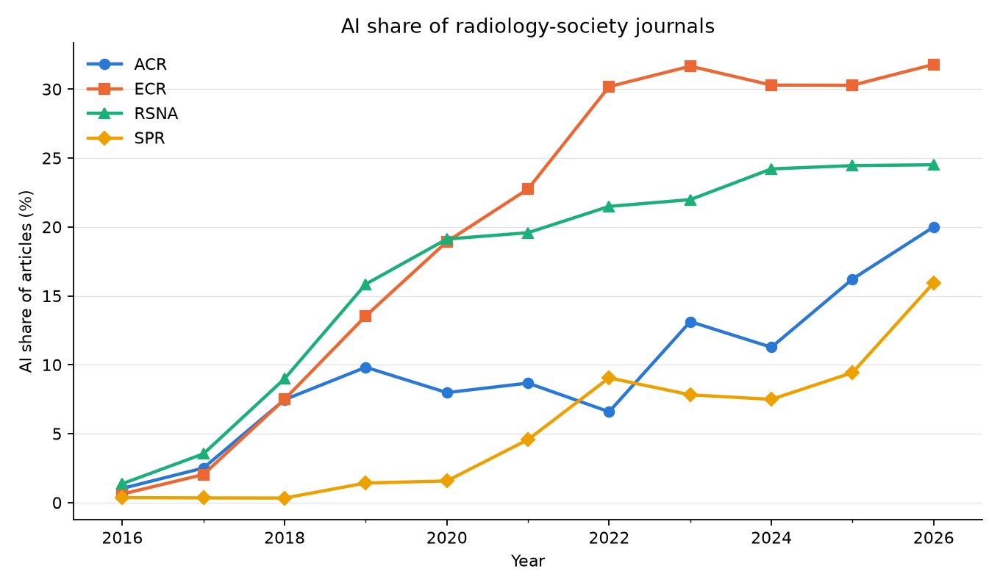

## Method notes

- **Queries** are defined in `pedrad_ai/config.py`; edit them to retune scope.
- **PubMed** counts use the `[pdat]` publication-date facet via E-utilities.
- **Recent-year undercount**: MEDLINE indexing and patent grants lag by months to years, so the final one or two years are low.
- **Conference labelling** of ML venues is title-only and conservative; radiology-society engagement is proxied by the AI share of each society's flagship journals (RSNA meetings have no machine-readable program).

