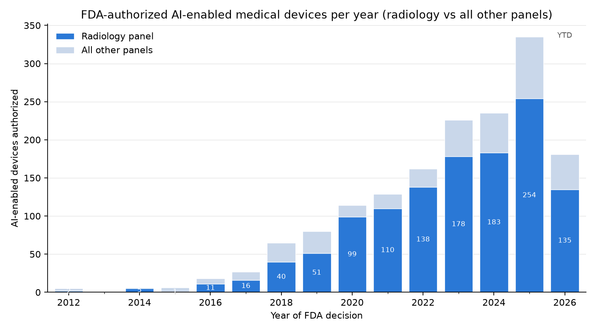
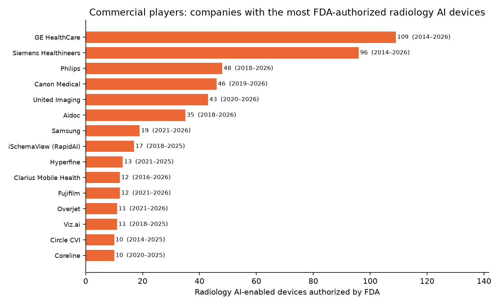

# The Biggest Players in Radiology AI (and Pediatric Radiology AI)

_Most-cited papers from OpenAlex; most-starred open-source tools from GitHub. Citation and star counts are snapshots at collection time._

## Most-cited radiology AI papers

**How obtained.** OpenAlex was searched with a *union* of modality- and task-specific queries (e.g. `CT deep learning segmentation`, `chest radiograph deep learning`, `radiomics machine learning`, `anatomical structures segmentation CT`), the results deduplicated by work id and ranked by citation count. The union matters: a single `radiology deep learning` query misses landmark papers whose title/abstract never use the word "radiology" — TotalSegmentator and nnU-Net, for instance, are framed purely as CT segmentation and only surface through the modality/task queries.

| Rank | Citations | FWCI | Year | Title | Venue |
|---:|---:|---:|---:|:--|:--|
| 1 | 14326 | 1023.0 | 2017 | A survey on deep learning in medical image analysis | Medical Image Anal. |
| 2 | 10044 | 226.3 | 2020 | nnU-Net: a self-configuring method for deep learning-based biomedical image segmentation | Nature Methods |
| 3 | 9570 | 95.9 | 2018 | UNet++: A Nested U-Net Architecture for Medical Image Segmentation | DLMIA/ML-CDS@MICCAI |
| 4 | 5658 | 446.6 | 2021 | Swin-Unet: Unet-like Pure Transformer for Medical Image Segmentation | ECCV Workshops |
| 5 | 5587 | 158.4 | 2017 | Computational Radiomics System to Decode the Radiographic Phenotype | Cancer Research |
| 6 | 4100 | 170.2 | 2018 | Convolutional neural networks: an overview and application in radiology | Insights into Imaging |
| 7 | 3743 | 74.3 | 2019 | CheXpert: A Large Chest Radiograph Dataset with Uncertainty Labels and Expert Comparison | AAAI Conference on Artificial Intelligence |
| 8 | 3634 | 236.9 | 2017 | ChestX-Ray8: Hospital-Scale Chest X-Ray Database and Benchmarks on Weakly-Supervised Classification and Localization of Common Thorax Diseases | Computer Vision and Pattern Recognition |
| 9 | 3322 | 149.0 | 2018 | Artificial intelligence in radiology | Nature Reviews. Cancer |
| 10 | 2990 | 340.4 | 2017 | Deep Learning in Medical Image Analysis | Annual Review of Biomedical Engineering |
| 11 | 2795 | 91.8 | 2020 | UNet 3+: A Full-Scale Connected UNet for Medical Image Segmentation | IEEE International Conference on Acoustics, Speech, and Signal Processing |
| 12 | 2769 | 272.4 | 2020 | COVID-Net: a tailored deep convolutional neural network design for detection of COVID-19 cases from chest X-ray images | Scientific Reports |
| 13 | 2719 |  | 2017 | Deep Learning for Medical Image Analysis | arXiv |
| 14 | 2553 | 290.0 | 2022 | Swin UNETR: Swin Transformers for Semantic Segmentation of Brain Tumors in MRI Images | BrainLes@MICCAI |
| 15 | 2360 | 77.8 | 2018 | Deep Learning Techniques for Automatic MRI Cardiac Multi-Structures Segmentation and Diagnosis: Is the Problem Solved? | IEEE Transactions on Medical Imaging |
| 16 | 2235 |  | 2019 | A Survey on Explainable Artificial Intelligence (XAI): Toward Medical XAI | IEEE Transactions on Neural Networks and Learning Systems |
| 17 | 2120 |  | 2019 | MultiResUNet : Rethinking the U-Net Architecture for Multimodal Biomedical Image Segmentation | Neural Networks |
| 18 | 2111 |  | 2019 | CE-Net: Context Encoder Network for 2D Medical Image Segmentation | IEEE Transactions on Medical Imaging |
| 19 | 2099 |  | 2023 | Foundation models for generalist medical artificial intelligence | Nature |
| 20 | 2031 |  | 2020 | Covid-19: automatic detection from X-ray images utilizing transfer learning with convolutional neural networks | Physical and Engineering Sciences in Medicine |
| 21 | 1994 |  | 2018 | An overview of deep learning in medical imaging focusing on MRI | Zeitschrift für Medizinische Physik |
| 22 | 1919 |  | 2022 | TotalSegmentator: Robust Segmentation of 104 Anatomic Structures in CT Images. | Radiology: Artificial Intelligence |
| 23 | 1916 |  | 2018 | GAN-based Synthetic Medical Image Augmentation for increased CNN Performance in Liver Lesion Classification | Neurocomputing |
| 24 | 1906 |  | 2019 | End-to-end lung cancer screening with three-dimensional deep learning on low-dose chest computed tomography | Nature Medicine |
| 25 | 1834 |  | 2017 | Learning a Variational Network for Reconstruction of Accelerated MRI Data | Magnetic Resonance in Medicine |
| 26 | 1706 |  | 2017 | Deep Learning at Chest Radiography: Automated Classification of Pulmonary Tuberculosis by Using Convolutional Neural Networks. | Radiology |
| 27 | 1696 |  | 2018 | Variable generalization performance of a deep learning model to detect pneumonia in chest radiographs: A cross-sectional study | PLoS Medicine |
| 28 | 1678 |  | 2017 | Low-Dose CT with a Residual Encoder-Decoder Convolutional Neural Network (RED-CNN) | IEEE Transactions on Medical Imaging |
| 29 | 1621 |  | 2020 | Can AI Help in Screening Viral and COVID-19 Pneumonia? | IEEE Access |
| 30 | 1608 |  | 2023 | Segment anything in medical images | Nature Communications |

### What the papers above 1,500 citations answer

| Citations | Paper | Topic | Clinical question |
|---:|:--|:--|:--|
| 14326 | A survey on deep learning in medical image analysis (2017) | survey | What can deep learning do across medical imaging? (the field's reference survey) |
| 10044 | nnU-Net: a self-configuring method for deep learning-based biomedical image segmentation (2020) | segmentation | Can one self-configuring method segment any organ or lesion without hand tuning? (nnU-Net) |
| 9570 | UNet++: A Nested U-Net Architecture for Medical Image Segmentation (2018) | segmentation | UNet++: A Nested U-Net Architecture for Medical Image Segmentation |
| 5658 | Swin-Unet: Unet-like Pure Transformer for Medical Image Segmentation (2021) | segmentation | Swin-Unet: Unet-like Pure Transformer for Medical Image Segmentation |
| 5587 | Computational Radiomics System to Decode the Radiographic Phenotype (2017) | radiomics | Can standardized image features (radiomics) be extracted reproducibly? (PyRadiomics) |
| 4100 | Convolutional neural networks: an overview and application in radiology (2018) | tutorial | What is a convolutional neural network, explained for radiologists? |
| 3743 | CheXpert: A Large Chest Radiograph Dataset with Uncertainty Labels and Expert Comparison (2019) | dataset | A 224k chest-radiograph dataset with uncertainty labels for training and benchmarking (CheXpert) |
| 3634 | ChestX-Ray8: Hospital-Scale Chest X-Ray Database and Benchmarks on Weakly-Supervised Classification and Localization of Common Thorax Diseases (2017) | classification | ChestX-Ray8: Hospital-Scale Chest X-Ray Database and Benchmarks on Weakly-Supervised Classification and Localization of Common Thorax Diseases |
| 3322 | Artificial intelligence in radiology (2018) | review | How will AI change radiology practice? (Hosny et al.) |
| 2990 | Deep Learning in Medical Image Analysis (2017) | survey | How does deep learning apply to medical image analysis? (review) |
| 2795 | UNet 3+: A Full-Scale Connected UNet for Medical Image Segmentation (2020) | segmentation | UNet 3+: A Full-Scale Connected UNet for Medical Image Segmentation |
| 2769 | COVID-Net: a tailored deep convolutional neural network design for detection of COVID-19 cases from chest X-ray images (2020) | classification | Can a CNN detect COVID-19 on chest X-ray? (COVID-Net) |
| 2719 | Deep Learning for Medical Image Analysis (2017) | other | Deep Learning for Medical Image Analysis |
| 2553 | Swin UNETR: Swin Transformers for Semantic Segmentation of Brain Tumors in MRI Images (2022) | segmentation | Swin UNETR: Swin Transformers for Semantic Segmentation of Brain Tumors in MRI Images |
| 2360 | Deep Learning Techniques for Automatic MRI Cardiac Multi-Structures Segmentation and Diagnosis: Is the Problem Solved? (2018) | segmentation | Is automatic cardiac MRI segmentation solved? (ACDC challenge) |
| 2235 | A Survey on Explainable Artificial Intelligence (XAI): Toward Medical XAI (2019) | explainability | How can AI decisions in medicine be made explainable? |
| 2120 | MultiResUNet : Rethinking the U-Net Architecture for Multimodal Biomedical Image Segmentation (2019) | segmentation | Architecture variant of U-Net for multimodal segmentation |
| 2111 | CE-Net: Context Encoder Network for 2D Medical Image Segmentation (2019) | segmentation | Architecture variant for 2D medical image segmentation (CE-Net) |
| 2099 | Foundation models for generalist medical artificial intelligence (2023) | foundation model | What would a single generalist medical AI model that handles images, text and records look like? (perspective) |
| 2031 | Covid-19: automatic detection from X-ray images utilizing transfer learning with convolutional neural networks (2020) | classification | Can transfer learning detect COVID-19 on X-ray with small data? |
| 1994 | An overview of deep learning in medical imaging focusing on MRI (2018) | review | Deep learning in MRI: acquisition to interpretation (overview) |
| 1919 | TotalSegmentator: Robust Segmentation of 104 Anatomic Structures in CT Images. (2022) | segmentation | Can one open tool segment 100+ anatomic structures on any CT? (TotalSegmentator) |
| 1916 | GAN-based Synthetic Medical Image Augmentation for increased CNN Performance in Liver Lesion Classification (2018) | synthesis | Can GAN-generated synthetic lesions improve training with scarce data? |
| 1906 | End-to-end lung cancer screening with three-dimensional deep learning on low-dose chest computed tomography (2019) | screening | Can AI read low-dose CT for lung-cancer screening as well as radiologists? (Google) |
| 1834 | Learning a Variational Network for Reconstruction of Accelerated MRI Data (2017) | reconstruction | Can a learned reconstruction accelerate MRI 4x without losing diagnostic quality? |
| 1706 | Deep Learning at Chest Radiography: Automated Classification of Pulmonary Tuberculosis by Using Convolutional Neural Networks. (2017) | classification | Deep Learning at Chest Radiography: Automated Classification of Pulmonary Tuberculosis by Using Convolutional Neural Networks. |
| 1696 | Variable generalization performance of a deep learning model to detect pneumonia in chest radiographs: A cross-sectional study (2018) | generalization | Does a pneumonia model trained at one hospital work at another? (often not) |
| 1678 | Low-Dose CT with a Residual Encoder-Decoder Convolutional Neural Network (RED-CNN) (2017) | reconstruction | Can a CNN denoise low-dose CT to standard-dose quality? (RED-CNN) |
| 1621 | Can AI Help in Screening Viral and COVID-19 Pneumonia? (2020) | classification | Can AI screen viral vs COVID-19 pneumonia on X-ray? |
| 1608 | Segment anything in medical images (2023) | foundation | Can a prompt-based 'segment anything' model work on medical images? (MedSAM) |
| 1603 | U-Net and Its Variants for Medical Image Segmentation: A Review of Theory and Applications (2020) | survey | U-Net and its variants: a review |
| 1538 | Deep Learning Techniques for Medical Image Segmentation: Achievements and Challenges (2019) | survey | Segmentation methods: achievements and challenges (review) |

### Most-cited radiology AI papers per year, 2023-present

**Why per year.** Inside a 2023-present window raw citation counts favor 2023 papers (they have had three years to accrue citations), so the recent era is ranked one publication year at a time. FWCI is OpenAlex's field-weighted citation impact (1 = world average for papers of the same field and year). Preprints (arXiv, medRxiv, ...) are included and marked in the venue column.

### Radiology AI, 2023

| Rank | Citations | FWCI | Year | Title | Venue |
|---:|---:|---:|---:|:--|:--|
| 1 | 2099 | 243.8 | 2023 | Foundation models for generalist medical artificial intelligence | Nature |
| 2 | 1608 | 615.8 | 2023 | Segment anything in medical images | Nature Communications |
| 3 | 861 | 69.6 | 2023 | Segment Anything Model for medical image analysis: an experimental study | Medical Image Anal. |
| 4 | 724 |  | 2023 | BiomedCLIP: a multimodal biomedical foundation model pretrained from fifteen million scientific image-text pairs | arXiv |
| 5 | 702 | 118.5 | 2023 | Redefining Radiology: A Review of Artificial Intelligence Integration in Medical Imaging | Diagnostics |
| 6 | 598 |  | 2023 | Towards Generalist Biomedical AI | NEJM AI |
| 7 | 573 | 55.8 | 2023 | MRI-based brain tumor detection using convolutional deep learning methods and chosen machine learning techniques | BMC Medical Informatics and Decision Making |
| 8 | 562 | 74.5 | 2023 | A Study of CNN and Transfer Learning in Medical Imaging: Advantages, Challenges, Future Scope | Sustainability |
| 9 | 525 | 16.1 | 2023 | How Artificial Intelligence Is Shaping Medical Imaging Technology: A Survey of Innovations and Applications | Bioengineering |
| 10 | 509 | 75.2 | 2023 | Medical image analysis using deep learning algorithms | Frontiers in Public Health |
| 11 | 497 | 17.9 | 2023 | Self-supervised learning for medical image classification: a systematic review and implementation guidelines | npj Digit. Medicine |
| 12 | 460 | 44.5 | 2023 | Brain Tumor Detection Based on Deep Learning Approaches and Magnetic Resonance Imaging | Cancers |
| 13 | 442 | 37.4 | 2023 | A generalist vision–language foundation model for diverse biomedical tasks | Nature Medicine |
| 14 | 419 | 13.5 | 2023 | Performance of ChatGPT on a Radiology Board-style Examination: Insights into Current Strengths and Limitations. | Radiology |
| 15 | 391 | 42.2 | 2023 | SAM-Adapter: Adapting Segment Anything in Underperformed Scenes | 2023 IEEE/CVF International Conference on Computer Vision Workshops (ICCVW) |

### Radiology AI, 2024

| Rank | Citations | FWCI | Year | Title | Venue |
|---:|---:|---:|---:|:--|:--|
| 1 | 1074 | 225.2 | 2024 | VM-UNet: Vision Mamba UNet for Medical Image Segmentation | ACM Transactions on Multimedia Computing, Communications, and Applications (TOMCCAP) |
| 2 | 377 |  | 2024 | Segment Anything Model for Medical Image Segmentation: Current Applications and Future Directions | Comput. Biol. Medicine |
| 3 | 349 | 47.6 | 2024 | Deep learning for medical image segmentation: State-of-the-art advancements and challenges | Informatics in Medicine Unlocked |
| 4 | 345 | 21.3 | 2024 | Comparison of Vision Transformers and Convolutional Neural Networks in Medical Image Analysis: A Systematic Review | Journal of medical systems |
| 5 | 324 | 26.4 | 2024 | Chatbots and Large Language Models in Radiology: A Practical Primer for Clinical and Research Applications. | Radiology |
| 6 | 317 | 43.4 | 2024 | Advances in Medical Image Segmentation: A Comprehensive Review of Traditional, Deep Learning and Hybrid Approaches | Bioengineering |
| 7 | 298 | 31.8 | 2024 | Vision-language models for medical report generation and visual question answering: a review | Frontiers Artif. Intell. |
| 8 | 282 | 74.6 | 2024 | Artificial intelligence in neuro-oncology: advances and challenges in brain tumor diagnosis, prognosis, and precision treatment | npj Precision Oncology |
| 9 | 279 | 72.6 | 2024 | METhodological RadiomICs Score (METRICS): a quality scoring tool for radiomics research endorsed by EuSoMII | Insights into Imaging |
| 10 | 261 | 30.9 | 2024 | OmniMedVQA: A New Large-Scale Comprehensive Evaluation Benchmark for Medical LVLM | Computer Vision and Pattern Recognition |
| 11 | 254 |  | 2024 | MedMamba: Vision Mamba for Medical Image Classification | arXiv |
| 12 | 242 | 36.0 | 2024 | Deep semi-supervised learning for medical image segmentation: A review | Expert systems with applications |
| 13 | 242 | 110.3 | 2024 | Generalist foundation models from a multimodal dataset for 3D computed tomography | Nature Biomedical Engineering |
| 14 | 241 | 34.5 | 2024 | A review of deep learning-based information fusion techniques for multimodal medical image classification | Comput. Biol. Medicine |
| 15 | 238 | 37.0 | 2024 | Employing deep learning and transfer learning for accurate brain tumor detection | Scientific Reports |

### Radiology AI, 2025

| Rank | Citations | FWCI | Year | Title | Venue |
|---:|---:|---:|---:|:--|:--|
| 1 | 333 | 0.0 | 2025 | ASAM: Anatomy-Encoded Segment Anything Model for Medical Images | IEEE International Symposium on Biomedical Imaging |
| 2 | 313 | 94.9 | 2025 | Towards generalist foundation model for radiology by leveraging web-scale 2D&3D medical data | Nature Communications |
| 3 | 258 | 225.8 | 2025 | Deep Convolutional Neural Networks in Medical Image Analysis: A Review | Inf. |
| 4 | 233 | 64.6 | 2025 | Artificial intelligence in healthcare and medicine: clinical applications, therapeutic advances, and future perspectives | European Journal of Medical Research |
| 5 | 223 |  | 2025 | Lingshu: A Generalist Foundation Model for Unified Multimodal Medical Understanding and Reasoning | arXiv |
| 6 | 208 | 65.9 | 2025 | A review of deep learning for brain tumor analysis in MRI | npj Precision Oncology |
| 7 | 208 | 1.1 | 2025 | MedVLM-R1: Incentivizing Medical Reasoning Capability of Vision-Language Models (VLMs) via Reinforcement Learning | International Conference on Medical Image Computing and Computer-Assisted Intervention |
| 8 | 173 | 87.2 | 2025 | Development and validation of an autonomous artificial intelligence agent for clinical decision-making in oncology | Nature Cancer |
| 9 | 151 | 54.0 | 2025 | Medical Image Segmentation: A Comprehensive Review of Deep Learning-Based Methods | Tomography |
| 10 | 150 | 65.8 | 2025 | Med-R1: Reinforcement Learning for Generalizable Medical Reasoning in Vision-Language Models | IEEE Transactions on Medical Imaging |
| 11 | 145 | 158.8 | 2025 | Multi-model assurance analysis showing large language models are highly vulnerable to adversarial hallucination attacks during clinical decision support | Communications Medicine |
| 12 | 141 |  | 2025 | MedSAM2: Segment Anything in 3D Medical Images and Videos | arXiv |
| 13 | 131 |  | 2025 | HealthGPT: A Medical Large Vision-Language Model for Unifying Comprehension and Generation via Heterogeneous Knowledge Adaptation | International Conference on Machine Learning |
| 14 | 122 | 108.2 | 2025 | Multimodal generative AI for medical image interpretation | Nature |
| 15 | 118 | 39.5 | 2025 | Advanced Brain Tumor Classification in MR Images Using Transfer Learning and Pre-Trained Deep CNN Models | Cancers |

### Radiology AI, 2026 (year to date)

| Rank | Citations | FWCI | Year | Title | Venue |
|---:|---:|---:|---:|:--|:--|
| 1 | 48 | 102.6 | 2026 | A generalizable foundation model for analysis of human brain MRI | Nature Neuroscience |
| 2 | 37 | 58.8 | 2026 | Explainable artificial intelligence (XAI) in medical imaging: a systematic review of techniques, applications, and challenges | BMC Medical Imaging |
| 3 | 27 | 67.3 | 2026 | Applications and limitations of large language models to integrate medical context: a comprehensive review | Iran Journal of Computer Science |
| 4 | 21 | 44.2 | 2026 | Agentic AI in Radiology: Evolution from Large Language Models to Future Clinical Integration. | Radiology: Artificial Intelligence |
| 5 | 21 |  | 2026 | Medical SAM3: A Foundation Model for Universal Prompt-Driven Medical Image Segmentation | arXiv |
| 6 | 19 | 21.4 | 2026 | BIBSNet: A deep learning baby image brain segmentation network for MRI scans | Developmental Cognitive Neuroscience |
| 7 | 18 | 62.7 | 2026 | A hybrid deep learning framework based on VGG19 and U-Net for accurate brain tumor segmentation in MRI images | Magnetic Resonance Letters |
| 8 | 17 | 28.4 | 2026 | Leveraging multi-modal foundation models for analysing spatial multi-omic and histopathology data | Nature Biomedical Engineering |
| 9 | 16 | 90.5 | 2026 | Reporting checklist for foundation and large language models in medical research (REFINE): an international consensus guideline. | Diagnostic and Interventional Radiology |
| 10 | 15 | 4.5 | 2026 | Multi-Task Learning Network for Medical Image Analysis Guided by Lesion Regions and Spatial Relationships of Tissues | IEEE transactions on circuits and systems for video technology (Print) |
| 11 | 15 | 76.1 | 2026 | Scaling medical AI across clinical contexts | Nature Medicine |
| 12 | 13 | 15.9 | 2026 | Large language models for simplifying radiology reports: a systematic review and meta-analysis of patient, public, and clinician evaluations | The Lancet Digital Health |
| 13 | 12 |  | 2026 | EfficientNetB7-Based Deep Learning Framework for Enhanced Classification of Lung and Colon Cancer Histopathological Images. | Journal of Visualized Experiments |
| 14 | 12 | 4.2 | 2026 | A novel Alzheimer’s disease classification system using a hybrid deep learning model with Xception feature extraction and improved RNN | Waves in Random and Complex Media |
| 15 | 12 | 45.3 | 2026 | Explainable AI-driven MRI-based brain tumor classification: a novel deep learning approach | Frontiers Artif. Intell. |

## Most-cited pediatric radiology AI papers

**How obtained.** Same union-of-queries method with pediatric terms (bone age, fetal/neonatal MRI, pediatric CT/fracture/pneumonia), additionally requiring a pediatric signal in the title so the list stays genuinely pediatric.

| Rank | Citations | FWCI | Year | Title | Venue |
|---:|---:|---:|---:|:--|:--|
| 1 | 458 | 27.0 | 2019 | The RSNA Pediatric Bone Age Machine Learning Challenge. | Radiology |
| 2 | 431 | 321.5 | 2017 | Fully Automated Deep Learning System for Bone Age Assessment | Journal of digital imaging |
| 3 | 426 | 328.6 | 2017 | Performance of a Deep-Learning Neural Network Model in Assessing Skeletal Maturity on Pediatric Hand Radiographs. | Radiology |
| 4 | 403 | 221.2 | 2017 | Deep learning for automated skeletal bone age assessment in X‐ray images | Medical Image Anal. |
| 5 | 352 | 57.4 | 2015 | Standard Plane Localization in Fetal Ultrasound via Domain Transferred Deep Neural Networks | IEEE journal of biomedical and health informatics |
| 6 | 253 | 25.8 | 2021 | An ensemble of neural networks provides expert-level prenatal detection of complex congenital heart disease | Nature Medicine |
| 7 | 233 | 30.3 | 2020 | Evaluation of deep convolutional neural networks for automatic classification of common maternal fetal ultrasound planes | Scientific Reports |
| 8 | 194 | 57.0 | 2021 | Automatic Fetal Ultrasound Standard Plane Recognition Based on Deep Learning and IIoT | IEEE Transactions on Industrial Informatics |
| 9 | 191 | 57.8 | 2022 | A Review on Deep-Learning Algorithms for Fetal Ultrasound-Image Analysis | Medical Image Anal. |
| 10 | 176 | 8.1 | 2015 | Automatic Fetal Ultrasound Standard Plane Detection Using Knowledge Transferred Recurrent Neural Networks | International Conference on Medical Image Computing and Computer-Assisted Intervention |
| 11 | 164 | 24.0 | 2020 | Using deep‐learning algorithms to classify fetal brain ultrasound images as normal or abnormal | Ultrasound in Obstetrics and Gynecology |
| 12 | 151 | 8.5 | 2020 | Improving Image Quality and Reducing Radiation Dose for Pediatric CT by Using Deep Learning Reconstruction. | Radiology |
| 13 | 143 | 73.0 | 2017 | Computerized Bone Age Estimation Using Deep Learning Based Program: Evaluation of the Accuracy and Efficiency. | AJR. American journal of roentgenology |
| 14 | 130 |  | 2017 | Pediatric Bone Age Assessment Using Deep Convolutional Neural Networks | bioRxiv |
| 15 | 129 | 12.8 | 2021 | Detection of Cardiac Structural Abnormalities in Fetal Ultrasound Videos Using Deep Learning | Applied Sciences |
| 16 | 124 |  | 2019 | Fetal Ultrasound Image Segmentation for Measuring Biometric Parameters Using Multi-Task Deep Learning | Annual International Conference of the IEEE Engineering in Medicine and Biology Society |
| 17 | 123 |  | 2018 | Artificial intelligence-assisted interpretation of bone age radiographs improves accuracy and decreases variability | Skeletal Radiology |
| 18 | 117 |  | 2013 | Neonatal Brain Abnormalities and Memory and Learning Outcomes at 7 Years in Children Born Very Preterm | Memory |
| 19 | 104 |  | 2019 | Regression Convolutional Neural Network for Automated Pediatric Bone Age Assessment From Hand Radiograph | IEEE journal of biomedical and health informatics |
| 20 | 104 |  | 2021 | Fetal Ultrasound Image Segmentation for Automatic Head Circumference Biometry Using Deeply Supervised Attention-Gated V-Net | Journal of digital imaging |

### What the papers above 100 citations answer

| Citations | Paper | Topic | Clinical question |
|---:|:--|:--|:--|
| 458 | The RSNA Pediatric Bone Age Machine Learning Challenge. (2019) | bone age | How well can crowdsourced AI estimate bone age? (RSNA challenge, 260 teams) |
| 431 | Fully Automated Deep Learning System for Bone Age Assessment (2017) | bone age | Fully automated bone age from hand radiographs |
| 426 | Performance of a Deep-Learning Neural Network Model in Assessing Skeletal Maturity on Pediatric Hand Radiographs. (2017) | bone age | Can a CNN assess skeletal maturity as accurately as radiologists? |
| 403 | Deep learning for automated skeletal bone age assessment in X‐ray images (2017) | bone age | Deep learning for automated bone age (BoNet) |
| 352 | Standard Plane Localization in Fetal Ultrasound via Domain Transferred Deep Neural Networks (2015) | fetal MRI | Standard Plane Localization in Fetal Ultrasound via Domain Transferred Deep Neural Networks |
| 253 | An ensemble of neural networks provides expert-level prenatal detection of complex congenital heart disease (2021) | detection | An ensemble of neural networks provides expert-level prenatal detection of complex congenital heart disease |
| 233 | Evaluation of deep convolutional neural networks for automatic classification of common maternal fetal ultrasound planes (2020) | fetal MRI | Evaluation of deep convolutional neural networks for automatic classification of common maternal fetal ultrasound planes |
| 194 | Automatic Fetal Ultrasound Standard Plane Recognition Based on Deep Learning and IIoT (2021) | fetal MRI | Automatic Fetal Ultrasound Standard Plane Recognition Based on Deep Learning and IIoT |
| 191 | A Review on Deep-Learning Algorithms for Fetal Ultrasound-Image Analysis (2022) | survey / review | A Review on Deep-Learning Algorithms for Fetal Ultrasound-Image Analysis |
| 176 | Automatic Fetal Ultrasound Standard Plane Detection Using Knowledge Transferred Recurrent Neural Networks (2015) | fetal MRI | Automatic Fetal Ultrasound Standard Plane Detection Using Knowledge Transferred Recurrent Neural Networks |
| 164 | Using deep‐learning algorithms to classify fetal brain ultrasound images as normal or abnormal (2020) | fetal MRI | Using deep‐learning algorithms to classify fetal brain ultrasound images as normal or abnormal |
| 151 | Improving Image Quality and Reducing Radiation Dose for Pediatric CT by Using Deep Learning Reconstruction. (2020) | reconstruction | Can deep-learning reconstruction cut pediatric CT dose while improving image quality? |
| 143 | Computerized Bone Age Estimation Using Deep Learning Based Program: Evaluation of the Accuracy and Efficiency. (2017) | bone age | Is a commercial deep-learning bone-age program accurate and faster in practice? |
| 130 | Pediatric Bone Age Assessment Using Deep Convolutional Neural Networks (2017) | bone age | Pediatric Bone Age Assessment Using Deep Convolutional Neural Networks |
| 129 | Detection of Cardiac Structural Abnormalities in Fetal Ultrasound Videos Using Deep Learning (2021) | fetal MRI | Detection of Cardiac Structural Abnormalities in Fetal Ultrasound Videos Using Deep Learning |
| 124 | Fetal Ultrasound Image Segmentation for Measuring Biometric Parameters Using Multi-Task Deep Learning (2019) | segmentation | Fetal Ultrasound Image Segmentation for Measuring Biometric Parameters Using Multi-Task Deep Learning |
| 123 | Artificial intelligence-assisted interpretation of bone age radiographs improves accuracy and decreases variability (2018) | bone age | Does AI assistance make radiologists' bone-age reads more accurate and consistent? |
| 117 | Neonatal Brain Abnormalities and Memory and Learning Outcomes at 7 Years in Children Born Very Preterm (2013) | other | Neonatal Brain Abnormalities and Memory and Learning Outcomes at 7 Years in Children Born Very Preterm |
| 104 | Regression Convolutional Neural Network for Automated Pediatric Bone Age Assessment From Hand Radiograph (2019) | bone age | Regression CNN for pediatric bone age |
| 104 | Fetal Ultrasound Image Segmentation for Automatic Head Circumference Biometry Using Deeply Supervised Attention-Gated V-Net (2021) | segmentation | Fetal Ultrasound Image Segmentation for Automatic Head Circumference Biometry Using Deeply Supervised Attention-Gated V-Net |

### Most-cited pediatric radiology AI papers per year, 2023-present

### Pediatric radiology AI, 2023

| Rank | Citations | FWCI | Year | Title | Venue |
|---:|---:|---:|---:|:--|:--|
| 1 | 62 | 33.6 | 2023 | Standard fetal ultrasound plane classification based on stacked ensemble of deep learning models | Expert systems with applications |
| 2 | 53 |  | 2023 | BOUNTI: Brain vOlumetry and aUtomated parcellatioN for 3D feTal MRI | bioRxiv |
| 3 | 52 | 4.6 | 2023 | Automated tumor segmentation and brain tissue extraction from multiparametric MRI of pediatric brain tumors: A multi-institutional study | Neuro-Oncology Advances |
| 4 | 44 | 5.5 | 2023 | Deep learning-based real time detection for cardiac objects with fetal ultrasound video | Informatics in Medicine Unlocked |
| 5 | 43 | 9.7 | 2023 | Deeplasia: deep learning for bone age assessment validated on skeletal dysplasias | Pediatric Radiology |
| 6 | 43 | 23.8 | 2023 | Review on deep learning fetal brain segmentation from Magnetic Resonance images | Artif. Intell. Medicine |
| 7 | 38 | 7.3 | 2023 | Deep learning model for prenatal congenital heart disease (CHD) screening can be applied to retrospective imaging from the community setting, outperforming initial clinical detection in a well-annotated cohort | Ultrasound in Obstetrics and Gynecology |
| 8 | 37 | 20.2 | 2023 | Transfer learning for accurate fetal organ classification from ultrasound images: a potential tool for maternal healthcare providers | Scientific Reports |
| 9 | 35 |  | 2023 | Large-scale annotation dataset for fetal head biometry in ultrasound images | Data in Brief |
| 10 | 34 | 16.6 | 2023 | Deep Learning-Based Multiclass Brain Tissue Segmentation in Fetal MRIs | Italian National Conference on Sensors |
| 11 | 32 | 36.6 | 2023 | Bone Age Assessment Using Artificial Intelligence in Korean Pediatric Population: A Comparison of Deep-Learning Models Trained With Healthy Chronological and Greulich-Pyle Ages as Labels | Korean Journal of Radiology |
| 12 | 31 | 5.8 | 2023 | MRI-Based End-To-End Pediatric Low-Grade Glioma Segmentation and Classification | Canadian Association of Radiologists journal = Journal l'Association canadienne des radiologistes |
| 13 | 30 | 7.8 | 2023 | Deep learning for estimation of fetal weight throughout the pregnancy from fetal abdominal ultrasound. | American Journal of Obstetrics & Gynecology MFM |
| 14 | 28 | 4.8 | 2023 | Deep Learning Technique for Congenital Heart Disease Detection Using Stacking-Based CNN-LSTM Models From Fetal Echocardiogram: A Pilot Study | IEEE Access |
| 15 | 27 | 33.5 | 2023 | Bone age assessment based on deep neural networks with annotation-free cascaded critical bone region extraction | Frontiers in Artificial Intelligence |

### Pediatric radiology AI, 2024

| Rank | Citations | FWCI | Year | Title | Venue |
|---:|---:|---:|---:|:--|:--|
| 1 | 34 | 3.2 | 2024 | The utilization of artificial intelligence in enhancing 3D/4D ultrasound analysis of fetal facial profiles | Journal of Perinatal Medicine |
| 2 | 30 | 23.8 | 2024 | FetalBrainAwareNet: Bridging GANs with anatomical insight for fetal ultrasound brain plane synthesis | Comput. Medical Imaging Graph. |
| 3 | 30 | 15.1 | 2024 | RTSeg-net: A lightweight network for real-time segmentation of fetal head and pubic symphysis from intrapartum ultrasound images | Comput. Biol. Medicine |
| 4 | 23 | 7.0 | 2024 | Deep learning-based automated lesion segmentation on pediatric focal cortical dysplasia II preoperative MRI: a reliable approach | Insights into Imaging |
| 5 | 21 | 2.4 | 2024 | Evaluating the Robustness of a Deep Learning Bone Age Algorithm to Clinical Image Variation Using Computational Stress Testing. | Radiology: Artificial Intelligence |
| 6 | 20 | 19.5 | 2024 | Artificial intelligence assisted common maternal fetal planes prediction from ultrasound images based on information fusion of customized convolutional neural networks | Frontiers in Medicine |
| 7 | 19 | 4.8 | 2024 | A deep learning framework for identifying and segmenting three vessels in fetal heart ultrasound images | BioMedical Engineering OnLine |
| 8 | 18 | 1.3 | 2024 | Diagnostic performance of an AI algorithm for the detection of appendicular bone fractures in pediatric patients. | European Journal of Radiology |
| 9 | 18 | 5.2 | 2024 | Explainable AI in Deep Learning Based Classification of Fetal Ultrasound Image Planes | Procedia Computer Science |
| 10 | 18 | 15.9 | 2024 | Deep learning denoising reconstruction for improved image quality in fetal cardiac cine MRI | Frontiers in Cardiovascular Medicine |
| 11 | 18 | 5.3 | 2024 | Integration of a Deep Convolutional Neural Network With Adaptive Channel Weight Technique for Automated Identification of Standard Fetal Biometry Planes | IEEE Transactions on Instrumentation and Measurement |
| 12 | 17 | 34.8 | 2024 | Intrapartum Ultrasound Image Segmentation of Pubic Symphysis and Fetal Head Using Dual Student-Teacher Framework with CNN-ViT Collaborative Learning | International Conference on Medical Image Computing and Computer-Assisted Intervention |
| 13 | 16 | 3.7 | 2024 | Stepwise Transfer Learning for Expert-Level Pediatric Brain Tumor MRI Segmentation in a Limited Data Scenario. | Radiology: Artificial Intelligence |
| 14 | 16 | 13.4 | 2024 | FetSAM: Advanced Segmentation Techniques for Fetal Head Biometrics in Ultrasound Imagery | IEEE Open Journal of Engineering in Medicine and Biology |
| 15 | 15 | 4.7 | 2024 | Nn-Unet-based Segmentation of Tumor Subcompartments in Pediatric Medulloblastoma Using Multiparametric MRI: A Multi-institutional Study. | Radiology: Artificial Intelligence |

### Pediatric radiology AI, 2025

| Rank | Citations | FWCI | Year | Title | Venue |
|---:|---:|---:|---:|:--|:--|
| 1 | 20 | 77.0 | 2025 | Bone Age Assessment Using Various Medical Imaging Techniques Enhanced by Artificial Intelligence | Diagnostics |
| 2 | 19 | 5.5 | 2025 | Real-life benefit of artificial intelligence-based fracture detection in a pediatric emergency department | European Radiology |
| 3 | 18 | 85.1 | 2025 | M-CNN-RF: A hybrid deep learning model for accurate pediatric skeletal age estimation using hand bone radiographs | Alexandria Engineering Journal |
| 4 | 18 | 4.6 | 2025 | AI implementation in pediatric radiology for patient safety: a multi-society statement from the ACR, ESPR, SPR, SLARP, AOSPR, SPIN | Pediatric Radiology |
| 5 | 18 | 24.9 | 2025 | Advancing prenatal healthcare by explainable AI enhanced fetal ultrasound image segmentation using U-Net++ with attention mechanisms | Scientific Reports |
| 6 | 18 | 4.9 | 2025 | Clinical validation of explainable AI for fetal growth scans through multi-level, cross-institutional prospective end-user evaluation | Scientific Reports |
| 7 | 16 | 171.3 | 2025 | A comprehensive review of artificial intelligence - based algorithm towards fetal facial anomalies detection (2013–2024) | Artificial Intelligence Review |
| 8 | 16 | 8.7 | 2025 | Prenatal detection of congenital heart defects using the deep learning-based image and video analysis: protocol for Clinical Artificial Intelligence in Fetal Echocardiography (CAIFE), an international multicentre multidisciplinary study | BMJ Open |
| 9 | 13 | 3.8 | 2025 | Predicting abnormal fetal growth using deep learning | npj Digital Medicine |
| 10 | 12 | 12.4 | 2025 | Association between deep learning radiomics based on placental MRI and preeclampsia with fetal growth restriction: A multicenter study. | European Journal of Radiology |
| 11 | 12 | 21.8 | 2025 | FetalMovNet: A Novel Deep Learning Model Based on Attention Mechanism for Fetal Movement Classification in US | IEEE Access |
| 12 | 11 | 8.6 | 2025 | Multi-view deep learning framework for the detection of chest X-rays compatible with pediatric pulmonary tuberculosis | Nature Communications |
| 13 | 11 | 7.0 | 2025 | Evaluation of Image Quality and Scan Time Efficiency in Accelerated 3D T1-Weighted Pediatric Brain MRI Using Deep Learning-Based Reconstruction | Korean Journal of Radiology |
| 14 | 11 | 14.5 | 2025 | Effectiveness and clinical impact of using deep learning for first-trimester fetal ultrasound image quality auditing | BMC Pregnancy and Childbirth |
| 15 | 10 | 2.3 | 2025 | Impact of deep learning on pediatric elbow fracture detection: a systematic review and meta-analysis | European Journal of Trauma and Emergency Surgery |

### Pediatric radiology AI, 2026 (year to date)

| Rank | Citations | FWCI | Year | Title | Venue |
|---:|---:|---:|---:|:--|:--|
| 1 | 11 | 34.3 | 2026 | Artificial intelligence and radiomics for pediatric brain tumor classification and molecular characterization: a systematic review | Neuroradiology |
| 2 | 5 | 27.9 | 2026 | Deep learning assessment of fetal brain maturation on 3D ultrasound volumes in early‐onset fetal growth restriction | Ultrasound in Obstetrics and Gynecology |
| 3 | 4 | 13.6 | 2026 | Data mining in pediatric radiology in the era of artificial intelligence. | Pediatric Radiology |
| 4 | 3 | 8.8 | 2026 | Artificial intelligence-enabled pediatric radiology in low-resource settings: addressing resource constraints in the African healthcare system | Pediatric Radiology |
| 5 | 3 | 17.6 | 2026 | Foundation models in radiology: a primer for pediatric radiologists | Pediatric Radiology |
| 6 | 3 | 17.3 | 2026 | Current applications and challenges of artificial intelligence applied to diagnostics in pediatric musculoskeletal imaging | Pediatric Radiology |
| 7 | 3 | 11.7 | 2026 | Automated bone age assessment in rare pediatric growth disorders: a comparative study using Deeplasia | Frontiers in Endocrinology |
| 8 | 2 | 13.2 | 2026 | Acquisition time/dose reduction in pediatric PET imaging using patch-based deep learning | EJNMMI Physics |
| 9 | 2 | 6.3 | 2026 | Image quality comparison between low-dose thin-slice deep-learning reconstruction and standard-dose thick-slice hybrid iterative reconstruction in pediatric abdominal CT. | European Journal of Radiology |
| 10 | 2 | 12.6 | 2026 | Optimizing pediatric chest CT: superior image quality and lower radiation dose with deep learning reconstruction. | European Journal of Radiology |
| 11 | 2 | 12.2 | 2026 | Enhancing efficiency in pediatric brain tumor segmentation using a pathologically diverse single-center clinical dataset | Neuro-Oncology Advances |
| 12 | 2 |  | 2026 | Atlas-Assisted Segment Anything Model for Fetal Brain MRI (FeTal-SAM) | arXiv |
| 13 | 2 | 17.6 | 2026 | Deep Learning-Based Multi-Class Pediatric Wrist Fracture Subtype Classification: A Pilot Study Comparing Convolutional Neural Network Architectures | Journal of Imaging |
| 14 | 1 | 6.6 | 2026 | Bibliometric Analysis of Artificial Intelligence in Pediatric Radiology and Medical Imaging: A Focus on Deep Learning Applications | Bioengineering |
| 15 | 1 | 6.6 | 2026 | Artificial Intelligence in Pediatric Imaging: A Primer for Pediatric Clinicians | Indian Journal of Pediatrics |

## What made it into the big venues

**How obtained.** NeurIPS, ICLR, ICML, CVPR, MICCAI and MIDL: Semantic Scholar bulk search with a radiology term query and the venue filter; RSNA and SPR: OpenAlex restricted to the society journals (meeting abstracts are not indexed). Titles pass the same relevance filter as the most-cited tables; FWCI from OpenAlex; * marks a pediatric title.

### NeurIPS (Conference on Neural Information Processing Systems), 2023-2026

45 radiology-AI works found (2023: 13, 2024: 12, 2025: 20); 0 pediatric.

| Year | Citations | FWCI | Paper |
|---:|---:|---:|:--|
| 2023 | 144 |  | SegVol: Universal and Interactive Volumetric Medical Image Segmentation |
| 2023 | 104 |  | LVM-Med: Learning Large-Scale Self-Supervised Vision Models for Medical Imaging via Second-order Graph Matching |
| 2023 | 72 |  | EHRXQA: A Multi-Modal Question Answering Dataset for Electronic Health Records with Chest X-ray Images |
| 2023 | 66 |  | SwiFT: Swin 4D fMRI Transformer |
| 2023 | 64 |  | NeuroGraph: Benchmarks for Graph Machine Learning in Brain Connectomics |
| 2024 | 47 | 2.0 | Touchstone Benchmark: Are We on the Right Way for Evaluating AI Algorithms for Medical Segmentation? |
| 2024 | 26 | 0.9 | Eye-gaze Guided Multi-modal Alignment for Medical Representation Learning |
| 2024 | 25 | 1.2 | Enhancing vision-language models for medical imaging: bridging the 3D gap with innovative slice selection |
| 2025 | 24 |  | 3D-RAD: A Comprehensive 3D Radiology Med-VQA Dataset with Multi-Temporal Analysis and Diverse Diagnostic Tasks |
| 2025 | 20 |  | Better Tokens for Better 3D: Advancing Vision-Language Modeling in 3D Medical Imaging |
| 2024 | 20 |  | DiffusionBlend: Learning 3D Image Prior through Position-aware Diffusion Score Blending for 3D Computed Tomography Reconstruction |
| 2023 | 19 |  | Knowledge-based in silico models and dataset for the comparative evaluation of mammography AI for a range of breast characteristics, lesion conspicuities and doses |
| 2025 | 17 | 0.0 | Brain Harmony: A Multimodal Foundation Model Unifying Morphology and Function into 1D Tokens |
| 2023 | 17 | 0.0 | Lung250M-4B: A Combined 3D Dataset for CT- and Point Cloud-Based Intra-Patient Lung Registration |
| 2023 | 15 |  | Spatio-Angular Convolutions for Super-resolution in Diffusion MRI |

### ICLR (International Conference on Learning Representations), 2023-2026

17 radiology-AI works found (2023: 4, 2024: 5, 2025: 8); 0 pediatric.

| Year | Citations | FWCI | Paper |
|---:|---:|---:|:--|
| 2024 | 143 |  | MMed-RAG: Versatile Multimodal RAG System for Medical Vision Language Models |
| 2023 | 107 |  | Advancing Radiograph Representation Learning with Masked Record Modeling |
| 2023 | 84 |  | DDM2: Self-Supervised Diffusion MRI Denoising with Generative Diffusion Models |
| 2025 | 70 |  | Large-scale and Fine-grained Vision-language Pre-training for Enhanced CT Image Understanding |
| 2023 | 40 |  | AE-FLOW: Autoencoders with Normalizing Flows for Medical Images Anomaly Detection |
| 2024 | 31 |  | MediConfusion: Can you trust your AI radiologist? Probing the reliability of multimodal medical foundation models |
| 2024 | 19 |  | The Effect of Intrinsic Dataset Properties on Generalization: Unraveling Learning Differences Between Natural and Medical Images |
| 2023 | 18 |  | Improved Training of Physics-Informed Neural Networks Using Energy-Based Priors: a Study on Electrical Impedance Tomography |
| 2024 | 16 |  | LeFusion: Controllable Pathology Synthesis via Lesion-Focused Diffusion Models |
| 2025 | 13 |  | SimXRD-4M: Big Simulated X-ray Diffraction Data and Crystal Symmetry Classification Benchmark |
| 2025 | 9 |  | Self-Supervised Diffusion MRI Denoising via Iterative and Stable Refinement |
| 2025 | 9 |  | Score-based Self-supervised MRI Denoising |
| 2024 | 8 |  | Unleashing the Potential of Vision-Language Pre-Training for 3D Zero-Shot Lesion Segmentation via Mask-Attribute Alignment |
| 2025 | 5 |  | Synthesizing Realistic fMRI: A Physiological Dynamics-Driven Hierarchical Diffusion Model for Efficient fMRI Acquisition |
| 2025 | 2 |  | Adaptive Shrinkage Estimation for Personalized Deep Kernel Regression in Modeling Brain Trajectories |

### ICML (International Conference on Machine Learning), 2023-2026

12 radiology-AI works found (2023: 4, 2024: 2, 2025: 6); 0 pediatric.

| Year | Citations | FWCI | Paper |
|---:|---:|---:|:--|
| 2025 | 21 |  | CLIMB: Data Foundations for Large Scale Multimodal Clinical Foundation Models |
| 2023 | 17 |  | ACAT: Adversarial Counterfactual Attention for Classification and Detection in Medical Imaging |
| 2025 | 17 |  | MindLLM: A Subject-Agnostic and Versatile Model for fMRI-to-Text Decoding |
| 2023 | 16 |  | Robustness of Deep Learning for Accelerated MRI: Benefits of Diverse Training Data |
| 2023 | 15 |  | Learning High-Order Relationships of Brain Regions |
| 2024 | 14 |  | Unsupervised Domain Adaptation for Anatomical Structure Detection in Ultrasound Images |
| 2025 | 11 |  | Raptor: Scalable Train-Free Embeddings for 3D Medical Volumes Leveraging Pretrained 2D Foundation Models |
| 2024 | 10 |  | Adaptive Sampling of k-Space in Magnetic Resonance for Rapid Pathology Prediction |
| 2023 | 8 |  | Contextualized Policy Recovery: Modeling and Interpreting Medical Decisions with Adaptive Imitation Learning |
| 2025 | 5 |  | Efficient Noise Calculation in Deep Learning-based MRI Reconstructions |
| 2025 | 2 |  | LangDAug: Langevin Data Augmentation for Multi-Source Domain Generalization in Medical Image Segmentation |
| 2025 | 0 |  | Staged and Physics-Grounded Learning Framework with Hyperintensity Prior for Pre-Contrast MRI Synthesis |

### CVPR (IEEE/CVF Conference on Computer Vision and Pattern Recognition), 2023-2026

57 radiology-AI works found (2023: 15, 2024: 24, 2025: 18); 1 pediatric.

| Year | Citations | FWCI | Paper |
|---:|---:|---:|:--|
| 2023 | 243 | 20.2 | Dynamic Graph Enhanced Contrastive Learning for Chest X-Ray Report Generation |
| 2023 | 222 | 75.5 | Ambiguous Medical Image Segmentation Using Diffusion Models |
| 2023 | 217 | 18.7 | METransformer: Radiology Report Generation by Transformer with Multiple Learnable Expert Tokens |
| 2023 | 164 | 21.9 | MCF: Mutual Correction Framework for Semi-Supervised Medical Image Segmentation |
| 2023 | 133 | 14.4 | KiUT: Knowledge-injected U-Transformer for Radiology Report Generation |
| 2023 | 117 | 67.2 | Structure-Aware Sparse-View X-Ray 3D Reconstruction |
| 2023 | 103 | 11.0 | Label-Free Liver Tumor Segmentation |
| 2024 | 84 | 47.9 | Towards Generalizable Tumor Synthesis |
| 2024 | 81 | 14.6 | Rethinking Diffusion Model for Multi-Contrast MRI Super-Resolution |
| 2023 | 75 | 14.1 | Learning Federated Visual Prompt in Null Space for MRI Reconstruction |
| 2024 | 73 | 13.8 | MemSAM: Taming Segment Anything Model for Echocardiography Video Segmentation |
| 2025 | 68 | 265.4 | Enhanced Contrastive Learning with Multi-view Longitudinal Data for Chest X-ray Report Generation |
| 2024 | 65 | 26.3 | CARZero: Cross-Attention Alignment for Radiology Zero-Shot Classification |
| 2023 | 57 | 33.0 | Continual Self-Supervised Learning: Towards Universal Multi-Modal Medical Data Representation Learning |
| 2023 | 53 | 9.9 | Intraoperative 2D/3D Image Registration via Differentiable X-ray Rendering |

### MICCAI (Medical Image Computing and Computer-Assisted Intervention), 2023-2026

521 radiology-AI works found (2023: 139, 2024: 195, 2025: 187); 25 pediatric.

| Year | Citations | FWCI | Paper |
|---:|---:|---:|:--|
| 2023 | 462 |  | MedNeXt: Transformer-driven Scaling of ConvNets for Medical Image Segmentation |
| 2025 | 208 | 1.1 | MedVLM-R1: Incentivizing Medical Reasoning Capability of Vision-Language Models (VLMs) via Reinforcement Learning |
| 2024 | 133 |  | CT2Rep: Automated Radiology Report Generation for 3D Medical Imaging |
| 2023 | 128 |  | CoLa-Diff: Conditional Latent Diffusion Model for Multi-Modal MRI Synthesis |
| 2023 | 105 |  | DiffMIC: Dual-Guidance Diffusion Network for Medical Image Classification |
| 2024 | 102 |  | Anatomically-Controllable Medical Image Generation with Segmentation-Guided Diffusion Models |
| 2023 | 97 | 13.9 | Beyond Adapting SAM: Towards End-to-End Ultrasound Image Segmentation via Auto Prompting |
| 2023 | 95 |  | Self-Supervised MRI Reconstruction with Unrolled Diffusion Models |
| 2024 | 87 |  | MedCLIP-SAM: Bridging Text and Image Towards Universal Medical Image Segmentation |
| 2023 | 83 |  | Make-A-Volume: Leveraging Latent Diffusion Models for Cross-Modality 3D Brain MRI Synthesis |
| 2023 | 72 | 19.0 | BerDiff: Conditional Bernoulli Diffusion Model for Medical Image Segmentation |
| 2023 | 71 |  | Ariadne's Thread: Using Text Prompts to Improve Segmentation of Infected Areas from Chest X-ray images |
| 2023 | 68 |  | Few Shot Medical Image Segmentation with Cross Attention Transformer |
| 2023 | 68 |  | Community-Aware Transformer for Autism Prediction in fMRI Connectome |
| 2023 | 64 |  | DisC-Diff: Disentangled Conditional Diffusion Model for Multi-Contrast MRI Super-Resolution |

### MIDL (Medical Imaging with Deep Learning), 2023-2026

62 radiology-AI works found (2023: 33, 2024: 29); 2 pediatric.

| Year | Citations | FWCI | Paper |
|---:|---:|---:|:--|
| 2023 | 78 |  | Patched Diffusion Models for Unsupervised Anomaly Detection in Brain MRI |
| 2023 | 39 |  | MMCFormer: Missing Modality Compensation Transformer for Brain Tumor Segmentation |
| 2023 | 29 |  | Medical diffusion on a budget: textual inversion for medical image generation |
| 2023 | 23 |  | MProtoNet: A Case-Based Interpretable Model for Brain Tumor Classification with 3D Multi-parametric Magnetic Resonance Imaging |
| 2023 | 22 |  | Diffusion Models for Contrast Harmonization of Magnetic Resonance Images |
| 2023 | 20 |  | Exploring Image Augmentations for Siamese Representation Learning with Chest X-Rays |
| 2023 | 19 |  | 3D Medical Axial Transformer: A Lightweight Transformer Model for 3D Brain Tumor Segmentation |
| 2023 | 19 |  | Vision-Language Modelling For Radiological Imaging and Reports In The Low Data Regime |
| 2023 | 14 |  | E(3) x SO(3)-Equivariant Networks for Spherical Deconvolution in Diffusion MRI |
| 2024 | 14 |  | Imbalance-aware loss functions improve medical image classification |
| 2023 | 14 |  | Amortized Normalizing Flows for Transcranial Ultrasound with Uncertainty Quantification |
| 2023 | 13 |  | Selective experience replay compression using coresets for lifelong deep reinforcement learning in medical imaging |
| 2023 | 12 |  | Shape of my heart: Cardiac models through learned signed distance functions |
| 2024 | 12 |  | Feasibility and benefits of joint learning from MRI databases with different brain diseases and modalities for segmentation |
| 2024 | 12 |  | Pretraining Vision-Language Model for Difference Visual Question Answering in Longitudinal Chest X-rays |

### RSNA (Radiological Society of North America: Radiology, Radiology: AI, RadioGraphics), 2023-2026

616 radiology-AI works found (2023: 151, 2024: 174, 2025: 185, 2026: 106); 13 pediatric. RSNA annual-meeting abstracts are not indexed; the society's journals stand in.

| Year | Citations | FWCI | Paper |
|---:|---:|---:|:--|
| 2023 | 919 | 29.4 | ChatGPT and Other Large Language Models Are Double-edged Swords. |
| 2024 | 452 | 113.7 | Checklist for Artificial Intelligence in Medical Imaging (CLAIM): 2024 Update. |
| 2023 | 419 | 13.5 | Performance of ChatGPT on a Radiology Board-style Examination: Insights into Current Strengths and Limitations. |
| 2023 | 392 | 33.2 | Deep Learning Image Reconstruction for CT: Technical Principles and Clinical Prospects. |
| 2024 | 324 | 26.4 | Chatbots and Large Language Models in Radiology: A Practical Primer for Clinical and Research Applications. |
| 2023 | 282 | 9.1 | Automation Bias in Mammography: The Impact of Artificial Intelligence BI-RADS Suggestions on Reader Performance. |
| 2023 | 273 | 44.4 | Potential of ChatGPT and GPT-4 for Data Mining of Free-Text CT Reports on Lung Cancer. |
| 2023 | 265 | 37.0 | MRI-based Quantification of Intratumoral Heterogeneity for Predicting Treatment Response to Neoadjuvant Chemotherapy in Breast Cancer. |
| 2023 | 259 | 47.2 | How AI Responds to Common Lung Cancer Questions: ChatGPT vs Google Bard. |
| 2023 | 258 | 35.5 | A Guide to Cross-Validation for Artificial Intelligence in Medical Imaging. |
| 2023 | 225 | 36.2 | Predicting Microvascular Invasion in Hepatocellular Carcinoma Using CT-based Radiomics Model. |
| 2024 | 215 | 58.7 | The Image Biomarker Standardization Initiative: Standardized Convolutional Filters for Reproducible Radiomics and Enhanced Clinical Insights. |
| 2023 | 181 | 27.7 | Cardiac MRI: State of the Art. |
| 2023 | 168 | 7.8 | Standalone AI for Breast Cancer Detection at Screening Digital Mammography and Digital Breast Tomosynthesis: A Systematic Review and Meta-Analysis. |
| 2023 | 138 | 23.7 | Clinical Impact of Deep Learning Reconstruction in MRI. |

### SPR (Society for Pediatric Radiology: Pediatric Radiology (journal)), 2023-2026

120 radiology-AI works found (2023: 27, 2024: 17, 2025: 37, 2026: 39); 70 pediatric. SPR meeting abstracts are not indexed; the society's journal stands in.

| Year | Citations | FWCI | Paper |
|---:|---:|---:|:--|
| 2023 | 49 | 1.6 | Detecting pediatric wrist fractures using deep-learning-based object detection * |
| 2023 | 44 | 1.2 | Artificial intelligence to identify fractures on pediatric and young adult upper extremity radiographs * |
| 2023 | 43 | 9.7 | Deeplasia: deep learning for bone age assessment validated on skeletal dysplasias * |
| 2023 | 42 | 1.2 | Comparison of diagnostic performance of a deep learning algorithm, emergency physicians, junior radiologists and senior radiologists in the detection of appendicular fractures in children |
| 2023 | 35 | 1.0 | Artificial intelligence-based detection of paediatric appendicular skeletal fractures: performance and limitations for common fracture types and locations * |
| 2023 | 31 | 1.0 | The unintended consequences of artificial intelligence in paediatric radiology * |
| 2024 | 24 | 2.0 | Capability of multimodal large language models to interpret pediatric radiological images * |
| 2023 | 23 | 4.0 | Artificial Intelligence in Paediatric Tuberculosis * |
| 2023 | 20 | 4.2 | Innovative advances in pediatric radiology: computed tomography reconstruction techniques, photon-counting detector computed tomography, and beyond * |
| 2025 | 18 | 4.6 | AI implementation in pediatric radiology for patient safety: a multi-society statement from the ACR, ESPR, SPR, SLARP, AOSPR, SPIN * |
| 2025 | 17 | 27.9 | Scanner-based real-time three-dimensional brain + body slice-to-volume reconstruction for T2-weighted 0.55-T low-field fetal magnetic resonance imaging * |
| 2024 | 15 |  | Artificial Intelligence vs. Doctors: Diagnosing Necrotizing Enterocolitis on Abdominal Radiographs |
| 2023 | 14 | 0.5 | Role of ChatGPT in radiology with a focus on pediatric radiology: proof by examples * |
| 2023 | 13 | 0.4 | ChatGPT, a radiologist’s perspective |
| 2025 | 13 | 7.2 | Deep learning-based denoising image reconstruction of body magnetic resonance imaging in children |

## Commercial players: the FDA AI-enabled device list

**How obtained.** The FDA publishes a spreadsheet of every AI-enabled device it has authorized ([source](https://www.fda.gov/medical-devices/software-medical-device-samd/artificial-intelligence-enabled-medical-devices)). Restricting to the *Radiology* lead panel gives products per year and clearances per company. The list carries no pediatric flag; device names were matched against pediatric terms and a curated list of products with pediatric indications was cross-checked against it.

- 1,164 of 1,524 AI-enabled devices (76.4%) are in the Radiology panel (snapshot 2026-09-03).

| Company | Radiology AI devices | Years | Examples |
|:--|---:|:--|:--|
| GE HealthCare | 107 | 2014–2026 | Automated Aortic Stenosis Software (AutoAS); LOGIQ Vita; LOGIQ Vita Pro; LOGIQ Vita Express; LOGIQ Vita Plus; LOGIQ Vita Power; LOGIQ S20; LOGIQ S20 Pro; LOGIQ S20 Express; LOGIQ S20 Plus; LOGIQ S20 Power; True Definition DL |
| Siemens Healthineers | 90 | 2014–2026 | SOMATOM X.cite; SOMATOM X.ceed; MAGNETOM Flow.Ace; MAGNETOM Flow.Plus; MI View&GO |
| Philips | 44 | 2018–2026 | Spectral CT Verida Family; EPIQ Series Diagnostic Ultrasound System, Affiniti Series Diagnostic Ultrasound System; CT Rembra RT; CT Areta RT; CT Rembra |
| Canon Medical | 43 | 2019–2026 | Vantage Fortian/Orian 1.5T, MRT-1550, V10.0 with AiCE Reconstruction Processing Unit for MR; Aquilion ServeSP (TSX-307B) V2.0; Alphenix, INFX-8000V/B, INFX-8000V/S, V9.6 with aEvolve Imaging (FOV Extension) |
| United Imaging | 40 | 2020–2026 | uMI Panvivo (uMI Panvivo); uMI Panvivo (uMI Panvivo S); uMI Panvivo (uMI Panvivo EX); uMI Panvivo (uMI Panvivo ES); uCT 780 with uWS-CT-Dual Energy Analysis; uMR 680 |
| Aidoc | 34 | 2018–2026 | BriefCase-Triage: CARE Multi-Triage CT for Pneumothorax; Pericardial effusion; Large aortic aneurysm; Shoulder fracture or dislocation device; BriefCase-Triage; BriefCase-Triage: CARE Multi-triage CT Body |
| Samsung | 19 | 2021–2026 | HERA Z20 Diagnostic Ultrasound System; HERA Z20e Diagnostic Ultrasound System; HERA Z20s Diagnostic Ultrasound System; R20 Diagnostic Ultrasound System; HERA Z30 Diagnostic Ultrasound System; R30 Diagnostic Ultrasound System; V8 Diagnostic Ultrasound System; cV8 Diagnostic Ultrasound System; V7 Diagnostic Ultrasound System; cV7 Diagnostic Ultrasound System; V6 Diagnostic Ultrasound System; cV6 Diagnostic Ultrasound System; V5 Diagnostic Ultrasound System; cV5 Diagnostic Ultrasound System; V4 Diagnostic Ultrasound System; cV4 Diagnostic Ultrasound System; V8 Diagnostic Ultrasound System; cV8 Diagnostic Ultrasound System; V7 Diagnostic Ultrasound System; cV7 Diagnostic Ultrasound System; V6 Diagnostic Ultrasound System; cV6 Diagnostic Ultrasound System |
| iSchemaView (RapidAI) | 17 | 2018–2025 | Rapid Aortic Measurements; Rapid Obstructive Hydrocephalus, Rapid OH; Rapid CTA 360 |
| Hyperfine | 13 | 2021–2025 | Swoop® Portable MR Imaging® System; Swoop® Portable MR Imaging® System (V2); Swoop® Portable MR Imaging® System |
| Clarius Mobile Health | 12 | 2016–2026 | Clarius Ejection Fraction AI; Clarius Median Nerve AI; Clarius Prostate AI |
| Viz.ai | 11 | 2018–2025 | Viz Subdural+, Viz SUBDURAL PLUS; Viz HDS, Viz Volume Plus, Viz ICH+; Viz AAA |
| Circle CVI | 10 | 2014–2025 | cvi42 Coronary Plaque Software Application; StrokeSENS ASPECTS Software Application; cvi42 Software Application |
| Coreline | 10 | 2020–2025 | AVIEW Lung Nodule CAD; AVIEW; AVIEW CAC |
| DiA Imaging Analysis | 10 | 2020–2025 | LVivo Software Application; LVivo Seamless; LVivo Software Application |
| Overjet | 10 | 2021–2025 | Overjet CBCT Assist; Overjet Image Enhancement Assist; Overjet Charting Assist |
| Fujifilm | 9 | 2021–2025 | ECHELON Synergy; Sonosite LX and Sonosite PX Ultrasound Systems; Synapse PACS (7.5) |
| Qure.ai | 9 | 2020–2026 | qXR-Detect; qER-CTA (v1.0); qCT LN Quant |
| Zebra Medical | 9 | 2018–2021 | HealthPPT; HealthCCSng; HealthJOINT |
| Annalise.ai | 8 | 2022–2025 | Annalise Enterprise; Annalise Enterprise CTB Triage Trauma; Annalise Enterprise CTB Triage Trauma |
| Ever FortuneAI | 8 | 2022–2025 | EFAI Chestsuite XR Malpositioned ETT Assessment System (ETT-XR-100); EFAI Neurosuite CT Midline Shift Assessment System (MLS-CT-100); EFAI Bonesuite XR Bone Age Pro Assessment System (BAP-XR-100) |

### Devices whose names carry a pediatric term

| Year | Company | Device |
|---:|:--|:--|
| 2025 | Brightheart | Fetal EchoScan (v1.2) |
| 2025 | Pearl, Inc. | Second Opinion® Pediatric |
| 2025 | BrightHeart | Fetal EchoScan (v1.1) |
| 2025 | AZmed | Rayvolve LN |
| 2025 | AZmed | Rayvolve PTX-PE |
| 2024 | BrightHeart | Fetal EchoScan |
| 2024 | AZmed SAS | Rayvolve |
| 2024 | Ever Fortune.AI Co., Ltd. | EFAI Bonesuite XR Bone Age Pro Assessment System (BAP-XR-100) |
| 2024 | 16 Bit Inc | Rho |
| 2024 | Overjet, Inc | Overjet Caries Assist-Pediatric |
| 2023 | Gleamer | BoneView |
| 2022 | AZmed SAS | Rayvolve |
| 2022 | Gleamer | BoneView |

### Commercial software with a pediatric angle (curated)

| Vendor | Product | Task | Pediatric status | On FDA list |
|:--|:--|:--|:--|:--|
| Gleamer | BoneView | fracture detection on radiographs | pediatric indication (age 2+) cleared 2023 | 4 device(s), 2022–2025 |
| AZmed | Rayvolve | fracture (and chest) findings on radiographs | pediatric fracture indication cleared 2024 | 4 device(s), 2022–2025 |
| Visiana | BoneXpert | automated bone age (GP / TW) | pediatric by design; CE-marked since 2009 (not on the FDA AI list) | not listed |
| 16 Bit | Rho | automated bone age | pediatric by design | 1 device(s), 2024–2024 |
| Ever Fortune.AI | EFAI Bonesuite Bone Age Pro | automated bone age | pediatric by design | 11 device(s), 2022–2026 |
| BrightHeart | Fetal EchoScan | fetal echocardiography view / anomaly assist | prenatal (fetal) by design | 5 device(s), 2024–2025 |
| GE HealthCare / Canon / Siemens / Philips | TrueFidelity, AiCE, Deep Resolve, Precise Image | deep-learning CT / MR reconstruction (lower dose, faster scans) | adult-cleared scanner software, widely used for pediatric dose reduction | 307 device(s), 2014–2026 |
| Subtle Medical / AIRS Medical | SubtleMR, SwiftMR | accelerated MRI via deep-learning denoising | adult-cleared; pediatric scan-time studies | 13 device(s), 2018–2026 |
| Qure.ai | qXR / qER | chest radiograph and head CT triage / quantification | adult indications; pediatric TB-screening evidence only | 9 device(s), 2020–2026 |
| Aidoc / Viz.ai | BriefCase, Viz LVO / ICH | worklist triage (hemorrhage, LVO, PE, pneumothorax) | adult-only indications; the largest deployed category | 43 device(s), 2018–2026 |

## Most-starred open-source radiology / imaging AI tools

| Rank | Stars | Repository | Language | Description |
|---:|---:|:--|:--|:--|
| 1 | 8849 | [MIC-DKFZ/nnUNet](https://github.com/MIC-DKFZ/nnUNet) | Python |  |
| 2 | 8652 | [Project-MONAI/MONAI](https://github.com/Project-MONAI/MONAI) | Python | AI Toolkit for Healthcare Imaging |
| 3 | 4385 | [bowang-lab/MedSAM](https://github.com/bowang-lab/MedSAM) | Jupyter Notebook | Segment Anything in Medical Images |
| 4 | 4317 | [OHIF/Viewers](https://github.com/OHIF/Viewers) | TypeScript | OHIF zero-footprint DICOM viewer and oncology specific Lesion Tracker, plus shared extensi |
| 5 | 3234 | [Beckschen/TransUNet](https://github.com/Beckschen/TransUNet) | Python | This repository includes the official project of TransUNet, presented in our paper: TransU |
| 6 | 2962 | [wasserth/TotalSegmentator](https://github.com/wasserth/TotalSegmentator) | Python | Tool for robust segmentation of >100 important anatomical structures in CT and MR images |
| 7 | 2612 | [Slicer/Slicer](https://github.com/Slicer/Slicer) | C++ | Multi-platform, free open source software for visualization and image computing. |
| 8 | 2439 | [TorchIO-project/torchio](https://github.com/TorchIO-project/torchio) | Python | Medical imaging processing for AI applications. |
| 9 | 2418 | [HuCaoFighting/Swin-Unet](https://github.com/HuCaoFighting/Swin-Unet) | Python | [ECCVW 2022] The codes for the work "Swin-Unet: Unet-like Pure Transformer for Medical Ima |
| 10 | 2258 | [Tencent/MedicalNet](https://github.com/Tencent/MedicalNet) | Python | Many studies have shown that the performance on deep learning is significantly affected by |
| 11 | 2231 | [microsoft/LLaVA-Med](https://github.com/microsoft/LLaVA-Med) | Python | Large Language-and-Vision Assistant for Biomedicine, built towards multimodal GPT-4 level  |
| 12 | 2227 | [ellisdg/3DUnetCNN](https://github.com/ellisdg/3DUnetCNN) | Python | Pytorch 3D U-Net Convolution Neural Network (CNN) designed for medical image segmentation |
| 13 | 2203 | [pydicom/pydicom](https://github.com/pydicom/pydicom) | Python | Read, modify and write DICOM files with python code |
| 14 | 2064 | [ozan-oktay/Attention-Gated-Networks](https://github.com/ozan-oktay/Attention-Gated-Networks) | Python | Use of Attention Gates in a Convolutional Neural Network / Medical Image Classification an |
| 15 | 1918 | [black0017/MedicalZooPytorch](https://github.com/black0017/MedicalZooPytorch) | Python | A pytorch-based deep learning framework for multi-modal 2D/3D medical image segmentation |
| 16 | 1652 | [InsightSoftwareConsortium/ITK](https://github.com/InsightSoftwareConsortium/ITK) | C++ | Insight Toolkit (ITK) -- Official Repository.  ITK builds on a proven, spatially-oriented  |
| 17 | 1533 | [facebookresearch/fastMRI](https://github.com/facebookresearch/fastMRI) | Python | A large-scale dataset of both raw MRI measurements and clinical MRI images. |
| 18 | 1497 | [ANTsX/ANTs](https://github.com/ANTsX/ANTs) | C++ | Advanced Normalization Tools (ANTs) |
| 19 | 1399 | [MedMNIST/MedMNIST](https://github.com/MedMNIST/MedMNIST) | Python | [pip install medmnist] 18x Standardized Datasets for 2D and 3D Biomedical Image Classifica |
| 20 | 1223 | [bowang-lab/MedRAX](https://github.com/bowang-lab/MedRAX) | Python | MedRAX: Medical Reasoning Agent for Chest X-ray - ICML 2025 |
| 21 | 1190 | [mlmed/torchxrayvision](https://github.com/mlmed/torchxrayvision) | Jupyter Notebook | TorchXRayVision: A library of chest X-ray datasets and models. Classifiers, segmentation,  |
| 22 | 1133 | [cornerstonejs/cornerstone3D](https://github.com/cornerstonejs/cornerstone3D) | TypeScript | Cornerstone is a set of JavaScript libraries that can be used to build web-based medical i |
| 23 | 1084 | [SimpleITK/SimpleITK](https://github.com/SimpleITK/SimpleITK) | C++ | SimpleITK: a layer built on top of the Insight Toolkit (ITK), intended to simplify and fac |
| 24 | 1042 | [Xiaoqi-Zhao-DLUT/MSNet-M2SNet](https://github.com/Xiaoqi-Zhao-DLUT/MSNet-M2SNet) | Python | (MIR 2026 [M2SNet] & MICCAI 2022 GOALS Challenge & MICCAI 2021 [MSNet]) Multi-scale in Mul |
| 25 | 954 | [uni-medical/SAM-Med3D](https://github.com/uni-medical/SAM-Med3D) | Python | SAM-Med3D: An Efficient General-purpose Promptable Segmentation Model for 3D Volumetric Me |

## Pediatric-specific open-source tools

| Stars | Repository | Description |
|---:|:--|:--|
| 19 | [thevishalagarwal/BoneAgeEstimation](https://github.com/thevishalagarwal/BoneAgeEstimation) | Deep Learning aproach for estimating bone age from hand x-ray images |
| 19 | [aimi-bonn/Deeplasia](https://github.com/aimi-bonn/Deeplasia) | Prior-free deep learning for pediatric bone age assessment robust to skeletal dysplasias |
| 15 | [Hzzone/Bone-Age-Assessment](https://github.com/Hzzone/Bone-Age-Assessment) | Deep Learning and Training dicom file with Caffe and Regression Prediction by age label. |
| 9 | [tana0101/Hip-Joint-Keypoint-Detection](https://github.com/tana0101/Hip-Joint-Keypoint-Detection) | A research-oriented deep learning pipeline for automatic hip joint keypoint detection, ace |
| 7 | [Giammarco07/DeePRAC_project](https://github.com/Giammarco07/DeePRAC_project) | Learning anatomical digital twins in pediatric 3D imaging for renal cancer surgery. A proj |
| 6 | [i-pan/boneage](https://github.com/i-pan/boneage) | Code and models for automated pediatric bone age evaluation with deep learning |
| 6 | [pazadeh/BAAM](https://github.com/pazadeh/BAAM) | A deep learning-based Bone Age Assessment Model (BAAM) |
| 5 | [RichardChangCA/Deep-Contrastive-Metric-Learning-Method-to-Detect-Polymicrogyria-in-Pediatric-Brain-MRI](https://github.com/RichardChangCA/Deep-Contrastive-Metric-Learning-Method-to-Detect-Polymicrogyria-in-Pediatric-Brain-MRI) | [Journal Paper: Computerized Medical Imaging and Graphics] A Novel Center-based Deep Contr |
| 5 | [dani-capellan/pTB_LungRegionExtractor](https://github.com/dani-capellan/pTB_LungRegionExtractor) | Multi-view deep learning-based solution that extracts lung and mediastinal regions of inte |
| 4 | [karelbecerra/sam-x-ray-medical-images-hand-sex-classification](https://github.com/karelbecerra/sam-x-ray-medical-images-hand-sex-classification) | Deep learning and segmentation in sex classification from left hand X-ray images in pediat |
| 4 | [bryanoliveira/bone-age-regression](https://github.com/bryanoliveira/bone-age-regression) | A Deep Learning approach to solve the bone age regression problem. |
| 3 | [ardranirwan28/bone-age-assessment](https://github.com/ardranirwan28/bone-age-assessment) | Bone Age Assessment project using deep learning from hand x-rays |
| 3 | [abdm149/GraduationProject](https://github.com/abdm149/GraduationProject) | This repository contains the code and resources for my graduation project on bone age esti |
| 2 | [nikshak/Pneumonia-Detection-using-Image-Classification](https://github.com/nikshak/Pneumonia-Detection-using-Image-Classification) | The implementation of clinical-decision support algorithms for medical imaging faces chall |
| 2 | [afiosman/deep-learning-based-bone-age-estimation](https://github.com/afiosman/deep-learning-based-bone-age-estimation) | Develop a deep learning-based model utilizing a fully connected convolutional neural netwo |

