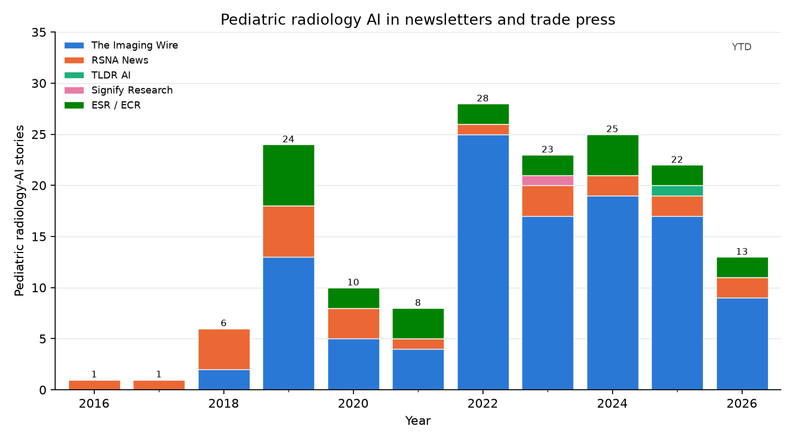
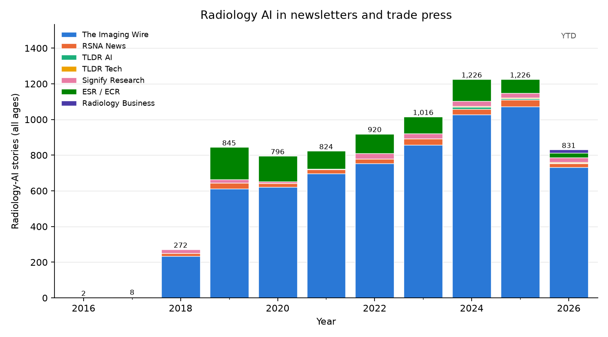
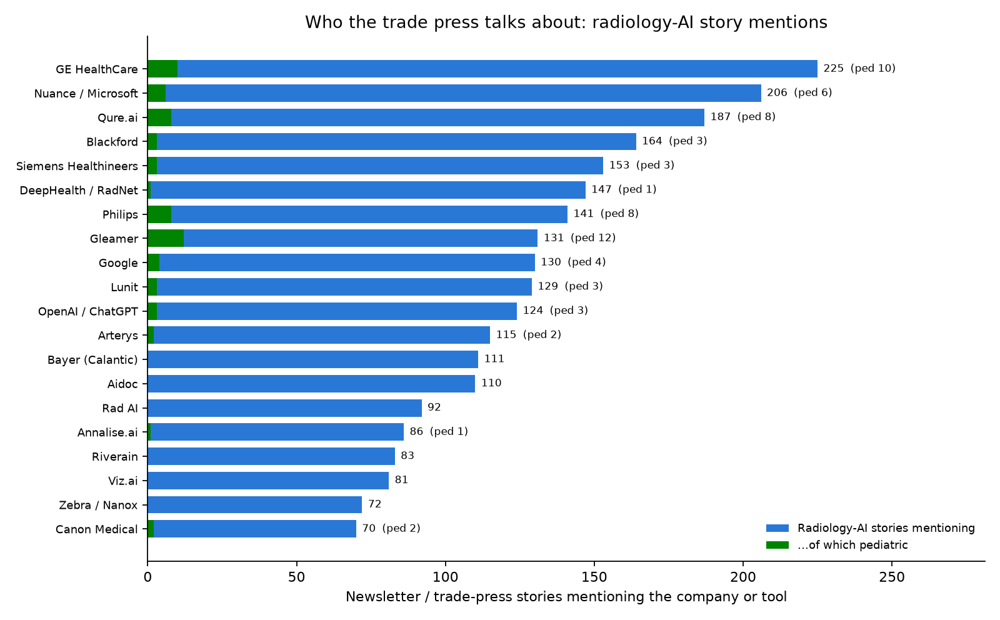

# Pediatric Radiology AI in the News: Newsletter and Trade-Press Watch

_Auto-generated from the public archives of 7 newsletters / news sites, collected 2026-09-09. The peer-reviewed literature lags practice by a year or more; this is the companion view of what the field is talking about right now._

## Headline

- **161** distinct pediatric-radiology-AI stories found across all archives.
- 2025: **22** stories; 2026 year-to-date: **13**.
- In The Imaging Wire (the deepest archive, 2018-2026), pediatric stories are **1.7%** of all radiology-AI stories — the trade-press analogue of the pediatric share of the literature.
- In RSNA News, pediatric stories are **10.2%** of AI-titled articles.

## How obtained

Each source's public archive was enumerated in full (WordPress REST API, the RSNA News archive page, TLDR's dated daily pages, or an RSS feed), every issue was split into its individual stories at heading boundaries (and digest lists such as The Imaging Wire's "The Wire" into their bullets), and a story was labelled **pediatric radiology AI** only when a pediatric term (pediatric, child, infant, neonatal, fetal, bone age, ...) and an AI term (AI, deep learning, algorithm, LLM, ...) occur **in the same story**; for sources that are not imaging-specific (TLDR, Signify) a radiology term is also required. Stories re-run across issues are de-duplicated by title. Vocabularies are in `pedrad_ai/config.py` (`NEWS_*_PATTERNS`).

| Source | Archive | Coverage | Issues / articles | Stories | Radiology-AI stories | Pediatric radiology-AI | Pediatric share of AI stories |
|:--|:--|:--|---:|---:|---:|---:|---:|
| [The Imaging Wire](https://theimagingwire.com/newsletters/) | wordpress | 2018-03-22 → 2026-09-02 | 838 | 19327 | 6610 | 111 | 1.7% |
| [RSNA News](https://www.rsna.org/news) | rsna_news | 2014-01-01 → 2026-09-01 | 1890 | 1872 | 246 | 25 | 10.2% |
| [TLDR AI](https://tldr.tech/ai/archives) | tldr | 2024-01-02 → 2026-09-09 | 696 | 11645 | 23 | 1 | 4.3% |
| [TLDR Tech](https://tldr.tech/tech/archives) | tldr | 2024-01-02 → 2026-09-09 | 702 | 10997 | 13 | 0 | 0.0% |
| [Signify Research](https://www.signifyresearch.net/insights/) | wordpress | 2017-05-16 → 2026-08-10 | 649 | 875 | 199 | 1 | 0.5% |
| [ESR / ECR](https://www.myesr.org/news/) | wordpress | 2019-02-14 → 2026-08-31 | 596 | 1350 | 857 | 23 | 2.7% |
| [Radiology Business](https://radiologybusiness.com) | rss | 2026-08-11 → 2026-09-09 | 100 | 100 | 19 | 0 | 0.0% |

_Coverage notes:_

- RSNA News: article bodies are fetched only for titles that already carry a pediatric or AI term; the radiology-AI denominator is therefore title-based.
- TLDR has no archive listing, so its daily pages are enumerated from 2024-01-01; weekend/holiday dates are skipped.
- RSS sources (Radiology Business, Health Imaging) expose only their most recent items, so they contribute recency, not history.
- ESR / ECR is the European Society of Radiology news feed plus the ESR AI Blog; ECR congress coverage appears inside the news feed, as there is no machine-readable ECR Today archive.
- Newsletter issues contain sponsor blocks; these are counted as stories, which slightly inflates denominators.
- Not included: [AuntMinnie](https://www.auntminnie.com) (blocks automated clients (HTTP 403)); [Diagnostic Imaging](https://www.diagnosticimaging.com) (blocks automated clients (HTTP 403)); [Health Imaging](https://healthimaging.com) (RSS feed exposes no items; no public archive listing); [RSNA AI newsletter / journal e-alerts](https://www.rsna.org) (email-only, no public archive; RSNA News is used instead).

## Pediatric radiology-AI stories by year and source

| Year | The Imaging Wire | RSNA News | TLDR AI | TLDR Tech | Signify Research | ESR / ECR | Radiology Business | Total |
|---:|---:|---:|---:|---:|---:|---:|---:|---:|
| 2016 | 0 | 1 | 0 | 0 | 0 | 0 | 0 | 1 |
| 2017 | 0 | 1 | 0 | 0 | 0 | 0 | 0 | 1 |
| 2018 | 2 | 4 | 0 | 0 | 0 | 0 | 0 | 6 |
| 2019 | 13 | 5 | 0 | 0 | 0 | 6 | 0 | 24 |
| 2020 | 5 | 3 | 0 | 0 | 0 | 2 | 0 | 10 |
| 2021 | 4 | 1 | 0 | 0 | 0 | 3 | 0 | 8 |
| 2022 | 25 | 1 | 0 | 0 | 0 | 2 | 0 | 28 |
| 2023 | 17 | 3 | 0 | 0 | 1 | 2 | 0 | 23 |
| 2024 | 19 | 2 | 0 | 0 | 0 | 4 | 0 | 25 |
| 2025 | 17 | 2 | 1 | 0 | 0 | 2 | 0 | 22 |
| 2026 (YTD) | 9 | 2 | 0 | 0 | 0 | 2 | 0 | 13 |

Pediatric share of The Imaging Wire's radiology-AI stories, by year:

| Year | Radiology-AI stories | Pediatric | Share |
|---:|---:|---:|---:|
| 2018 | 234 | 2 | 0.9% |
| 2019 | 613 | 13 | 2.1% |
| 2020 | 622 | 5 | 0.8% |
| 2021 | 696 | 4 | 0.6% |
| 2022 | 754 | 25 | 3.3% |
| 2023 | 857 | 17 | 2.0% |
| 2024 | 1028 | 19 | 1.8% |
| 2025 | 1073 | 17 | 1.6% |
| 2026 (YTD) | 733 | 9 | 1.2% |

## Who the trade press talks about

Stories mentioning each company or tool, over all radiology-AI stories and the pediatric subset (sponsor blocks and round-ups mentioning more than five players excluded). A third importance signal next to citations and GitHub stars.

| Company / tool | Radiology-AI stories | ...of which pediatric |
|:--|---:|---:|
| GE HealthCare | 225 | 10 |
| Nuance / Microsoft | 206 | 6 |
| Qure.ai | 187 | 8 |
| Blackford | 164 | 3 |
| Siemens Healthineers | 153 | 3 |
| DeepHealth / RadNet | 147 | 1 |
| Philips | 141 | 8 |
| Gleamer | 131 | 12 |
| Google | 130 | 4 |
| Lunit | 129 | 3 |
| OpenAI / ChatGPT | 124 | 3 |
| Arterys | 115 | 2 |
| Bayer (Calantic) | 111 | 0 |
| Aidoc | 110 | 0 |
| Rad AI | 92 | 0 |
| Annalise.ai | 86 | 1 |
| Riverain | 83 | 0 |
| Viz.ai | 81 | 0 |
| Zebra / Nanox | 72 | 0 |
| Canon Medical | 70 | 2 |
| Enlitic | 68 | 0 |
| iCAD | 65 | 0 |
| Nvidia | 58 | 2 |
| Fujifilm | 52 | 3 |
| Subtle Medical | 51 | 1 |

## What the news is about

Topic tags are keyword-based and overlapping (a story can carry several). Counts are stories, all sources, all years.

| Topic | Stories |
|:--|---:|
| appendicitis / abdomen / ultrasound | 52 |
| fetal / neonatal brain MRI | 39 |
| funding / business | 37 |
| regulatory / FDA clearance | 29 |
| chest / pneumonia | 28 |
| fracture / trauma / abuse | 26 |
| CT dose / reconstruction | 23 |
| cancer / oncology | 22 |
| bone age / skeletal maturity | 15 |
| cardiac / echo | 11 |
| scoliosis / MSK | 7 |
| LLMs / report generation | 3 |

## The stories (most recent first)

### 2026

- **2026-08-25** · RSNA News · [AI Challenges Fuel Innovation Beyond the Leaderboard](https://www.rsna.org/news/2026/august/ai-challenges-fuel-innovation) _[bone age / skeletal maturity, fracture / trauma / abuse, chest / pneumonia, appendicitis / abdomen / ultrasound, funding / business]_  
  …ues from Brazil partnered with a team of computer scientists and AI engineers from Universidade Federal de Goiás in Brazil.  Dr. Kitamura describes RSNA’s 2017 Pediatric Bone Age Challenge as an exhilarating experience that combined earnest research and le…
- **2026-08-16** · The Imaging Wire · [CT vs. MRI for Pediatric TBI, Helium Vulnerability, and Ditching the Disk](https://theimagingwire.com/newsletter/ct-vs-mri-for-pediatric-tbi-surveillance/)  
  Radiology organizations are looking to replace legacy reporting solutions with new technology that will serve as their operational foundation for years to come. Join The Imaging Wire and Microsoft on Monday, August 24, at 12:00 PM ET for an exclusive custom…
- **2026-07-12** · The Imaging Wire · [The Wire · AI’s Rise in Pediatric Imaging:](https://theimagingwire.com/newsletter/sensible-approach-to-supervising-radiology-ai/) _[bone age / skeletal maturity]_ · paper: [Shah et al., 2026 (European Radiology)](https://doi.org/10.1007/s00330-026-12728-9)  
  AI’s Rise in Pediatric Imaging: Despite ample research on AI use in radiology, scant data has emerged on how the technology impacts pediatric imaging. New survey results in European…
- **2026-06-28** · The Imaging Wire · [The Wire · BrightHeart’s Bright Future:](https://theimagingwire.com/newsletter/interventional-work-changes-heat-wave-melts-mri-and-aidoc-breakthrough/) _[fetal / neonatal brain MRI, appendicitis / abdomen / ultrasound, regulatory / FDA clearance]_ · paper: [Zelop et al., 2025 (Obstetrics & Gynecology)](https://doi.org/10.1097/aog.0000000000006027)  
  BrightHeart’s Bright Future: Having received the CE mark, BrightHeart is set to make the EU debut of their AI-driven fetal ultrasound solution at FMF 2026 conference this week. A 2025 Obstetrics & Gynecology study showed the software’s capability to identif…
- **2026-06-22** · RSNA News · [Researchers Use AI to Establish Body Charts for CT Imaging Across the Adult Lifespan](https://www.rsna.org/news/2026/june/ai-body-charts-for-ct-imaging) _[chest / pneumonia, funding / business]_  
  …adulthood,” he said.   Turning Routine CT Data Into Reference Charts  Reference charts have long been used to compare individual patients to population norms. Pediatric growth charts and MRI-based brain charts offer those such benchmarks, yet no equivalent…
- **2026-05-10** · The Imaging Wire · [Pediatric MRI Safety, RTs and Remote Radiology, and PSMA-PET](https://theimagingwire.com/newsletter/pediatric-mri-safety/) _[cardiac / echo]_  
  Welcome to issue #800 of The Imaging Wire !   This week’s milestone is a good time to look back on the progress our little newsletter has made since its founding by CEO Jake Fishman in a San Diego coffee shop eight years ago.   The Imaging Wire and parent c…
- **2026-03-29** · The Imaging Wire · [The Wire · Ultrasound AI Gets Breakthrough Nod:](https://theimagingwire.com/newsletter/mammography-use-falls/) _[fetal / neonatal brain MRI, appendicitis / abdomen / ultrasound, regulatory / FDA clearance, funding / business]_  
  …ed by DeepEcho. The company’s Blind Sweep Platform guides users through acquisition of B-mode ultrasound scans, automating the acquisition of measurements like fetal presentation, placental location, and gestational age. DeepEcho will continue working with…
- **2026-02-26** · ESR / ECR · [MRI Unveiling at the](https://www.myesr.org/bracco-and-the-european-society-of-radiology-empower-the-future-of-radiology-at-ecr-2026/) _[fetal / neonatal brain MRI]_  
  …ety of Neuroradiology and Director of the Neuroradiology Unit at the Giannina Gaslini Institute in Genoa, will share perspectives on the use of gadopiclenol in pediatric neuroradiology. Bronwyn E. Hamilton, MD, Professor of Radiology at Oregon Health & Sci…
- **2026-02-08** · The Imaging Wire · [The Wire · GE Bolsters Ultrasound with Fetal AI:](https://theimagingwire.com/newsletter/better-stroke-care-with-ct/) _[fetal / neonatal brain MRI, appendicitis / abdomen / ultrasound]_  
  GE Bolsters Ultrasound with Fetal AI: GE HealthCare is adding new fetal AI capabilities to its Voluson women’s health ultrasound scanners through new algorithms available on its Voluson Solutio…
- **2026-02-01** · The Imaging Wire · [The Wire · DL-Based CT Reduces Radiation Dose:](https://theimagingwire.com/newsletter/good-news-for-mammography-ai/) _[CT dose / reconstruction, cancer / oncology, appendicitis / abdomen / ultrasound]_  
  DL-Based CT Reduces Radiation Dose: New revelations on cancer risk from medical radiation have focused attention on dose reduction, especially for kids. In a new paper in European Journal of Radiology , researchers performed abdominal CT scans on 82 kids us…
- **2026-01-28** · The Imaging Wire · [The Wire · AHA Publishes New Stroke Guidelines:](https://theimagingwire.com/newsletter/ct-lung-screening-for-non-smokers/) · paper: [Prabhakaran et al., 2026 (Stroke)](https://doi.org/10.1161/str.0000000000000513)  
  …ns of interest to the radiology community include a section on mobile stroke units (recommended), as well as the inclusion for the first time of guidelines for pediatric stroke (MRI is recommended for diagnosis). But the report declines to recommend the in…
- **2026-01-28** · ESR / ECR · [Guerbet: Innovation and French Cooperation in the Spotlight at ECR 2026](https://www.myesr.org/guerbet-innovation-and-french-cooperation-in-the-spotlight-at-ecr-2026/) _[chest / pneumonia, CT dose / reconstruction, regulatory / FDA clearance, scoliosis / MSK]_  
  …piclenol), our macrocyclic gadolinium-based contrast agent. If approved by the European Commission, Elucirem™ (gadopiclenol) will be indicated in adults and in children from birth, for contrast-enhanced magnetic resonance imaging (MRI) to improve detection…
- **2026-01-07** · The Imaging Wire · [The Wire · BrightHeart Raises €11M:](https://theimagingwire.com/newsletter/top-2026-radiology-trends/) _[cardiac / echo, appendicitis / abdomen / ultrasound, regulatory / FDA clearance, funding / business]_  
  …ghtHeart Raises €11M: BrightHeart raised €11M ($12.9M) in a Series A round to further commercialize its AI technology for detecting congenital heart defects on prenatal ultrasound exams. The company has received five FDA clearances and is ramping up its pe…
### 2025

- **2025-11-09** · The Imaging Wire · [The Wire · AI Detects Pediatric Elbow Fractures:](https://theimagingwire.com/newsletter/imaging-news-from-aha-2025/) _[fracture / trauma / abuse]_  
  AI Detects Pediatric Elbow Fractures: Gleamer’s BoneView AI solution helped emergency physicians in France detect pediatric elbow fractures in a new paper in EJR . Researchers used…
- **2025-10-08** · The Imaging Wire · [Reducing CT Radiation Dose System-Wide](https://theimagingwire.com/newsletter/reducing-ct-radiation-dose/) _[CT dose / reconstruction, cancer / oncology, cardiac / echo]_  
  …rsial, but most established models connect low-level radiation to cancer formation.  The debate heated up this year with a September study linking radiation to pediatric blood cancers , following research in April claiming CT radiation would account for 5%…
- **2025-10-01** · The Imaging Wire · [The Wire · Carebot Expands AI Portfolio:](https://theimagingwire.com/newsletter/emergency-ct-use-booms/) _[bone age / skeletal maturity, fracture / trauma / abuse, chest / pneumonia]_  
  …es the company’s flagship Carebot AI CXR algorithm for analyzing chest X-rays, but also includes applications for head CT and lung CT, bone fracture detection, bone age assessment, and skeletal measurement. The move reflects the recent trend of AI develope…
- **2025-08-27** · The Imaging Wire · [The Wire · Sonio Launches New Maternal-Fetal AI Options:](https://theimagingwire.com/newsletter/cardiac-cts-long-term-promise/) _[fetal / neonatal brain MRI, funding / business]_  
  Sonio Launches New Maternal-Fetal AI Options: Sonio has segmented its flagship AI software for maternal-fetal medicine (also called Sonio) to create new price points. Sonio Start, Sonio Plus, S…
- **2025-08-13** · The Imaging Wire · [AI-Assisted Fracture Detection](https://theimagingwire.com/newsletter/lessons-from-heartflows-ipo/) _[fracture / trauma / abuse]_  
  AI-Assisted Fracture Detection  Gleamer’s BoneView AI solution helped radiologists detect fractures on radiographs of both adults and children in a meta-analysis of eight studies. Discover how it can help your practice today .
- **2025-08-03** · The Imaging Wire · [Radiologist Pay Jumps Nearly 8% in New Survey](https://theimagingwire.com/newsletter/radiologist-pay-jumps/)  
  …s list of highest-compensated specialties in 2024, slipping a couple positions compared to the 9th spot in last year’s survey.   Moving ahead of radiology were pediatric (general) surgery and interventional radiology, two new physician categories added wit…
- **2025-07-10** · RSNA News · [How Is AI Being Used in Daily Neuroradiology Practice?](https://www.rsna.org/news/2025/july/ai-in-daily-neuroradiology-practice) _[fracture / trauma / abuse, CT dose / reconstruction, cancer / oncology, regulatory / FDA clearance, LLMs / report generation, funding / business]_  
  …diology, only about 126 FDA-cleared products exist, and few of them relate to brain tumor imaging,” said Mariam S. Aboian, MD, PhD, an attending radiologist at Children’s Hospital of Philadelphia.  As Dr. Aboian noted, one possible area where AI tools coul…
- **2025-07-03** · The Imaging Wire · [The Wire · DeepEcho Gets FDA Nod for Fetal AI:](https://theimagingwire.com/newsletter/top-6-radiology-trends-cardiac-mri-and-pollution/) _[fetal / neonatal brain MRI, appendicitis / abdomen / ultrasound, regulatory / FDA clearance]_  
  DeepEcho Gets FDA Nod for Fetal AI: DeepEcho received FDA 510(k) clearance to market its AI software for analyzing fetal ultrasound scans . DeepEcho is indicated for use as a concurrent readi…
- **2025-06-01** · The Imaging Wire · [The Wire · BrightHeart’s 3rd FDA Clearance:](https://theimagingwire.com/newsletter/ct-use-and-radiation-exposure/) _[fetal / neonatal brain MRI, appendicitis / abdomen / ultrasound, regulatory / FDA clearance]_  
  …d FDA Clearance: Notching BrightHeart’s third FDA clearance in less than a year, the FDA granted 510(k) clearance for its B-Right Views software for automating fetal heart ultrasound. B-Right Views uses AI to automatically detect the standard views for sec…
- **2025-05-20** · RSNA News · [Radiologists Share Tips to Prevent AI Bias](https://www.rsna.org/news/2025/may/tips-to-prevent-ai-bias) _[chest / pneumonia, funding / business]_  
  …d lead author Paul H. Yi, MD, associate member (associate professor) in the Department of Radiology and director of Intelligent Imaging Informatics at St. Jude Children’s Research Hospital in Memphis, TN. “However, AI algorithms can sometimes exhibit biase…
- **2025-05-18** · The Imaging Wire · [The Wire · New GE Clearances:](https://theimagingwire.com/newsletter/imaging-workload-jumps/) _[CT dose / reconstruction, cardiac / echo, appendicitis / abdomen / ultrasound, regulatory / FDA clearance, funding / business]_  
  …erventional radiology system. The solution removes streak artifacts caused by arterial blood flow during CBCT acquisitions. Separately, GE got FDA approval for pediatric echocardiography indications with its Optison ultrasound contrast agent.
- **2025-05-14** · The Imaging Wire · [The Wire · Philips Partners with NVIDIA on AI for MRI:](https://theimagingwire.com/newsletter/industry-news-from-ismrm-2025/) _[chest / pneumonia, regulatory / FDA clearance]_  
  …ges and adjust quality and speed parameters. In other Philips ISMRM news, the company extended its partnership with Polarean for xenon lung function imaging to children as young as six (pending FDA clearance).
- **2025-04-13** · The Imaging Wire · [The Wire · GE’s Cincinnati Pediatric Partnership:](https://theimagingwire.com/newsletter/getting-paid-for-ai/) _[appendicitis / abdomen / ultrasound]_  
  GE’s Cincinnati Pediatric Partnership: GE HealthCare partnered with Cincinnati Children’s Hospital on a research collaboration to advance pediatric imaging across multiple modalities. T…
- **2025-04-02** · The Imaging Wire · [The Wire · AZmed Gets New Chest AI Clearances:](https://theimagingwire.com/newsletter/in-office-image-reading/) _[fracture / trauma / abuse, chest / pneumonia, regulatory / FDA clearance]_  
  …e” brand to cover its entire product portfolio and renaming specific clinical applications as AZchest and AZtrauma, which was cleared for fracture detection in kids in 2024 and in adults in 2022 .
- **2025-03-04** · TLDR AI · [AI to diagnose invisible brain abnormalities in children with epilepsy (4 minute read)](https://tldr.tech/ai/2025-03-04)  
  AI to diagnose invisible brain abnormalities in children with epilepsy (4 minute read)  MELD Graph, an AI tool developed by researchers at King's College London and UCL, detects 64% of epilepsy-linked brain abnorm…
- **2025-02-27** · The Imaging Wire · [The Wire · AI Detects Pediatric Epilepsy:](https://theimagingwire.com/newsletter/highlights-from-ecr-2025/) _[fetal / neonatal brain MRI]_  
  AI Detects Pediatric Epilepsy: In a new paper in JAMA Neurology , U.K. researchers developed a homegrown AI algorithm called MELD Graph to detect signs of epilepsy on pediatric bra…
- **2025-02-14** · ESR / ECR · [Learn more about FUJIFILM’s latest innovations at ECR!](https://www.myesr.org/changing-mindsets-for-patients-and-the-planet/) _[cancer / oncology]_ · paper: [Iwan et al., 2020 (European Radiology)](https://doi.org/10.1007/s00330-020-07060-9)  
  …QUALITY  Learn about how reducing anxiety in the diagnostic process can make a huge difference to MRI patient wellbeing and to imaging results, especially with paediatric patients and those with claustrophobia.  “Claustrophobia is estimated to occur in 2.1…
- **2025-02-06** · ESR / ECR · [Philips at #ECR2025: New AI-enabled systems, intelligent software, and imaging cloud services streamline radiology workflows, advance clinical insights](https://www.myesr.org/philips-at-ecr2025-new-ai-enabled-systems-intelligent-software-and-imaging-cloud-services-streamline-radiology-workflows-advance-clinical-insights/) _[CT dose / reconstruction, cardiac / echo, appendicitis / abdomen / ultrasound, regulatory / FDA clearance, funding / business]_  
  …ss the growing need for faster workflows and more efficient diagnostic processes. With over 100+ new image quality pre-sets for abdomen, vascular, small parts, pediatrics, and OB/GYN, both systems feature advanced automation and algorithms to deliver great…
- **2025-02-02** · The Imaging Wire · [The Wire · Ultrasound AI Detects Fetal Defects:](https://theimagingwire.com/newsletter/pe-purchases-in-radiology/) _[fetal / neonatal brain MRI, cardiac / echo, appendicitis / abdomen / ultrasound, regulatory / FDA clearance]_  
  Ultrasound AI Detects Fetal Defects: BrightHeart’s AI algorithm for analyzing fetal ultrasound scans helped clinicians detect congenital heart defects. In a study presented at the Society…
- **2025-01-29** · The Imaging Wire · [The Wire · Samsung Launches OB/GYN Ultrasound:](https://theimagingwire.com/newsletter/vc-funding-booms-for-radiology-startups/) _[fetal / neonatal brain MRI, appendicitis / abdomen / ultrasound, funding / business]_  
  Samsung Launches OB/GYN Ultrasound: Samsung Medison launched a new premium OB/GYN ultrasound scanner for the U.S. at this week’s Society for Maternal-Fetal Medicine meeting. Samsung Z20 is an AI-powered system optimized for challenging cases like high BMI p…
- **2025-01-08** · The Imaging Wire · [The Resource Wire · AI for Pediatric Fracture Detection:](https://theimagingwire.com/newsletter/radiology-trends-for-2025/) _[fracture / trauma / abuse]_  
  AI for Pediatric Fracture Detection: Pediatric fractures are common but can be easily missed on radiography. Meanwhile, AI tools for fracture detection have mostly been tested…
- **2025-01-08** · The Imaging Wire · [The Industry Wire · Children’s National taps Microsoft to prototype AI tools .](https://theimagingwire.com/newsletter/radiology-trends-for-2025/)  
  Children’s National taps Microsoft to prototype AI tools .
### 2024

- **2024-12-15** · The Imaging Wire · [The Wire · Researchers Study AI for Pediatric Fractures:](https://theimagingwire.com/newsletter/mobile-mammographys-value/) _[fracture / trauma / abuse]_  
  Researchers Study AI for Pediatric Fractures: U.K. researchers launched a research study to test Gleamer’s BoneView AI solution for detecting pediatric fractures on X-rays. A team led by Susan S…
- **2024-12-02** · The Imaging Wire · [The Wire · Milvue Joins deepc AI Platform:](https://theimagingwire.com/newsletter/mammo-ai-opens-rsna-2024/) _[fracture / trauma / abuse, appendicitis / abdomen / ultrasound, scoliosis / MSK]_  
  …access to TechCare Alert for detecting fractures in the appendicular skeleton and chest; TechCare Bones & Spine for musculoskeletal measurements; and TechCare Kids, which combines pathology detection with bone measurements.
- **2024-11-25** · The Imaging Wire · [The Wire · Fetal Ultrasound AI Cleared:](https://theimagingwire.com/newsletter/ai-post-market-monitoring/) _[fetal / neonatal brain MRI, cardiac / echo, appendicitis / abdomen / ultrasound, regulatory / FDA clearance]_  
  Fetal Ultrasound AI Cleared: French software start-up BrightHeart received FDA clearance for its first AI application, for detecting congenital heart defects on feta…
- **2024-11-19** · RSNA News · [Incorrect AI Advice Influences Diagnostic Decisions](https://www.rsna.org/news/2024/november/ai-influences-diagnostic-decisions) _[chest / pneumonia]_  
  …one of the study’s senior authors, Paul H. Yi, MD, director of intelligent imaging informatics and associate member in the Department of Radiology at St. Jude Children’s Research Hospital in Memphis, TN. “However, a gap between AI proof-of-concept and its…
- **2024-10-17** · ESR / ECR · [On Artificial Intelligence: An interview with Brendan Kelly](https://www.myesr.org/ai-blog/on-artificial-intelligence-an-interview-with-brendan-kelly/) _[CT dose / reconstruction, funding / business]_  
  …were extremely delighted to dive into the topic of artificial intelligence in radiology with Brendan Kelly. With a passion for AI, Kelly is currently an AI and Paediatric Radiology Fellow at Great Ormond Street Hospital for Children NHS Foundation Trust, a…
- **2024-10-10** · The Imaging Wire · [Low-Dose CT in Kids / Hinton Nabs Nobel, Cancels MRI](https://theimagingwire.com/newsletter/low-dose-ct-in-kids-confounds-cad/) _[CT dose / reconstruction]_  
  Together with  “I’m in a cheap hotel in California which doesn’t have a good internet or phone connection. I was going to have an MRI scan today but I’ll have to cancel that!”   AI pioneer and amateur prognosticator Geoffrey Hinton, PhD , on learning he was…
- **2024-10-10** · The Imaging Wire · [Low-Dose CT Confounds CAD in Kids](https://theimagingwire.com/newsletter/low-dose-ct-in-kids-confounds-cad/) _[chest / pneumonia, CT dose / reconstruction, cancer / oncology, funding / business]_ · paper: [Hardie et al., 2025 (American Journal of Roentgenology)](https://doi.org/10.2214/ajr.24.31972)  
  Low-Dose CT Confounds CAD in Kids   When it comes to pediatric CT scans, clinicians should make every effort to reduce dose as much as possible. But a new study in AJR indicates that lower CT radiation dose can affect the…
- **2024-10-06** · The Imaging Wire · [The Wire · Fracture AI Improves Over Time:](https://theimagingwire.com/newsletter/mammography-ai-predicts-cancer/) _[fracture / trauma / abuse]_  
  …r multiple versions. In a study from Spain , researchers tracked the performance of three successive versions of Gleamer’s BoneView algorithm in 2.7k adult and pediatric bone trauma X-rays. The algorithm’s positive predictive value improved 24% (from 57% t…
- **2024-10-03** · ESR / ECR · [On Artificial Intelligence: An interview with Susan Shelmerdine](https://www.myesr.org/ai-blog/on-artificial-intelligence-an-interview-with-susan-shelmerdine/) _[funding / business]_  
  …ificial Intelligence”. Among Shelmerdine’s many accolades are her roles as the Chairperson for the Artificial Intelligence Taskforce at the European Society of Paediatric Radiology as well as the prestigious Roentgen Professorship at The Royal College of R…
- **2024-09-08** · The Imaging Wire · [The Wire · AZmed AI Extended to Kids:](https://theimagingwire.com/newsletter/ct-lung-cancer-screening-5/) _[fracture / trauma / abuse, regulatory / FDA clearance]_  
  AZmed AI Extended to Kids: AI developer AZmed received 510(k) clearance to market its Rayvolve algorithm for fracture detection on pediatric X-rays. Rayvolve was first cleared for adults in June 2022; to support the new clearance, AZmed worked with imaging…
- **2024-09-04** · The Imaging Wire · [The Wire · Samsung Finalizes Sonio Acquisition:](https://theimagingwire.com/newsletter/cardiac-imaging-was-a-hot-topic-at-esc-2024/) _[fetal / neonatal brain MRI, appendicitis / abdomen / ultrasound, regulatory / FDA clearance, funding / business]_  
  …n May . Sonio Detect guides sonographers through prenatal scans in real time to ensure exam completeness while also supporting real-time reporting of potential fetal abnormalities; the software received FDA clearance in 2023, with an updated version cleare…
- **2024-08-25** · The Imaging Wire · [When Follow-Up Falls Short / Pediatric CT Use](https://theimagingwire.com/newsletter/when-follow-up-falls-short/)  
  Together with  “I think it’s great the new generation doesn’t want to take care of the ever increasing old and sick people given how physicians have been turned to poop over the [l]ast few decades. They can triple the reimbursement to doctors if they want t…
- **2024-08-25** · The Imaging Wire · [The Wire · MAUI Emerges from Stealth:](https://theimagingwire.com/newsletter/when-follow-up-falls-short/) _[fracture / trauma / abuse, fetal / neonatal brain MRI, appendicitis / abdomen / ultrasound, regulatory / FDA clearance]_  
  …MAUI received a $4M grant from the U.S. Department of Defense to develop the technology for trauma medicine, but it also has applications for fetal, abdominal, pediatric, small organ, and other uses.
- **2024-08-14** · The Imaging Wire · [The Wire · Cardiac Ultrasound Scanner Cleared:](https://theimagingwire.com/newsletter/two-for-one-ct-screening/) _[cardiac / echo, appendicitis / abdomen / ultrasound, regulatory / FDA clearance]_  
  …clearance for Acuson Origin, a cardiovascular ultrasound scanner with AI-powered features. The system is targeted at a range of cardiac applications, including pediatric, structural heart, vascular, and EP exams, and includes the company’s 2D and 4D Heart…
- **2024-07-10** · RSNA News · [Experts Outline Considerations to Deploy AI in Radiology](https://www.rsna.org/news/2024/july/deploying-ai-in-radiology) _[regulatory / FDA clearance, funding / business]_  
  …ols into clinical radiology practice,” said lead author Marius George Linguraru, DPhil, Connor Family Professor and Endowed Chair of Research and Innovation at Children's National Hospital. “AI tools can play a key role in radiology, but radiologists must…
- **2024-07-01** · ESR / ECR · [AI applications in musculoskeletal imaging](https://www.myesr.org/ai-blog/ai-applications-in-musculoskeletal-imaging/) _[bone age / skeletal maturity, fracture / trauma / abuse, cancer / oncology, scoliosis / MSK]_  
  …w provides an overview of the clinical applications of AI in musculoskeletal imaging, diving into specific areas of musculoskeletal disorders including trauma, bone age estimation, bone and soft-tissue tumors, and orthopedic implant-related pathology. An i…
- **2024-06-29** · The Imaging Wire · [The Wire · FDA Clears New Clarius Prenatal App:](https://theimagingwire.com/newsletter/top-4-trends-at-siim-2024/) _[fetal / neonatal brain MRI, appendicitis / abdomen / ultrasound, regulatory / FDA clearance]_  
  …eloper Clarius Mobile Health received FDA clearance for Clarius OB AI , a new software application for OB prenatal applications. The app automatically performs fetal biometry measurements to estimate fetal age, weight, and growth intervals, and runs on the…
- **2024-05-19** · The Imaging Wire · [The Wire · Early Preeclampsia Risk Screening:](https://theimagingwire.com/newsletter/ct-lung-screening-news-from-ats-2024/) _[fetal / neonatal brain MRI, appendicitis / abdomen / ultrasound]_ · paper: [Guerby et al., 2024 (Hypertension)](https://doi.org/10.1161/hypertensionaha.123.22584)  
  Early Preeclampsia Risk Screening: A Fetal Medicine Foundation (FMF) screening algorithm that combines biophysical, biochemical, and ultrasound markers successfully detected preeclampsia risk in early p…
- **2024-04-22** · The Imaging Wire · [The Wire · GE Launches US Scanners:](https://theimagingwire.com/newsletter/ct-changes-headache-workup/) _[fetal / neonatal brain MRI, appendicitis / abdomen / ultrasound]_  
  …include new AI tools and functionality, such as a “HeyVoluson” voice command feature and the SonoLyst suite of tools for identifying, annotating, and measuring fetal anatomy. Other features include tools for pelvic floor measurements and fibroid mapping, a…
- **2024-03-20** · The Imaging Wire · [The Resource Wire · AI Helps Residents Detect Fractures:](https://theimagingwire.com/newsletter/radiology-ais-roi/) _[fracture / trauma / abuse]_  
  AI Helps Residents Detect Fractures: Gleamer’s BoneView AI algorithm helped radiology residents detect fractures on adult and pediatric radiographs. Learn more about how it worked in this research summary.
- **2024-02-07** · The Imaging Wire · [Meet Gleamer at ECR 2024](https://theimagingwire.com/newsletter/mri-for-prostate-screening/) _[fracture / trauma / abuse]_  
  Meet Gleamer at ECR 2024  Learn all about Gleamer and its portfolio of AI solutions, including its BoneView algorithm for detecting fractures in adults and children, at the upcoming ECR 2024 conference. Schedule a meeting today .
- **2024-01-20** · The Imaging Wire · [The Wire · Us2.ai](https://theimagingwire.com/newsletter/out-of-network-radiology-claims/) _[funding / business]_  
  Us2.ai ’s Echo AI Platform Play: Last week’s news of Children’s National and Us2.ai ’s rheumatic heart disease screening initiative , also revealed Us2.ai ’s promising new pathway for bringing custom echo AI applicatio…
- **2024-01-17** · The Imaging Wire · [The Wire · Echo AI’s RHD Impact:](https://theimagingwire.com/newsletter/breast-cancer-mortality-drop/) _[appendicitis / abdomen / ultrasound]_ · paper: [Brown et al., 2024 (Journal of the American Heart Association)](https://doi.org/10.1161/jaha.123.031257)  
  …art disease, especially in developing countries. The article detailed a new echo AI solution developed by Children’s National and Us2.ai that could help detect pediatric RHD while it’s still easily treatable with penicillin ( currently 90% accuracy ), pote…
- **2024-01-15** · ESR / ECR · [Hidden health risks of endocrine disruptors?](https://www.myesr.org/hidden-health-risks-of-endocrine-disruptors/) _[CT dose / reconstruction]_  
  …ortium of 11 partner institutions from seven countries. “Our research project is based on several European cohort population studies, including the LiNA mother–child study established at the UFZ. This provides us with a wealth of data”. Because the biosamp…
- **2024-01-10** · The Imaging Wire · [AI Models Go Head-to-Head in Project AIR Study](https://theimagingwire.com/newsletter/ai-models-tested/) _[bone age / skeletal maturity, fracture / trauma / abuse, chest / pneumonia, funding / business]_ · paper: [van Leeuwen et al., 2024 (Radiology)](https://doi.org/10.1148/radiol.230981)  
  …Centre in the Netherlands invited AI developers to participate, with nine products from eight vendors validated from June 2022 to January 2023: two models for bone age prediction and seven algorithms for lung nodule assessment (one vendor participated in b…
### 2023

- **2023-12-11** · ESR / ECR · [Revolutionising paediatric radiology: the future impact of AI](https://www.myesr.org/ai-blog/revolutionising-paediatric-radiology-the-future-impact-of-ai/) _[funding / business]_  
  …option of artificial intelligence (AI) within the subspecialties of radiology and whether it has a fixed role in radiology’s future; this is especially true in paediatric radiology. Factors such as a lack of trust in AI applications and a lack of IT infras…
- **2023-11-26** · The Imaging Wire · [The Wire · AI of MRI Diagnoses Autism:](https://theimagingwire.com/newsletter/welcome-to-rsna-2023/) _[fetal / neonatal brain MRI]_  
  AI of MRI Diagnoses Autism: In another presentation from RSNA , researchers showed how an AI algorithm that analyzed brain MRI scans of children ages 24-48 months was able to diagnose autism at an early stage. The algorithm analyzes diffusion tensor MRI (DT…
- **2023-11-12** · The Imaging Wire · [Uneven Success Against Breast Cancer / Pediatric Radiation](https://theimagingwire.com/newsletter/uneven-success-against-breast-cancer/) _[cancer / oncology]_  
  “It’s been death by a thousand cuts. The fact that we can still do quite well reading higher volumes is part of the problem.”   JD4540 in the radHQ.net forums , in a post on cuts in Medicare reimbursement.   Imaging Wire Sponsors  Bayer • Blackford • CARPL.…
- **2023-11-08** · The Imaging Wire · [The Wire · Philips to Expand AI-Powered POCUS:](https://theimagingwire.com/newsletter/ct-lung-screening-benefit/) _[fetal / neonatal brain MRI, funding / business]_  
  …ner for guiding obstetric care; the new grant will expand the project globally and brings the total funding to $60M. Lumify will help non-experts perform early fetal scans by automating image acquisition and/or image interpretation.
- **2023-11-08** · The Imaging Wire · [The Resource Wire · Stories of Success in Cloud and AI:](https://theimagingwire.com/newsletter/ct-lung-screening-benefit/)  
  …for a symposium at 9:30 am on Monday November 27 to hear stories of innovation, success, and best practices from Alex Towbin, MD, associate CMIO of Cincinnati Children’s Hospital, and Randy Hicks, MD, CEO of Regional Medical Imaging.
- **2023-10-08** · The Imaging Wire · [The Wire · ChatGPT Reports for Patients:](https://theimagingwire.com/newsletter/generative-ai-language-model/) _[LLMs / report generation]_ · paper: [Jeblick et al., 2023 (European Radiology)](https://doi.org/10.1007/s00330-023-10213-1)  
  …friendly radiology reports. In European Radiology , German researchers asked ChatGPT to create three fictitious radiology reports that could be understood by a child. Fifteen radiologists rated the reports’ quality, finding them to be factually accurate an…
- **2023-09-20** · The Imaging Wire · [The Wire · GE Lands $44M AI Ultrasound Grant:](https://theimagingwire.com/newsletter/ai-and-breast-mri/) _[chest / pneumonia, fetal / neonatal brain MRI, appendicitis / abdomen / ultrasound, funding / business]_  
  …untries that will help healthcare professionals without specialized training in ultrasound perform scans, with a focus on maternal and fetal care as well as in pediatric lung health. Leading the research will be Caption Health, the ultrasound AI company th…
- **2023-08-02** · The Imaging Wire · [The Wire · MRI Radiomics Hones in on Crohn’s:](https://theimagingwire.com/newsletter/ai-cuts-mammo-workload/) · paper: [Liu et al., 2024 (American Journal of Roentgenology)](https://doi.org/10.2214/ajr.23.29812)  
  MRI Radiomics Hones in on Crohn’s: A radiomics model that combined AI analysis of non-contrast MRI scans with clinical features like lab tests outperformed pediatric radiologists for diagnosing Crohn’s disease, a GI condition typically first diagnosed with…
- **2023-08-02** · The Imaging Wire · [The Wire · Sonio Gets FDA Nod for Fetal AI:](https://theimagingwire.com/newsletter/ai-cuts-mammo-workload/) _[fetal / neonatal brain MRI, appendicitis / abdomen / ultrasound, regulatory / FDA clearance, funding / business]_  
  Sonio Gets FDA Nod for Fetal AI: In a major milestone, French prenatal ultrasound AI developer Sonio has received FDA clearance for its Sonio Detect software. Sonio Detect guides sonograph…
- **2023-07-07** · RSNA News · [Survivors of Childhood Cancer: Risk of Future Disease, Screening Needs and the Role of Radiology](https://www.rsna.org/news/2023/july/screenings-for-childhood-cancer-survivors) _[CT dose / reconstruction, cancer / oncology]_  
  …l treatment of primary childhood cancer may create a false sense of security,” Dr. Gao added. “Continuity of care may also be disrupted when transitioning from pediatric to adult medical care, with timely screening often overlooked.”   Ensuring Consistent…
- **2023-06-25** · The Imaging Wire · [The Wire · AI Detects Child Abuse on CT](https://theimagingwire.com/newsletter/theranostics-grabs-snmmi-spotlight/) _[fracture / trauma / abuse]_  
  AI Detects Child Abuse on CT : AI algorithms could be used to detect subtle signs of child abuse on pediatric brain CT scans that might otherwise be missed, says a new paper in JAMA Network Open . Researchers developed a deep learning model to analyze CT sc…
- **2023-06-19** · The Imaging Wire · [Better Together at SIIM](https://theimagingwire.com/newsletter/better-together-at-siim/)  
  …n. Unfortunately, the research suggests otherwise:   Numerous studies have demonstrated the negative effect that the isolation of the COVID pandemic has had on adolescent mental health and academic performance   Loneliness can also have a negative effect o…
- **2023-06-12** · RSNA News · [Understanding the Imaging Spectrum of non-Hodgkin Lymphoma in Children, Adolescents and Young Adults](https://www.rsna.org/news/2023/june/pediatric-non-hodgkin-lymphoma-imaging) _[CT dose / reconstruction, cancer / oncology, funding / business]_  
  …sed guidelines around the role of imaging with regard to staging, prognosis, treatment and follow-up. This may be because of variability in referral patterns, (pediatric vs. adult health care facilities) and inconsistent treatment protocols.   “Age is an i…
- **2023-06-07** · The Imaging Wire · [The Wire · BrightHeart’s Fetal Heart AI:](https://theimagingwire.com/newsletter/mayos-ai-model/) _[fetal / neonatal brain MRI, appendicitis / abdomen / ultrasound, funding / business]_  
  BrightHeart’s Fetal Heart AI: Paris-based ultrasound AI startup BrightHeart launched to help clinicians catch the 70% of congenital fetal heart defects that go undetected. BrightH…
- **2023-05-07** · The Imaging Wire · [The Wire · New C-Arm Launched:](https://theimagingwire.com/newsletter/learning-curve-in-dbt-screening/) _[fracture / trauma / abuse, CT dose / reconstruction]_  
  …s a cost-effective option for minimally invasive procedures in orthopedics, trauma, and other surgical areas. Zenition 10 includes a DSA capability, a low-dose pediatric mode, and image processing algorithms to reduce metal implant artifacts. The new C-arm…
- **2023-04-12** · Signify Research · [Where do opportunities exist?](https://www.signifyresearch.net/2023/04/12/circle-square-digital-health-trends-march-2023/) _[fetal / neonatal brain MRI, funding / business]_  
  …y (GTG) traces, mother and baby’s heart rates, contraction rate and/or fetal movement. Notable is the System C Healthcare acquisition of Scottish maternity and neonatal specialist Clevermed (Feb, 2023).  EDIS: Conversely, the Emergency Department Informati…
- **2023-04-12** · RSNA News · [RSNA Webinar to Examine Impact of Large Language Models](https://www.rsna.org/news/2023/april/chatgpt-webinar) _[LLMs / report generation]_  
  …nheur Children's Hospital, University of Tennessee Health Science Center   Jonathan Elias, MD – Weill Cornell Medical College, Cornell University and attending pediatrician, New York Presbyterian Hospital   Keith D. Hentel, MD, MS – New York Presbyterian H…
- **2023-04-07** · The Imaging Wire · [Ultrasound Spots Breech Pregnancies](https://theimagingwire.com/newsletter/ultrasound-scans-on-pregnant-women/) _[fetal / neonatal brain MRI, appendicitis / abdomen / ultrasound]_ · paper: [Knights et al., 2023 (PLOS Medicine)](https://doi.org/10.1371/journal.pmed.1004192)  
  …breech presentation dropped from 14.2% to 2.8% with conventional ultrasound and from 16.2% to 3.5% with POCUS.  The scans also had an impact on babies’ health. Infants born at either facility had less likelihood of a lower Apgar score (<7) five minutes aft…
- **2023-04-07** · The Imaging Wire · [The Resource Wire · When Sao Paolo’s Diagnosticos da America SA (DASA, the world’s fourth largest di](https://theimagingwire.com/newsletter/ultrasound-scans-on-pregnant-women/) _[chest / pneumonia]_  
  When Sao Paolo’s Diagnosticos da America SA (DASA, the world’s fourth largest diagnostics company) set out to evaluate Qure.ai’s QXR solution for their pediatric chest X-ray workflows, they leveraged CARPL.ai’s platform to streamline their evaluation. See h…
- **2023-03-17** · The Imaging Wire · [The Resource Wire · When Sao Paolo’s Diagnosticos da America (DASA, the world’s fourth largest diagn](https://theimagingwire.com/newsletter/med-students-return-to-radiology-match-breaks-records/) _[chest / pneumonia]_  
  When Sao Paolo’s Diagnosticos da America (DASA, the world’s fourth largest diagnostics company) set out to evaluate Qure.ai’s QXR solution for their pediatric chest X-ray workflows, they leveraged CARPL.ai’s platform to streamline their evaluation. See how…
- **2023-03-08** · ESR / ECR · [ECR 2023 – A true celebration of the cycle of life.](https://www.myesr.org/hello-world/)  
  …ing marked by cutting-edge science, invaluable education and unforgettable moments.   With a focus on radiology throughout the human life cycle, extending from prenatal radiology right through to forensic imaging, the scientific programme featured a series…
- **2023-03-01** · The Imaging Wire · [The Wire · Fetal Ultrasound AI Generalizability:](https://theimagingwire.com/newsletter/3788/) _[fetal / neonatal brain MRI, appendicitis / abdomen / ultrasound]_ · paper: [Sendra-Balcells et al., 2023 (Scientific Reports)](https://doi.org/10.1038/s41598-023-29490-3)  
  Fetal Ultrasound AI Generalizability: A new Scientific Reports study suggests that fetal ultrasound deep learning models trained in high-resource regions can general…
- **2023-01-08** · The Imaging Wire · [The Wire · Gestational Age AI:](https://theimagingwire.com/newsletter/radiology-in-2040-leqembis-imaging-impact/) _[fetal / neonatal brain MRI, appendicitis / abdomen / ultrasound]_  
  Gestational Age AI: Google Health researchers developed a trio of fetal ultrasound AI models (still image, video, and ensemble AI) that all improved trained operators’ ability to estimate gestational age. The team developed the AI…
### 2022

- **2022-12-21** · The Imaging Wire · [The Wire · Sonio Scores Another €10M:](https://theimagingwire.com/newsletter/imaging-in-2022-enterprise-imaging-expansion/) _[appendicitis / abdomen / ultrasound, funding / business]_  
  Sonio Scores Another €10M: French prenatal ultrasound AI startup Sonio secured €10M in new funding (€7.5M equity investment, €2.5M grant) that it will use to add features to its platform, support its US…
- **2022-12-04** · The Imaging Wire · [RSNA 2022 Reflections / Pediatric Deprioritization](https://theimagingwire.com/newsletter/rsna-2022-reflections-pediatric-deprioritization/)  
  Together with  “AI is like adolescent sex. They talk more about doing it than actually doing it.”   The immortal Dr. Saurabh Jha’s opening line at last week’s AI After Dark event.   Imaging Wire S…
- **2022-12-04** · The Imaging Wire · [The Wire · Pediatric Deprioritization:](https://theimagingwire.com/newsletter/rsna-2022-reflections-pediatric-deprioritization/) _[regulatory / FDA clearance]_  
  Pediatric Deprioritization: Most imaging AI solutions are only cleared for adult patients, and it appears that these adult AI solutions can inadvertently cause pediatric…
- **2022-11-14** · ESR / ECR · [AI for radiological paediatric fracture assessment](https://www.myesr.org/ai-blog/artificial-intelligence-for-radiological-paediatric-fracture-assessment-a-systematic-review/) _[fracture / trauma / abuse]_  
  …different appearances of the growing skeleton at different ages. In this systematic review, the authors reviewed the available literature on the use of AI for paediatric fracture detection. Additional Key points: Few articles (n=9) were available for revie…
- **2022-10-23** · The Imaging Wire · [The Wire · Pediatric Thyroid Nodule Alternatives:](https://theimagingwire.com/newsletter/proactive-imaging-momentum-high-energy-spect-ct/) _[appendicitis / abdomen / ultrasound]_ · paper: [Yang et al., 2023 (American Journal of Roentgenology)](https://doi.org/10.2214/ajr.22.28231)  
  Pediatric Thyroid Nodule Alternatives: A Duke-led study highlighted TI-RADS and ultrasound AI’s advantages for classifying pediatric thyroid nodules , versus using radio…
- **2022-10-16** · The Imaging Wire · [The Wire · Google’s Fetal Ultrasound AI:](https://theimagingwire.com/newsletter/comprehensive-brain-ct-ai-marrying-screenings/) _[fetal / neonatal brain MRI, appendicitis / abdomen / ultrasound]_ · paper: [Gomes et al., 2022 (Communications Medicine)](https://doi.org/10.1038/s43856-022-00194-5)  
  Google’s Fetal Ultrasound AI: A Google Health-led study highlighted a fetal ultrasound AI model that significantly improved assessments performed using lower-cost handheld ul…
- **2022-10-05** · The Imaging Wire · [A Precision Acquisition / Pediatric Fracture Detection](https://theimagingwire.com/newsletter/a-precision-acquisition-pediatric-fracture-detection/) _[fracture / trauma / abuse, funding / business]_  
  Together with  “They might even go to medical school and learn some anatomy and physiology.”   Rizwan Malik, MBBS in response to a post forecasting that physicians will become technology-focused “medical engineers” in the future.   Imaging Wire Sponsors  an…
- **2022-10-05** · The Imaging Wire · [The Wire · Gleamer’s Pediatric Performance:](https://theimagingwire.com/newsletter/a-precision-acquisition-pediatric-fracture-detection/) _[fracture / trauma / abuse, regulatory / FDA clearance]_ · paper: [Nguyen et al., 2022 (Pediatric Radiology)](https://doi.org/10.1007/s00247-022-05496-3)  
  Gleamer’s Pediatric Performance: A new Pediatric Radiology study highlighted Gleamer’s BoneView AI software’s impact on pediatric fracture detection . Three senior pediatric radio…
- **2022-08-03** · The Imaging Wire · [The Wire · Ultrasound X-Rays:](https://theimagingwire.com/newsletter/a-lung-ct-alliance-the-who-how-of-ai-implementations/) _[appendicitis / abdomen / ultrasound, scoliosis / MSK]_  
  …d an AI algorithm called UXGAN (Ultrasound to X-ray Generative Attentional Network) that creates X-ray-like images from ultrasound exams. In their study of 200 children, the researchers found that the ultrasound-synthesized X-rays produced scoliosis measur…
- **2022-07-20** · The Imaging Wire · [The Wire · Ultrasound AI Cystic Hygroma Detection](https://theimagingwire.com/newsletter/pneumothorax-performance-beating-bi-rads/) _[fetal / neonatal brain MRI, appendicitis / abdomen / ultrasound]_ · paper: [Walker et al., 2022 (PLOS ONE)](https://doi.org/10.1371/journal.pone.0269323)  
  Ultrasound AI Cystic Hygroma Detection : A new study out of The Ottawa Hospital showed that fetal ultrasound AI models could be used to accurately diagnose cystic hygroma during the first trimester. The researchers trained and tested the AI model using 289…
- **2022-07-15** · RSNA News · [MR Scoring Algorithm Can Help Radiologists Determine Next Steps for Renal Masses](https://www.rsna.org/news/2022/july/mri-scoring-for-renal-masses) _[cancer / oncology, appendicitis / abdomen / ultrasound, funding / business]_  
  …al imaging:  Imaging Findings Can Help Guide Ablation of Renal Cell Carcinoma   Study Tracks Key Imaging Features of COVID-19-Related Abdominal Inflammation in Children
- **2022-07-05** · The Imaging Wire · [The Wire · Sonio’s Prenatal Ultrasound Funding:](https://theimagingwire.com/newsletter/imaging-in-h1-becoming-merative/) _[appendicitis / abdomen / ultrasound, regulatory / FDA clearance, funding / business]_  
  Sonio’s Prenatal Ultrasound Funding: French prenatal ultrasound AI startup secured €5M in funding that it will use to enhance its platform, support its FDA clearance and US exp…
- **2022-06-26** · The Imaging Wire · [The Wire · Kids ≠ Small Adults:](https://theimagingwire.com/newsletter/ai-experiences-expectations-echo-goes-home/) · paper: [Shin et al., 2022 (Scientific Reports)](https://doi.org/10.1038/s41598-022-14519-w)  
  Kids ≠ Small Adults: A recent study showing that Lunit’s Insight CXR accurately interpreted pediatric X-rays gained headlines across radiology news outlets, who largely touted the study as a sign that we might be able to fix our pediatric AI deficit with ad…
- **2022-06-22** · The Imaging Wire · [Longevity Imaging / Adult AI for Pediatrics](https://theimagingwire.com/newsletter/longevity-imaging-adult-ai-for-pediatrics/)  
  Together with  “If radiologists wore masks forever would anyone notice?”   A Tweet from Penn Medicine radiologist, Saurabh Jha, MD.   Imaging Wire Sponsors  Arterys • Bayer Radiology • Blackford Analysis • Canon Medical Systems • CARPL.ai • Change Healthcar…
- **2022-06-22** · The Imaging Wire · [The Wire · Adult AI for Pediatric Patients:](https://theimagingwire.com/newsletter/longevity-imaging-adult-ai-for-pediatrics/) _[chest / pneumonia]_ · paper: [Shin et al., 2022 (Scientific Reports)](https://doi.org/10.1038/s41598-022-14519-w)  
  Adult AI for Pediatric Patients: A new study out of South Korea found that Lunit Insight CXR accurately interpreted pediatric chest X-rays , even though Insight CXR is only developed…
- **2022-06-05** · The Imaging Wire · [The Wire · Parents’ AI Perceptions:](https://theimagingwire.com/newsletter/making-mri-accessible-genetic-imaging/)  
  Parents’ AI Perceptions: A Lurie Children’s Hospital survey (n = 1,620) found that most parents are open to emergency clinicians using AI tools to manage children with respiratory illnesses. The maj…
- **2022-05-18** · The Imaging Wire · [The Wire · iThera Targets DMD:](https://theimagingwire.com/newsletter/radiographer-ai-more-home-imaging/) _[CT dose / reconstruction]_  
  iThera Targets DMD: iThera Medical is leading a €1.6m project to develop a machine learning-assisted optoacoustic imaging solution for pediatric Duchenne muscular dystrophy (DMD) monitoring. The solution will combine iThera’s Multispectral optoacoustic tomo…
- **2022-05-16** · ESR / ECR · [Key points](https://www.myesr.org/ai-blog/clinical-applications-of-artificial-intelligence-and-radiomics-in-neuro-oncology-imaging/) _[cancer / oncology]_  
  …cs allowed the connection of the imaging phenotype of the tumor to its molecular environment.  AI is applied for the assessment of extra-axial brain tumors and pediatric tumors.
- **2022-05-11** · The Imaging Wire · [DASA and CARPL.ai’s Pediatric AI Evaluation](https://theimagingwire.com/newsletter/radiologist-skill-gap-x-ray-uproar/) _[chest / pneumonia]_  
  DASA and CARPL.ai’s Pediatric AI Evaluation  When Sao Paolo’s Diagnosticos da America SA (DASA, the world’s 4th largest diagnostics company) set out to evaluate Qure.ai’s QXR solution for t…
- **2022-05-11** · The Imaging Wire · [The Wire · Pediatric BoneView:](https://theimagingwire.com/newsletter/radiologist-skill-gap-x-ray-uproar/) _[fracture / trauma / abuse, appendicitis / abdomen / ultrasound, regulatory / FDA clearance]_ · paper: [Hayashi et al., 2022 (Skeletal Radiology)](https://doi.org/10.1007/s00256-022-04070-0)  
  Pediatric BoneView: Skeletal Radiology published a rare pediatric AI study , finding that GLEAMER’s BoneView algorithm accurately detected acute pediatric appendicular f…
- **2022-04-20** · The Imaging Wire · [The Resource Wire · When Sao Paolo’s Diagnosticos da America SA (DASA, the world’s 4th largest diagn](https://theimagingwire.com/newsletter/nyus-video-reporting-longitudinal-ai/) _[chest / pneumonia]_  
  When Sao Paolo’s Diagnosticos da America SA (DASA, the world’s 4th largest diagnostics company) set out to evaluate Qure.ai’s QXR solution for their pediatric chest X-ray workflows, they leveraged CARPL.ai’s platform to streamline their evaluation. See how…
- **2022-03-27** · The Imaging Wire · [Incidental Evolution / Amateur Ultrasound AI](https://theimagingwire.com/newsletter/incidental-evolution-amateur-ultrasound-ai/) _[fetal / neonatal brain MRI, appendicitis / abdomen / ultrasound]_  
  Together with  “We want to make high-quality fetal ultrasound as easy as taking your temperature.”   Northwestern Medical’s Mozziyar Etemadi, MD, PhD his goal to develop an amateur-ready fetal ultrasound soluti…
- **2022-03-27** · The Imaging Wire · [The Wire · Amateur Ultrasound AI:](https://theimagingwire.com/newsletter/incidental-evolution-amateur-ultrasound-ai/) _[fetal / neonatal brain MRI, appendicitis / abdomen / ultrasound]_  
  Amateur Ultrasound AI: Northwestern Medicine and Google are teaming up to develop a handheld ultrasound AI solution intended to help expand access to fetal ultrasound interpretations in low and middle-income countries. Since these exams would be performed b…
- **2022-03-20** · The Imaging Wire · [The Case for Operational AI](https://theimagingwire.com/newsletter/the-case-for-operational-ai-e-stroke-effect/) _[CT dose / reconstruction]_  
  …like SubtleMR:  Allow more revenue-generating scans per day  Alleviate technologist burnout and staffing challenges  Improve the patient experience (especially pediatric)  Eliminate re-scans by reducing movement artifacts that occur in long exams  Don’t re…
- **2022-03-06** · The Imaging Wire · [The Wire · Pediatric CT DLIR:](https://theimagingwire.com/newsletter/ct-first-cad-full-body-uproar/) _[CT dose / reconstruction]_ · paper: [Nagayama et al., 2022 (American Journal of Roentgenology)](https://doi.org/10.2214/ajr.21.27255)  
  Pediatric CT DLIR: A new AJR study out of Japan shared what might be the first evidence of CT deep learning image reconstruction’s effectiveness with pediatric patients.…
- **2022-02-09** · The Imaging Wire · [Cancer Moonshot](https://theimagingwire.com/newsletter/cancer-moonshot-trans-atlantic-ultrasound/) _[cancer / oncology, funding / business]_  
  …Overcoming the COVID pandemic’s cancer screening backlog  Addressing inequity in cancer incidence, detection, and care  Developing new treatments for rare and childhood cancers  Fast-tracking the development of multi-cancer tests  Improving the experience…
- **2022-01-24** · The Imaging Wire · [The Resource Wire · Check out this Blackford Analysis white paper detailing how children’s hospital](https://theimagingwire.com/newsletter/a-necessary-split-color-coded-mri/)  
  Check out this Blackford Analysis white paper detailing how children’s hospital imaging teams can leverage AI to improve modality throughput and imaging device availability.
- **2022-01-03** · The Imaging Wire · [The Resource Wire · See why Children’s National Medical Center calls Arterys’ Cardio AI 4D flow “an](https://theimagingwire.com/newsletter/imaging-in-2022-covbaseai/)  
  See why Children’s National Medical Center calls Arterys’ Cardio AI 4D flow “an important diagnostic tool that enhances diagnostic sensitivity and has the potential to impro…
### 2021

- **2021-11-15** · The Imaging Wire · [The Wire · Philips’ Gates Grant:](https://theimagingwire.com/newsletter/right-diagnoses-wrong-reasons-rsna-preview/) _[fetal / neonatal brain MRI, appendicitis / abdomen / ultrasound, funding / business]_  
  …ght images using Philips’ Lumify ultrasound and then assist with image interpretation, allowing them to identify more early-stage pregnancy problems and reduce childbirth deaths and fetal mortality.
- **2021-11-11** · The Imaging Wire · [Leveraging Pediatric Imaging AI](https://theimagingwire.com/newsletter/ucsf-deploys-ge-pureplay/)  
  Leveraging Pediatric Imaging AI   Check out this Blackford Analysis white paper detailing how children’s hospital imaging teams can leverage AI to improve modality throughput and i…
- **2021-06-07** · The Imaging Wire · [The Wire · Expert-Level Fetal Ultrasound AI:](https://theimagingwire.com/news/imagings-security-moment-whatsapp-ai/) _[fetal / neonatal brain MRI, cardiac / echo, appendicitis / abdomen / ultrasound]_ · paper: [Arnaout et al., 2021 (Nature Medicine)](https://doi.org/10.1038/s41591-021-01342-5)  
  Expert-Level Fetal Ultrasound AI: UCSF researchers developed a deep learning system that achieved “expert-level” detection of prenatal congenital heart disease (CHD) in fetal ult…
- **2021-06-01** · The Imaging Wire · [The Wire · Private AI:](https://theimagingwire.com/news/cts-case-mdr-live-disrupting-nhs/) _[chest / pneumonia, CT dose / reconstruction]_ · paper: [Kaissis et al., 2021 (Nature Machine Intelligence)](https://doi.org/10.1038/s42256-021-00337-8)  
  …-preserving Medical Image Analysis) deep learning system provided new details on its privacy safeguards and showed that it can accurately identify pneumonia in pediatric CXRs. PriMIA combines federated learning (shares algorithms across sites, not data) wi…
- **2021-05-25** · ESR / ECR · [Radiology artificial intelligence, a systematic evaluation of methods (RAISE): a systematic review protocol](https://www.myesr.org/ai-blog/radiology-artificial-intelligence-a-systematic-evaluation-of-methods-raise-a-systematic-review-protocol/)  
  …narrative reviews have the potential for bias, we hoped to minimise this risk by publishing our protocol. Furthermore, we are doing two “sister” reviews of the paediatric and adult literature; the paediatric paper is about to be submitted for peer review w…
- **2021-04-19** · ESR / ECR · [Noise reduction approach in pediatric abdominal CT combining deep learning and dual-energy technique](https://www.myesr.org/ai-blog/noise-reduction-approach-in-pediatric-abdominal-ct-combining-deep-learning-and-dual-energy-technique/) _[CT dose / reconstruction, appendicitis / abdomen / ultrasound]_  
  …study aimed to evaluate the image quality of low iodine concentration, dual-energy CT (DECT) combined with a deep learning-based noise reduction technique for pediatric abdominal CT, compared with standard iodine concentration single-energy polychromatic C…
- **2021-04-19** · ESR / ECR · [Article:](https://www.myesr.org/ai-blog/noise-reduction-approach-in-pediatric-abdominal-ct-combining-deep-learning-and-dual-energy-technique/) _[appendicitis / abdomen / ultrasound]_ · paper: [Lee et al., 2020 (European Radiology)](https://doi.org/10.1007/s00330-020-07349-9)  
  Article: Noise reduction approach in pediatric abdominal CT combining deep learning and dual-energy technique
- **2021-03-19** · RSNA News · [RSNA To Host Webinar on Leveraging the Full Potential of AI](https://www.rsna.org/news/2021/march/radiologists-data-scientists-webinar) _[cancer / oncology]_  
  …d improve patient care.”  Other featured speakers include,   Marius George Linguraru, DPhil, MA, MSc , principal investigator in the Sheikh Zayed Institute for Pediatric Surgical Innovation at Children's National Hospital in Washington DC  Ronald M. Summer…
### 2020

- **2020-12-17** · The Imaging Wire · [The Wire · Boston Children’s Explainable COVID AI:](https://theimagingwire.com/news/no-ai-resistance/)  
  Boston Children’s Explainable COVID AI: DarwinAI and Red Hat are collaborating with Boston Children’s Hospital to develop a suite of open-source explainable AI tools for CX…
- **2020-12-03** · The Imaging Wire · [“Point of care physicians want answers, not images.”](https://theimagingwire.com/news/virtual-rsna-2020/)  
  …D; President and CEO, RAD-AID International  AI Activator: Jon T. DeVries, CEO; Qlarity Imaging  Burnout Fighter: Marla B.K. Sammer, MD; Associate Professor of Pediatric Radiology, Texas Children’s Hospital  Insights to Action: Syed Zaidi, MD, MBA; Associa…
- **2020-11-30** · The Imaging Wire · [The Wire · CT DLR Benefits:](https://theimagingwire.com/news/rsna-2020-another-ntap-covid-burnout/) _[CT dose / reconstruction]_ · paper: [Brady et al., 2021 (Radiology)](https://doi.org/10.1148/radiol.2020202317)  
  CT DLR Benefits: New research out of Cincinnati Children’s Hospital revealed that Canon’s AiCE deep learning reconstruction (DLR) software improved pediatric CT image quality and radiation dosage without sacrificing noise texture and spatial resolution. Thr…
- **2020-11-19** · RSNA News · [In Fourth Year, RSNA AI Challenge Propels Winners to Greater Heights](https://www.rsna.org/news/2020/october/ai-challenge-winners-update) _[bone age / skeletal maturity, chest / pneumonia]_  
  …for the first RSNA AI Challenge in 2017. The deadline was only two weeks away and he and his teammates had not come up with a workable solution for determining pediatric bone age, the theme for the challenge.  “We tried a lot of the standard models that we…
- **2020-10-09** · RSNA News · [Radiology Informatics Experts Help Shape the Future of Artificial Intelligence](https://www.rsna.org/news/2020/october/ai-radiologist-input) _[bone age / skeletal maturity, chest / pneumonia]_  
  …cted. Perhaps most importantly, the challenges have spurred additional research and product development, Dr. Mongan said.  “In the year that followed the first pediatric bone age challenge, there were numerous publications about pediatric bone age algorith…
- **2020-10-01** · The Imaging Wire · [The Wire · GE Voluson SWIFT:](https://theimagingwire.com/news/ink-agents-mammoscope-ai-reactions/) _[fetal / neonatal brain MRI, appendicitis / abdomen / ultrasound]_  
  …existing Scan Assistant (guides clinicians, reduces patient scanning by up to 45%), SonoBiometry (reduces measurement time by 38%), and SonoCNS tools (reduces fetal brain measurement keystrokes by 75%).
- **2020-09-10** · RSNA News · [RSNA Launches Pulmonary Embolism AI Challenge](https://www.rsna.org/news/2020/september/pulmonary-embolism-ai-challenge) _[bone age / skeletal maturity, chest / pneumonia]_  
  …Past AI Challenges are available for review:  2019: RSNA Intracranial Hemorrhage Detection Challenge   2018: RSNA Pneumonia Detection Challenge   2017: RSNA Pediatric Bone Age Challenge   Read coverage of previous AI Challenges in RSNA News:   RSNA AI Chal…
- **2020-06-29** · The Imaging Wire · [The Wire · Vuno’s Big CE Approval:](https://theimagingwire.com/news/legal-transparency-voice-assisted-guidance-diagnostic-bias/) _[bone age / skeletal maturity, chest / pneumonia, regulatory / FDA clearance]_  
  …solutions , allowing their use across 27 EU countries and the many global countries that recognize CE marking. The solutions include VUNO Med-BoneAge (assesses bone age based on left hand X-ray), VUNO Med-DeepBrain (segments/quantifies brain regions w/ MRI…
- **2020-06-10** · ESR / ECR · [Strategies to defeat bias](https://www.myesr.org/ai-blog/does-gender-bias-exist-in-radiology-ai/) _[regulatory / FDA clearance]_  
  …am,” Rockall echoed. At her department, she tries to promote workplace flexibility for her team, i.e. planning for flexibility in case of maternity leave, sick children, etc.  “I will also try to offer involvement in studies to some of the female registrar…
- **2020-06-10** · ESR / ECR · [Personal involvement](https://www.myesr.org/ai-blog/does-gender-bias-exist-in-radiology-ai/) _[funding / business]_  
  …metimes the funding models don’t quite fit – like when I applied for my first AI grant with NIHR EME fund,” Rockall said.  “I sleep five hours a night. My four children grew up sitting next to me while I was on the computer. They were my “hobby”, and when…
### 2019

- **2019-12-23** · The Imaging Wire · [The Resource Wir e](https://theimagingwire.com/news/a-laser-ultrasound-first-breast-mri-radiomics-breakthrough/) _[appendicitis / abdomen / ultrasound, regulatory / FDA clearance]_ · paper: [Mullin, 2018 (Nature Medicine)](https://doi.org/10.1038/d41591-018-00003-4)  
  …etails the recent advances in Parkinson’s treatment, including the role of focused ultrasound treatment.   This Nuance video shares how Orlando’s Arnold Palmer Children’s Hospital used PowerShare to Ditch The Disk and improve patient care.  Did you know th…
- **2019-12-19** · ESR / ECR · [AI shows potential in low-resource settings](https://www.myesr.org/ai-blog/ai-shows-potential-in-low-resource-settings/) _[chest / pneumonia, fetal / neonatal brain MRI, cancer / oncology, appendicitis / abdomen / ultrasound, funding / business]_  
  …in your module to recognise what is your model for that age, and your module could suggest with AI which measurement is normal and which isn’t,” Malumba added. Foetal hydrocephalus, a condition that can only be confirmed with the help of diagnostic imaging…
- **2019-12-12** · The Imaging Wire · [The Resource Wire](https://theimagingwire.com/news/hardians-ai-roundup-siemens-new-cts-ai/) _[appendicitis / abdomen / ultrasound]_  
  …est ROI from their X-ray technology as radiography demands increase and budgets head the other direction.  This Nuance video shares how Orlando’s Arnold Palmer Children’s Hospital used PowerShare to #ditchthedisk and improve patient care.  The Focused Ultr…
- **2019-12-11** · RSNA News · [Artificial Intelligence Boosts MRI Detection of ADHD](https://www.rsna.org/news/2019/november-december/ai-mri-for-adhd) _[fetal / neonatal brain MRI]_  
  …ogy: Artificial Intelligence .  Increasingly, the connectome is regarded as key to understanding brain disorders like ADHD. According to the National Survey of Children’s Health, approximately 9.4% of U.S. children, ages 2 to 17 years (6.1 million) in 2016…
- **2019-12-02** · The Imaging Wire · [The Wire · A review article from U of Wisconsin and UCSF detailed recent AI successes in MS](https://theimagingwire.com/news/nines-redefines-optical-game-changer/) _[bone age / skeletal maturity, fracture / trauma / abuse]_ · paper: [Kijowski et al., 2019 (Journal of Magnetic Resonance Imaging)](https://doi.org/10.1002/jmri.27001)  
  A review article from U of Wisconsin and UCSF detailed recent AI successes in MSK radiographic imaging (estimating pediatric bone age, detecting fractures, and assessing osteoarthritis) that may soon be clinically available. The article also highlighted evi…
- **2019-11-25** · The Imaging Wire · [The Study](https://theimagingwire.com/news/pennpet-image-ensemble-ai/) _[bone age / skeletal maturity]_  
  The Study – The researchers used 48 submissions from the 2017 RSNA Pediatric Bone Age Machine Learning Challenge, creating various ensembles trained on 12,611 pediatric hand radiographs that were later tested on 200 test radiographs.
- **2019-11-20** · RSNA News · [Ensembling Improves Machine Learning Model Performance](https://www.rsna.org/news/2019/november-december/ensembling-to-improve-model-performance) _[bone age / skeletal maturity]_  
  November 20, 2019  Pan  Ensembles created using models submitted to the RSNA Pediatric Bone Age Machine Learning Challenge convincingly outperformed single-model prediction of bone age, according to a study published in Radiology: Artificial Inte…
- **2019-08-22** · The Imaging Wire · [The Wire · University of Alberta spinoff, Medo.ai , shared an update on its still in-develo](https://theimagingwire.com/news/the-case-for-pocus-x-ray-shakeup-radiology-corporatization/) _[appendicitis / abdomen / ultrasound, scoliosis / MSK]_  
  …e 3D images from point-of-care ultrasound scans that are then uploaded for AI-based analysis. Medo.ai’s app will initially focus on diagnosing hip dysplasia in infants (easy to treat, but easy to miss) and the firm is already testing applications for other…
- **2019-08-21** · RSNA News · [Quantitative Dynamic MRI Shows Promise for Children with Thoracic Insufficiency Syndrome](https://www.rsna.org/news/2019/august/thoracic-insufficiency-syndrome) _[chest / pneumonia, CT dose / reconstruction, scoliosis / MSK]_  
  …the chest wall component of excursion overlaid in orange.  Tong, et al, Radiology 2019 © RSNA 2019  Study Highlights  Images from free-breathing dynamic MRI in pediatric patients with TIS (July 2009–August 2015) were retrospectively evaluated before and af…
- **2019-07-15** · ESR / ECR · [Radiation dose in pregnancy](https://www.myesr.org/ai-blog/radiation-dose-in-pregnancy/) _[CT dose / reconstruction, funding / business]_  
  Due to the high radiosensitivity of the fetus and embryo, diagnostic imaging procedures for pregnant patients raise health concerns. Therefore, the authors of this work set out to develop a methodology for…
- **2019-07-04** · ESR / ECR · [AI-assisted education for rads: challenges and promises](https://www.myesr.org/ai-blog/ai-assisted-education-for-rads-challenges-and-promises/)  
  …hair of the Radiology department and Vice Dean at Hadassah Hebrew University Medical Centre in Jerusalem, Israel. Personalised education “If we think about our children, schools haven’t changed that much in the last hundred years: children get up in the mo…
- **2019-06-24** · The Imaging Wire · [The Imaging Wire · AI Benefits](https://theimagingwire.com/news/hologics-us-bid-image-segmentation-simplified-breast-mris-early-benefits/)  
  …ve potential time savings, the team hopes to make image segmentation more accessible in situations where sufficient training data is unavailable (e.g. uncommon pediatric brain conditions).
- **2019-05-31** · ESR / ECR · [Artificial Intelligence: From Buzzword into Clinical Routine](https://www.myesr.org/ai-blog/artificial-intelligence-from-buzzword-into-clinical-routine/) _[chest / pneumonia, cancer / oncology, funding / business]_  
  …Euros over a ten-year period. This is one of the findings of the “Sherlock in Health” [1] study, which concentrates on three particularly widespread diseases: childhood obesity, dementia, and breast cancer. As an evolutionary influence in healthcare, AI ha…
- **2019-05-28** · The Imaging Wire · [The Wire · Frost & Sullivan reported that the global ultrasound market reached $6.12 billio](https://theimagingwire.com/news/hologic-meets-maria-dbt-doesnt-need-dm-questioning-mrs-progress/) _[fetal / neonatal brain MRI, cancer / oncology, appendicitis / abdomen / ultrasound, scoliosis / MSK]_  
  …ogy) will become more established by 2023, while AI applications will be increasingly common for premium ultrasound applications (e.g. detecting breast cancer, fetal image assessment, cardiology).
- **2019-05-20** · The Imaging Wire · [The Wire · GE Healthcare and Boston Children’s Hospital are partnering to develop an AI-bas](https://theimagingwire.com/news/ai-not-a-threat-surprise-billing-targeted-ai-for-ug-rt/)  
  GE Healthcare and Boston Children’s Hospital are partnering to develop an AI-based pediatric radiology solution that will be trained by the hospital’s radiologists and embedded into GE’s imaging systems. GE and Boston Children’s are developing an algor…
- **2019-05-07** · RSNA News · [AI-Based Applications Boost Image Quality](https://www.rsna.org/news/2019/may/ai-based-applications-boost-image-quality) _[CT dose / reconstruction, cancer / oncology, regulatory / FDA clearance, funding / business]_  
  …“Evaluation at our pilot clinical sites shows it can provide adequate image quality comparable to scans that take four times as long — a tremendous benefit for children and patients undergoing repeat PET exams,” Dr. Gong said.  Shorter studies also allow c…
- **2019-05-05** · The Imaging Wire · [“Everyone who argues that ‘AI isn’t magic’ needs to have an infusion of childlike wonder, stat.”](https://theimagingwire.com/news/controversial-ai-opinions-rb-42-warning-pigg-o-stat-goes-viral/)  
  “Everyone who argues that ‘AI isn’t magic’ needs to have an infusion of childlike wonder, stat.”   Radiologist and PhD Candidate (and 2nd time Imaging Wire quote provider), Luke Oakden-Rayner , touting the qualities of the term “Artifici…
- **2019-04-29** · The Imaging Wire · [The Wire · Samsung announced that its S-Vue 3.02 image post-processing engine is now cleare](https://theimagingwire.com/news/handheld-adoption-curve-vr-consultation-primary-care-overhaul/) _[appendicitis / abdomen / ultrasound, regulatory / FDA clearance]_  
  Samsung announced that its S-Vue 3.02 image post-processing engine is now cleared by the FDA for use with pediatric patients , after gaining FDA clearance for adults in late 2017. The S-Vue 3.02, which is included with Samsung’s GC85A and GM85 DR X-ray syst…
- **2019-04-18** · ESR / ECR · [Strategic research agenda for biomedical imaging](https://www.myesr.org/ai-blog/strategic-research-agenda-for-biomedical-imaging/) _[fetal / neonatal brain MRI, cancer / oncology]_  
  …urs and neurodegenerative disease).  Disease-specific, targeted, and image-guided therapies (e.g. theranostics in metastatic pancreatic cancer).  Assessment of foetal and prenatal health (e.g. BOLD MRI in the assessment of placental function).  Assessment…
- **2019-04-08** · The Imaging Wire · [The Imaging Wire](https://theimagingwire.com/news/hubris-and-hype-pacs-hack-vector-flow-breakthrough/) _[chest / pneumonia, cancer / oncology, cardiac / echo, appendicitis / abdomen / ultrasound, funding / business]_ · paper: [Mirsky et al., 2019 (arXiv preprint)](https://doi.org/10.48550/arxiv.1901.03597)  
  …6.5 centimeters and identify abnormalities in the unhealthy child. This new technique could prove to be an important breakthrough for cardiac ultrasound (only pediatric for now), which has traditionally been valuable in measuring overall heart health, and…
- **2019-02-20** · ESR / ECR · [Big data, artificial intelligence, and structured reporting](https://www.myesr.org/ai-blog/big-data-artificial-intelligence-and-structured-reporting/)  
  …g without using the word “dog”? Maybe even sometimes not pointing at the dog but at the ball instead? Well, probably it would take substantially longer for the child to make sense of the given information.  The same applies to recent developments and resea…
- **2019-02-11** · The Imaging Wire · [The Wire · GE Healthcare promoted the results of its SonoCNS ultrasound tool , revealing th](https://theimagingwire.com/news/pocus-101-agfas-health-it-focus-pcp-compliance/) _[fetal / neonatal brain MRI, appendicitis / abdomen / ultrasound]_  
  GE Healthcare promoted the results of its SonoCNS ultrasound tool , revealing that the GE Edison AI-powered solution reduces keystrokes during fetal brain measurements by 75%, allowing for more patient interaction and specifically benefitting less experienc…
- **2019-02-04** · The Imaging Wire · [The Wire · Researchers at Texas Children’s Hospital were able to classify acute and non-acu](https://theimagingwire.com/news/big-ai-investments-specialist-faceoff-ais-med-student-impact/) · paper: [Rayan et al., 2019 (Radiology: Artificial Intelligence)](https://doi.org/10.1148/ryai.2019180015)  
  Researchers at Texas Children’s Hospital were able to classify acute and non-acute pediatric elbow x-rays using a convolutional neural network approach by viewing an entire series of patient images together, similar to how a human radiologist reviews m…
- **2019-01-30** · RSNA News · [RSNA Launches Radiology: Artificial Intelligence](https://www.rsna.org/news/2019/january/radiology-ai-journal-launch) _[fracture / trauma / abuse, chest / pneumonia]_  
  …, et al. Deep learning object detection networks can be trained to accurately detect and localize fractures on wrist radiographs.   “Binomial Classification of Pediatric Elbow Fractures using a Deep Learning Multiview Approach Emulating Radiologist Decisio…
### 2018

- **2018-10-29** · RSNA News · [RSNA Leads the Way in Artificial Intelligence, Machine Learning, 3D Printing](https://www.rsna.org/news/2018/november-december/rsna-2018-ai-ml-3d-printing) _[fracture / trauma / abuse, chest / pneumonia, cancer / oncology, cardiac / echo, appendicitis / abdomen / ultrasound]_  
  …Operating Room Time by Using In-House 3D-Printed Models of Inferior Orbital Wall Fractures for Pre-contouring Osteosynthesis Implants — SSM13-02  • A Realistic Pediatric Abdominal Phantom with Contrast Enhancement Using 3D Printing Technology: Comparison w…
- **2018-09-24** · The Imaging Wire · [AI Fails the Vision Test](https://theimagingwire.com/news/silver-tsunami-mobile-mri-growth-ai-fails-the-vision-test/)  
  …ails the Vision Test   A study from York University and University of Toronto in Canada found that that artificial intelligence systems fail a vision test that children can easily accomplish, highlighting a key challenge with current AI computer vision / o…
- **2018-08-23** · The Imaging Wire · [Facebook and NYU Team to Speed-up MRIs](https://theimagingwire.com/news/fb-nyus-fastmri-another-ucnp-breakthrough-execs-vote-amazon/) _[CT dose / reconstruction]_  
  …ges’ underlying structure and create reconstructed images that are sufficient for diagnosis. If successful, fastMRI would make the modality a better option for children or claustrophobic people, who struggle with long MRI imaging times, while also alleviat…
- **2018-08-01** · RSNA News · [Artificial Intelligence, Machine Learning, Play an Expanding Role at RSNA 2018](https://www.rsna.org/news/2018/august/artificial-intelligence-machine-learning-play-expanding-role) _[bone age / skeletal maturity, chest / pneumonia, cancer / oncology]_  
  …oster of programming focusing on the power and potential of AI in radiology and issues associated with implementation. Following the successful debut of the ML Pediatric Bone Age Challenge in 2017, RSNA 2018 will feature the ML Pneumonia Detection Challeng…
- **2018-06-01** · RSNA News · [Standardized Data is Critical to Machine Learning](https://www.rsna.org/news/2018/june/standardized-data-is-critical-to-machine-learning) _[bone age / skeletal maturity, cancer / oncology, funding / business]_  
  …”  As a result, algorithms may not have a sufficient quantity of data sets to learn from, said Safwan Halabi, MD, clinical assistant professor of radiology and pediatric radiology at Stanford University, in Palo Alta, CA, and a member of the RSNA ML Challe…
- **2018-02-07** · RSNA News · [RSNA ML Pediatric Bone Challenge Showcases Promising New Tools](https://www.rsna.org/news/2018/february/rsna-ml-pediatric-bone-challenge) _[bone age / skeletal maturity]_  
  BY JENNIFER ALLYN  February 07, 2018  Flanders  Kalpathy Cramer  Halabi  Cicero  Bilbily  In designing an algorithm to predict skeletal age from pediatric hand x-rays, Mark Cicero, MD, and Alexander Bilbily, MD, demonstrated the potential of machine learnin…
### 2017

- **2017-04-28** · RSNA News · [MRI Shows Early Brain Changes in Autistic Children](https://www.rsna.org/news/2017/april/mri_shows-early-brain-changes-in-autistic-children) _[fetal / neonatal brain MRI]_  
  …archers continue to make progress in understanding autism spectrum disorder (ASD), the statistics on ASD remain sobering.  In the U.S., approximately one in 68 children has been identified with some form of ASD, according to the Centers for Disease Control…
### 2016

- **2016-10-25** · RSNA News · [MRI Shows Brain Disruption in Children with Post-traumatic Stress Disorder](https://www.rsna.org/news/2016/october-november/mri-shows-brain-disruption-in-children) _[fracture / trauma / abuse, fetal / neonatal brain MRI]_  
  …ress disorder (PTSD) revealed that the structural connectome showed a shift toward “regularization,” providing a structural basis for functional alterations of pediatric PTSD, according to recent Radiology research.  In the study, Xueling Suo, MM, from Wes…

