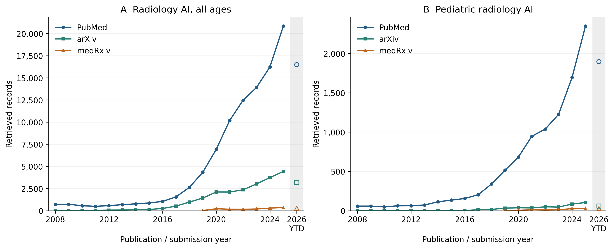
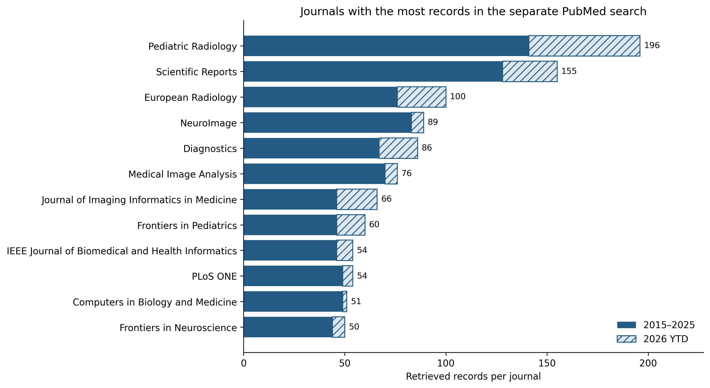

# Artificial intelligence in pediatric radiology: a landscape review of growth, clinical applications, and emerging directions through 2026

**Article type:** Scoping review with bibliometric analysis and narrative synthesis

**Running title:** The pediatric radiology AI landscape

**Authors:** Joseph Rich, Joel Philip, Amit Sura

**Affiliations:** [AUTHOR ACTION: add each author's institutional affiliation]

**Corresponding author:** [AUTHOR ACTION: add name, postal address, email address, and telephone number]

**Evidence snapshot:** Primary-study search through September 9, 2026; cohort analysis and selected source verification September 11, 2026. Counts describe 3,496 included primary-study records, with publication-version adjudication still required. Separate dissemination analyses and discussion updated September 16, 2026; source-specific snapshot dates are documented in the supplement.

**Tables:** 5

**Figures:** 8 main figures; study selection, conference and news context, and methodological detail in the supplement.

**Word counts:** Abstract 229; main text 4,415 (Introduction through Conclusion, excluding headings; whitespace-delimited count, September 16, 2026).

## Abstract

Artificial intelligence (AI) research in pediatric radiology is expanding, but its clinical relevance varies by application. We developed a structured literature database that will remain programmatically updated and used it to examine publication trends, clinical topics, shared datasets, and open models, particularly in 2025–2026. The PubMed/MEDLINE, Embase, and supplementary-source cohort contains 3,496 included primary-study records, including 685 assigned to 2025 and 686 to 2026 through September 9. Separate descriptive analyses examined publication and dissemination channels. MRI accounts for 45.5% of included records, ultrasound 23.7%, radiography 19.3%, and CT 9.3%. MRI's predominance partly reflects developmental neuroscience; excluding a broad exploratory neuroscience subset brings MRI and ultrasound to approximately equal shares. Fetal imaging is well represented, whereas acute abdominal disease and several non-neurologic neonatal applications receive less attention. Frequently named datasets serve neurodevelopmental research and established radiographic benchmarks. Recent studies introduce pediatric image–text models, reusable fetal ultrasound models, faster reconstruction methods, and evaluations of AI-assisted clinical decisions. Detection, measurement, prediction, and segmentation nevertheless account for most publications. Automated extraction, unresolved publication duplicates, and indexing lag limit precise estimates. For clinical evaluation, priorities are to define a useful task, establish pediatric applicability, and measure changes in the intended workflow. Research priorities include shared datasets for less-studied applications and testing across ages and institutions. Visibility across journals, preprints, conferences, and news should inform surveillance of the field; it does not establish clinical benefit.

**Keywords:** Artificial Intelligence; Radiology; Pediatrics; Bibliometrics; Review

## Introduction

Keeping up with AI in pediatric radiology means following work on bone age, fractures, fetal ultrasound, brain development, tumor imaging, and reconstruction, as well as newer models trained on images and text. Few clinicians can read this literature in depth. Publication counts alone offer little guidance about which applications are established, which tools are available, or which clinical problems have received little attention.

Kamran and colleagues reviewed 789 original articles through 2024, most of them in musculoskeletal, neurologic, and chest imaging [1]. Our updated search takes a broader scope, including fetal imaging, developmental neuroscience, and preprints. These differences in scope affect the relative prominence of each application and need to be considered when comparing the two reviews.

A central contribution is a comprehensive, structured database of pediatric radiology AI literature that we will continue to update programmatically. Using this resource, the review describes how the field has developed, where research is concentrated by modality, clinical problem, task, and age, and which datasets and open tools are available. We give particular attention to developments in 2025–2026 and their implications for clinical practice and future research. Individual studies illustrate the main findings; we do not attempt a detailed appraisal of every model or pool diagnostic accuracy across unrelated applications.

Separate descriptive analyses place this evidence within its publication and dissemination setting: journals, preprint servers, selected conferences, and news archives. These analyses help identify where readers can follow the field, while the screened primary-study cohort supports the clinical synthesis.

## Review approach and interpretation

### Evidence base

We searched PubMed/MEDLINE and Embase for records published from January 1, 2005, through September 9, 2026, and included supplementary OpenAlex records. Eligible primary research applied AI to diagnostic radiologic imaging in children or fetuses. Mixed-age studies had to meet the recorded pediatric eligibility criteria. Journal articles and preprints were eligible; reviews, other non-primary publications, conference abstracts, and proceedings were excluded from the counts. Echocardiography was included, extending the review beyond examinations performed exclusively in radiology departments.

The recorded search and screening process yielded 13,510 identified records, 6,602 screened records, and 3,496 included primary-study records. Screening and extraction from abstracts were automated using a structured schema. A second automated model rescreened 150 records to assess agreement; independent human validation remains incomplete. Full search strategies, eligibility criteria, and the selection flow are provided in the supplement.

An audit found 79 groups with identical normalized titles, involving 161 records. These included duplicate database entries and preprint/journal versions. We retained the full database cohort for the primary analysis and repeated the modality analysis with one record per normalized title. This reduced the cohort to 3,414 records without changing the modality ranking. Throughout this review, counts therefore refer to included records. The number of independent investigations and unique patients has not been established.

### Database and ongoing updates

The database organizes records by modality, clinical question, AI task, age group, validation, and reported code availability. We will maintain it through programmatic retrieval, structured extraction, and regeneration of summary analyses. Its comprehensive scope supports both clinicians following their subspecialty and researchers identifying gaps. The manuscript reports a fixed September 9, 2026 snapshot; subsequent database updates will not alter these reported results.

### Analysis and selection of examples

Records could have more than one modality, task, or age label. We identified clinical topics by applying keyword rules to titles and extracted clinical questions. Searches for dataset names also used the extracted population, model description, and dataset-size fields. These counts describe mentions of selected topics and resources; they do not provide an exhaustive disease classification or confirm how a dataset was used. The 973 records that matched none of the topic rules remained in the overall denominator.

Historical comparisons use 2005–2014, 2015–2019, 2020–2022, and 2023–2024, followed by separate 2025 and 2026 summaries. Percentages use each period's record count. The 2026 interval is incomplete and is not annualized. Annual assignment follows source metadata; online publication, preprint, and journal issue dates are not fully harmonized.

We selected examples for their clinical relevance, the availability of reusable resources, or a change in research approach, including studies with negative findings. Citation thresholds were not used to select the cohort or recent examples. We checked dataset descriptions and software availability against selected primary publications and official hosting pages. These checks informed the narrative but did not add records to the cohort.

We used a scoping review and bibliometric approach. Differences in disease prevalence, reference standards, populations, model outputs, and performance measures precluded a meaningful pooled effect estimate. We summarized the recorded validation methods but did not conduct a formal study-level risk-of-bias assessment.

### Publication and dissemination context

We analyzed archived contextual searches separately from the screened cohort. Broad PubMed queries and approximate translations for arXiv and medRxiv described annual publication activity from 2008. A separate title/abstract PubMed search described journal output from 2015; its narrower vocabulary and unscreened publication types differ from the review eligibility search. We ranked journals by retrieved record count, without using journal citedness as a measure of study quality.

For supplementary context, we summarized title matches from six conferences' accepted-paper lists and automated story matches from seven news archives in 2023–2026. These count papers and stories, respectively, and were not added to the included-study denominator. Missing source-years were retained as unavailable. We did not pool sources, deduplicate publication versions across these searches, or interpret visibility as adoption or effectiveness. Source-specific coverage, query definitions, and archived-file fingerprints are provided in the supplement; all 2026 results are incomplete.

## How the field developed

The cohort contains 71 records from 2005–2014, 295 from 2015–2019, and 794 from 2020–2022. A further 965 were published in 2023–2024, 685 in 2025, and 686 in 2026 year to date (Fig. 1). The last two periods account for 39.2% of the cohort. Recent work thus makes up a substantial part of the review, although indexing delays and overlap between publication versions limit estimates of the rate of growth.

Separate PubMed searches put these numbers in the context of radiology publishing overall (Fig. 2). The broad pediatric radiology AI query returned 58 records for 2008 and 2,348 for 2025; the corresponding all-radiology AI query returned 715 and 20,831. In 2025, AI represented 7.4% of pediatric radiology PubMed records and 11.4% of all radiology PubMed records. The translated preprint queries returned 104 pediatric radiology AI records from arXiv and 26 from medRxiv in 2025, compared with 4,426 and 351 for radiology AI across ages. Preprint counts are approximate because translation cannot reproduce PubMed's MeSH mapping. Figure 2 displays sources separately: preprints can overlap PubMed records and later journal publications, so adding them would not estimate unique investigations. The broader, unscreened searches also explain why the pediatric PubMed count exceeds the 685 included records assigned to 2025.

Early studies tested whether imaging measurements and patterns could be automated. Shared benchmarks, including the 2017 RSNA bone-age challenge, gave researchers a common basis for comparing models and were followed by clinical evaluations [2,3]. Work on segmentation, prediction, and reconstruction expanded the range of tasks. Recent studies increasingly examine whether a model trained on one large dataset can be adapted to several tasks, and whether using it changes care.

### Where the work is published and discussed

The separate journal search retrieved 5,099 records across 1,061 source labels during 2015–2026, including some proceedings and preprint sources. Pediatric Radiology contributed the most records (196), followed by Scientific Reports (155), European Radiology (100), and NeuroImage (89). The twelve highest-output journals accounted for 1,037 records (20.3%; Fig. 3). This dispersion across radiology, neuroscience, general science, and technical journals helps explain why following a single specialty journal gives an incomplete view. Counts describe this search's output rather than a ranking of clinical relevance.

Conference and news findings provide additional context (supplementary Figs. S2–S3). In the retrieved 2025 acceptance lists, MICCAI had 320 radiology-AI title matches, including ten with pediatric terms; MIDL had 40, including two. The pediatric counts may miss work whose titles omit the population. Automated news matches totaled 23 in 2023, 25 in 2024, and 22 in 2025. The Imaging Wire supplied 17, 19, and 17 of these, respectively, but differences in archive depth and screening preclude inferring readership or market influence. These series do not demonstrate uniform growth across dissemination channels.

## Where research is concentrated

### MRI: developmental research and clinical applications

MRI is the most studied modality, with 1,590 records (45.5%). Its share falls from 58.3% in 2015–2019 to 43.9% in 2025 and 40.1% in 2026 year to date (Table 1; Fig. 4). This decline in share reflects the growing contribution of other modalities within an expanding literature.

Many MRI studies concern development, cognition, or neuropsychiatric conditions. Across the cohort, the topic search identifies 355 records mentioning brain development/cognition and 313 mentioning autism, ADHD, or psychiatric disease, with overlap between the groups. Other studies address tumors, epilepsy, fetal anatomy, tissue segmentation, or image acquisition (Fig. 5). These uses of MRI serve different purposes: predicting a behavioral score in a research cohort has different implications for practice from detecting a lesion in a referred child.

MRI's lead is smaller when developmental neuroscience is excluded. The broad neuroscience sensitivity rule removes 748 MRI records, leaving MRI at 30.6% and ultrasound at 30.1% of the remaining cohort. Under the narrower diagnostic rule, MRI retains a larger lead at 39.9%. Both analyses are exploratory; all records remain in the primary analysis. The results help explain differences from reviews focused on direct clinical applications, in which radiography ranked first [1].

Brain tumor imaging accounts for 162 records matching the selected CNS tumor terms. The Children's Brain Tumor Network (CBTN), for example, links repeated clinical MRI examinations with information about the patient's disease [4]. Such data support segmentation and longitudinal assessment, although multiple examinations from one child must be distinguished from independent patients.

### Ultrasound: a concentration in fetal imaging

Ultrasound accounts for 828 records (23.7%). Among the 786 records labeled fetal, 560 include ultrasound and 229 include MRI. Fetal studies therefore contribute substantially to the ultrasound literature; the total should not be read as a measure of research in children after birth.

Fetal ultrasound research includes standard-plane recognition, biometry, segmentation, and anomaly assessment. FETAL_PLANES_DB provides images for plane-classification research [5]. Congenital heart disease studies have progressed from model development to testing in community settings [6,7]. These tasks address different parts of an examination: obtaining the view, measuring anatomy, and recognizing disease. Each requires its own evaluation.

Postnatal ultrasound studies cover cardiac function, hip dysplasia, abdominal pain, and hepatobiliary or urinary disease. Across modalities, the topic search identifies 60 hip-dysplasia records and 44 acute-abdomen records. The Regensburg appendicitis dataset combines ultrasound images with clinical and laboratory information [8], allowing researchers to study how imaging contributes to the diagnostic assessment.

### Radiography: established tasks and shared benchmarks

Radiography contributes 676 records (19.3%). Bone age, pulmonary infection, scoliosis, and fracture/trauma are recurring topics, with 176, 161, 142, and 138 mentions respectively across the full cohort. These counts are overlapping clinical-topic matches rather than modality-specific totals.

Bone-age assessment has a defined numerical output, an established benchmark, and a history of comparison with human readers [2,3]. More recent work tests children whose skeletal development differs from that represented in the training data. Fracture research includes both benchmark studies and evaluations in clinical practice. GRAZPEDWRI-DX provides a shared wrist-trauma dataset [9], although its results cannot be assumed to apply to other anatomical sites or to the full pediatric emergency caseload.

The chest radiograph datasets used in these studies vary considerably in scope. Pneumonia classification is a narrower task than interpreting a neonatal chest and abdominal radiograph. PediCXR/VinDr-PCXR includes labels for multiple thoracic findings [10], while recent neonatal image–text models assess several findings and devices together [11]. These resources allow researchers to study more of the findings encountered in practice.

### CT, nuclear imaging, and fluoroscopy

CT accounts for 325 records (9.3%), nuclear medicine/PET for 53 (1.5%), and fluoroscopy for 13 (0.4%). These counts describe the retrieved literature. They have not been adjusted for examination volume and cannot establish the relative clinical importance of each modality.

CT research includes segmentation, quantitative assessment, and reconstruction. Pediatric-CT-SEG provides scans from 359 patients with expert organ contours [12]. When adult-trained TotalSegmentator was tested on this dataset, mean Dice performance was lower than in an external adult cohort; pediatric training and fine-tuning improved the results [13]. This study addresses a practical question for pediatric imaging: when can an adult model be used, and how much adaptation does it need?

Although the nuclear imaging literature is small, it includes work on reducing acquisition time and radiation exposure while preserving image quality. Fluoroscopy has even fewer records. Its dynamic examinations could lend themselves to sequence interpretation, procedure support, and automated measurement, but the present evidence does not establish which of these would offer the greatest clinical benefit.

## Which age groups are represented?

Child and adolescent labels occur in 1,301 (37.2%) and 889 (25.4%) records. Fetal imaging accounts for 786 (22.5%), infants for 515 (14.7%), and neonates for 346 (9.9%). Another 498 records (14.2%) specify pediatrics without a narrower age label. These categories overlap and do not indicate how often performance was reported separately by age.

Examining age and modality together gives a more useful picture than age totals alone (Fig. 6). Neonatal records include 202 MRI studies, 76 ultrasound studies, and 48 radiography studies. Describing neonatal AI as uniformly underexplored would overlook the substantial MRI literature. Likewise, the large number of fetal ultrasound studies says little about the evidence for infant abdominal ultrasound.

The available datasets partly explain these differences. ABCD follows development from late childhood, ABIDE includes both children and adults, and the developing Human Connectome Project (dHCP) provides neonatal and fetal MRI [14–16]. Participants in these research cohorts may differ from children referred for an acute clinical examination. Pediatric model evaluation should account for developmental stage, body size, acquisition conditions, and pathology, because a pooled result may conceal poor performance in a particular age group.

## Which tasks dominate?

Detection/diagnosis remains the most common task, accounting for 1,337 records (38.2%), followed by measurement in 838 (24.0%), outcome prediction in 683 (19.5%), and segmentation in 662 (18.9%). Reconstruction/imputation contributes 277 (7.9%) and workflow applications 167 (4.8%) (Fig. 7). Report-generation/LLM and foundation/vision-language labels are uncommon. These categories describe what models are used for; they do not distinguish architectures or establish when a particular method first appeared.

## Shared datasets and open tools

### Commonly named datasets

ABCD is the most frequently mentioned of the dataset names we searched for, appearing in 83 records. ABIDE and RSNA bone age appear in 42 each, dHCP in 39, and ADHD-200 in 33. CBTN appears in 17 records, GRAZPEDWRI-DX in 15, and BraTS-PEDs in 12. These counts give only a partial view of dataset use: abstracts often omit names, and a mention may refer to training, testing, or background discussion.

The frequently named resources largely serve neurodevelopmental research and radiographic benchmark tasks. Their prominence is consistent with the distribution of publications, although it does not show that dataset availability caused that distribution. Table 2 summarizes selected datasets, their size and access requirements, and the questions they can support.

Dataset size needs to be interpreted carefully. CBTN's described release contains 23,101 MRI examinations from 1,526 patients, and dHCP also includes repeat examinations [4,16]. Images, examinations, and patients therefore cannot be treated as equivalent sample sizes. Related resources may contain overlapping patients, and repeated examinations need to be accounted for when dividing data into training and test sets. Access also varies: some resources require registration, credentialing, or an approved data-use agreement, and a model's training data may remain restricted even when its weights are released.

### Reusable software and pediatric model releases

Researchers can use open software for both model development and inference (Table 3). nnU-Net configures a segmentation training pipeline, while MONAI provides tools for developing medical-imaging applications. MedSAM supports segmentation from user prompts, and TotalSegmentator provides pretrained anatomical segmentation [17–20]. All can be useful in pediatric research, but each needs evaluation in the intended pediatric population.

Several releases are designed for pediatric tasks: Deeplasia for bone age, pTBLightNet for tuberculosis-compatible chest radiographs, and FetalCLIP for fetal ultrasound [21–23]. Access to these models allows independent testing and adaptation, subject to the conditions of each release.

nnU-Net, MONAI, and MedSAM are among the leading repositories in the project's GitHub snapshot. The selected list includes frameworks, models, and supporting software, so it cannot measure clinical adoption. In the paper cohort, 168 records (4.8%) are labeled open-source and 92 (2.6%) have a populated code-URL field. These fields record reported availability; they do not establish whether the code runs, weights are accessible, or the license permits a proposed use. Reproducing a result may also require details of preprocessing and evaluation that are absent from the release.

## What changed in 2025–2026

### Models trained on pediatric images and text

Recent pediatric models increasingly learn from images paired with text and can be used for several related tasks. NeoCLIP's 2025 journal report describes training with 20,154 neonatal radiographs and 15,795 reports from 4,629 infants to identify 15 radiological features and five devices [11]. The study shows how image–text learning can be applied to neonatal radiographs, although its retrospective institutional cohort leaves prospective performance elsewhere untested.

FetalCLIP's June 2026 publication reports pretraining on 210,035 fetal ultrasound images paired with text, followed by evaluation on classification, gestational-age estimation, congenital heart disease detection, and segmentation [23]. The authors provide code and downloadable weights for further research. The model demonstrates the potential to reuse features learned within fetal ultrasound across several tasks; its results do not establish performance in other pediatric imaging applications.

Such models still account for a small share of publications. Eight records in 2025 and eight in 2026 year to date carry a foundation/vision-language label (1.2% in each period). Report-generation/LLM records increase from five (0.7%) to 12 (1.7%). These numbers are too small, and the categories and retrieval too imprecise, to support firm claims about growth (Fig. 8). Detection, measurement, prediction, and segmentation remain much more common.

### Shorter acquisitions and improved reconstruction

Reconstruction studies offer another route to clinical benefit: shorter acquisitions with adequate image quality. Yoo and colleagues studied accelerated pediatric brain MRI in 46 patients and reported shorter 3D T1 acquisitions with improved image-quality measures [24]. A 2026 study evaluated reconstruction of motion-robust single-shot T2 images in awake and sedated children [25]. Improved images or shorter individual sequences, however, do not by themselves establish a reduction in sedation or total examination time.

In pediatric PET, Han and colleagues evaluated patch-based denoising using 88 examinations from 64 test patients. Truncating list-mode data from 90 to 20 seconds per bed simulated reduced counts; enhanced images were rated equivalent or superior in overall quality and noise in more than 85% of cases [26]. This supports further investigation of shorter or lower-activity acquisitions. It was not a prospective trial administering the proposed reduced activity.

For reconstruction methods, evaluation needs to extend beyond image-quality scores to the diagnostic task and the child's examination as a whole.

### Testing established tools in practice

In 2025, Ziegner and colleagues evaluated fracture detection in a pediatric emergency setting and found a modest improvement in resident accuracy, alongside instances in which readers abandoned a correct diagnosis after viewing AI output [27]. A subsequent 2026 prospective study enrolled 667 children and adolescents with AI support available on alternating days. Diagnostic revisions requiring recall occurred in 8.6% without AI and 5.7% with AI; the risk ratio was 0.66, with a 95% confidence interval of 0.37–1.19 [28]. This leaves the clinical effect uncertain despite high standalone accuracy.

Recent bone-age work tests performance in less typical patients. The 2026 Deeplasia study compared the model with multiple experts in children with rare endocrine, syndromic, and storage disorders [21]. Adult-to-child transfer has also been tested directly, including in the TotalSegmentator study published in a 2025 journal issue after its online release in 2024 [13].

These studies address questions that benchmark accuracy alone cannot answer: how a model performs in unusual cases, how readers respond to its output, and whether that response helps patients. Table 4 summarizes the selected examples; it is not a ranking or a representative sample of all recent papers.

## Discussion: clinical implications and research priorities

### From a promising model to a useful clinical task

The practical message of this landscape is to begin with a defined problem in pediatric care. Bone-age measurement, fracture assistance, and acquisition or reconstruction provide concrete examples, although their evidence and intended uses differ. A local evaluation should specify the expected benefit and comparator before choosing a tool: more reproducible measurements, fewer missed findings, shorter reading or examination times, or lower exposure while preserving diagnostic information. Publication volume alone cannot identify which application will be most useful in a particular department.

Pediatric applicability should be examined explicitly. The adult-to-child CT segmentation study and rare-disorder bone-age evaluation illustrate why age, anatomy, pathology, and acquisition setting matter [13,21]. A local test set should include younger children and unusual anatomy as well as routine cases, with performance examined by clinically relevant subgroup where numbers permit. Fine-tuning can address a mismatch, but requires further independent testing; it does not itself establish generalizability.

Available resources also serve different purposes. nnU-Net and MONAI support development, while pretrained models and commercial products require assessment for a particular use. In the United States, the FDA AI-enabled device list links to authorization records but is not comprehensive [29]. Product selection should examine the relevant module's labeling, age range, anatomy, and software version. A company's overall device count does not establish pediatric applicability. CLAIM can guide appraisal of reporting about data sources, reference standards, and testing; it is not a clinical-benefit score [30].

A pilot should measure the human–AI workflow as well as standalone model performance. The fracture studies show why reader behavior and patient recall are relevant alongside accuracy [27,28]. Depending on the task, evaluation could track missed findings, false alarms, reading time, repeat imaging, dose, or total examination time. Reconstruction gains should be assessed at the examination level before inferring less sedation or improved patient experience. Errors and subgroup performance should continue to be reviewed after implementation and software updates. These are practical implications of the evidence map, rather than conclusions from a comparative implementation trial.

### Following developments and building the missing evidence

The dissemination analyses suggest a complementary reading strategy: use specialty and technical journals to assess published evidence, and preprints and conference papers to identify methods worth evaluating. News sources can draw attention to products or studies, but their claims should be traced to the underlying publication or product documentation. Citation counts, journal metrics, repository stars, and news mentions describe different forms of visibility. None establishes pediatric clinical benefit. The maintained database can support this distinction by preserving publication type, population, validation design, and availability alongside each record.

Research priorities differ between established and less-studied applications (Table 5). For tasks with widely used benchmarks, the next study should test a different patient mix, institution, acquisition setting, or clinical outcome. Where data are scarce, a well-designed shared dataset may be more useful than another comparison of architectures.

Abdominal ultrasound, urinary disease, chronic lung/airway assessment, fluoroscopy, and non-neurologic neonatal imaging warrant further study and dataset development. The topic search found 44 acute-abdomen records, 70 renal/urinary records, 39 chronic lung/airway records, and five inflammatory bowel disease records. These relatively small counts suggest areas to examine more closely, but may miss studies using different terminology and have not been adjusted for disease burden.

Researchers adapting pretrained models should compare them with strong conventional baselines on pediatric data. Adult pretraining, self-supervision, and multimodal learning may reduce annotation requirements, but the benefit needs to be measured for the task in question. Longitudinal studies could address growth and treatment response, with care to keep repeated observations from the same child from crossing training and test boundaries.

Pediatric radiologists can contribute by selecting a frequent clinical problem, defining a reproducible reference standard, and collaborating across hospitals to assemble and test relevant cases. Bone-age assessment, fracture assistance, reconstruction, and selected ultrasound tasks have been evaluated clinically, while image–text and foundation models remain emerging research tools. The next study should address the uncertainty that matters for the intended patients and workflow.

The database assigns 654 records (18.7%) to external/multicenter validation, 217 (6.2%) to reader studies, and 115 (3.3%) to prospective evaluation. Only one validation category is stored per record, so these counts cannot capture every design feature of a study. Even with that limitation, the relatively small numbers of reader and prospective evaluations show how much remains to be learned about clinical use.

Based on these findings, we expect near-term work to emphasize adapting models to children, reusing models across related tasks, and applying AI to acquisition and longitudinal assessment. The prospects for broader autonomous interpretation are less clear. Progress will need to be judged by performance in new populations and clinical settings as well as by improvements on existing benchmarks.

## Limitations

Screening and extraction relied on abstracts and have not undergone completed independent human validation. Duplicate database entries and publication versions also remain in the cohort. Retaining one record per normalized title changes the MRI share from 45.5% to 45.0%, ultrasound from 23.7% to 23.8%, and radiography from 19.3% to 19.5%. The modality ranking is therefore stable under this sensitivity analysis, although it does not resolve all duplication.

Clinical-topic and dataset counts depend on explicit vocabulary and incomplete extracted descriptions. They are exploratory and cannot establish disease burden, dataset independence, or true resource adoption. Developmental neuroscience, fetal imaging, and echocardiography broaden the scope relative to routine radiology practice. Conversely, excluding conference proceedings and omitting dedicated searches of IEEE Xplore, Scopus, and Web of Science may underrepresent technical innovations. The source-year convention, preprint overlap, and 2026 indexing lag complicate historical comparisons.

We did not perform a formal study-level risk-of-bias assessment or pool performance estimates. The examples illustrate research developments and cannot establish comparative effectiveness. Dataset access, software releases, and model versions may also change after this review. The findings are most useful for identifying broad patterns; small differences in percentages should be interpreted cautiously.

The contextual searches have different vocabularies, date fields, and collection dates from the primary cohort. The journal and conference aggregates lack explicit collection timestamps. Conference title matching may miss relevant work, while news matching may capture incidental pediatric references or sponsor text. Unequal archive coverage and unresolved publication overlap prevent interpreting these series as comparable measures of growth, research quality, or clinical adoption.

## Conclusion

Pediatric radiology AI research is growing, with much of the work concentrated in MRI, fetal ultrasound, and radiographic assessment of skeletal development, chest findings, and trauma. The distribution also varies by age: a substantial literature in one group, such as fetal ultrasound, does not imply comparable evidence in another.

Studies from 2025–2026 introduce pediatric image–text models that can support several tasks and extend work on reconstruction and clinical evaluation. For pediatric radiologists, the practical sequence is to identify a worthwhile task, examine evidence in the intended children and setting, and measure what changes when the tool enters the workflow. For researchers, priorities include building datasets for less-studied applications and testing whether models help across ages and institutions. Following developments across publication channels can identify opportunities, but clinical benefit requires direct evaluation. The accompanying literature database will remain programmatically updated to help both groups follow the field beyond this review.

## Tables

**Table 1. Modality composition and recent publication periods**

| Modality | All records (n=3,496) | 2023–2024 (n=965) | 2025 (n=685) | 2026 YTD (n=686) |
|:--|--:|--:|--:|--:|
| MRI | 1,590 (45.5%) | 428 (44.4%) | 301 (43.9%) | 275 (40.1%) |
| Ultrasound | 828 (23.7%) | 229 (23.7%) | 178 (26.0%) | 170 (24.8%) |
| Radiography | 676 (19.3%) | 186 (19.3%) | 132 (19.3%) | 152 (22.2%) |
| CT | 325 (9.3%) | 94 (9.7%) | 52 (7.6%) | 74 (10.8%) |
| Nuclear medicine/PET | 53 (1.5%) | 23 (2.4%) | 7 (1.0%) | 8 (1.2%) |
| Fluoroscopy | 13 (0.4%) | 4 (0.4%) | 3 (0.4%) | 2 (0.3%) |

Categories overlap; other/multiple labels are omitted here and retained in supplementary Table L1. Counts follow the current cohort and source publication year. YTD ends September 9, 2026.

**Table 2. Selected shared datasets and the research questions they support**

| Resource | Modality / population | Scale of the specified resource | Access / research role |
|:--|:--|:--|:--|
| RSNA bone-age challenge (2017) [2] | Hand radiographs; pediatric skeletal maturation | 14,236 radiographs across challenge partitions | RSNA challenge terms; measurement benchmark |
| GRAZPEDWRI-DX (2022) [9] | Wrist trauma radiographs; includes ages extending to 19 years | 20,327 images from 6,091 patients | Open download; localization and fracture classification |
| PediCXR / VinDr-PCXR [10] | Chest radiographs; children under 10 years | 9,125 studies; multiple finding and diagnosis labels | Credentialed PhysioNet access; broader thoracic interpretation |
| FETAL_PLANES_DB (2020) [5] | Maternal-fetal ultrasound | Standard planes and other views from two hospitals | Open Zenodo release; plane recognition, not a comprehensive anomaly cohort |
| Regensburg appendicitis [8] | Ultrasound with clinical/laboratory information; children and adolescents | Published imaging analysis: 579 patients, 1,709 images | Public dataset; later tabular releases have different denominators |
| ABCD [14] | Longitudinal brain MRI; recruited at 9–10 years | 11,878 baseline participants; available imaging varies by visit | Controlled access through the study's current data-sharing route; development and cognition |
| ABIDE I and II [15] | Structural and resting-state brain MRI; children and adults | Multisite collections; age eligibility must be applied to individual participants | Registered research access; autism and cross-site methods |
| dHCP, fourth release (2024) [16] | Neonatal and fetal brain MRI | 783 neonatal participants / 886 datasets; 273 fetal participants / 297 datasets | Project access process; early development, segmentation, and longitudinal work |
| CBTN, described 2023 release [4] | Clinical brain/spine tumor MRI | 23,101 examinations from 1,526 patients | Governed access; tumor imaging and repeated clinical examinations |
| Pediatric-CT-SEG, version 2 [12] | Pediatric chest/abdomen/pelvis CT; 5 days–16 years | 359 patients; expert contours for up to 29 structures | Open TCIA release; segmentation and dosimetry |

Selected resources overlap the presentation's dataset map; this is not an exhaustive or size-ranked list. Dataset sizes use their original units and specified versions. BraTS-PEDs and FeTA are additional named challenge resources in the cohort's mention table; their release-specific inventories are not conflated with these resources.

**Table 3. Open software and model resources relevant to pediatric imaging research**

| Resource | What is available / purpose | Pediatric interpretation |
|:--|:--|:--|
| [nnU-Net](https://github.com/MIC-DKFZ/nnUNet) [17] | Segmentation training and inference framework | A strong development baseline; requires relevant data and evaluation |
| [MONAI](https://github.com/Project-MONAI/MONAI) [18] | Medical-imaging training and application infrastructure | Enables development; is not itself a pediatric diagnostic model |
| [MedSAM](https://github.com/bowang-lab/MedSAM) [19] | Promptable medical segmentation code and checkpoints | Useful for annotation/adaptation; test developmental anatomy and pathology |
| [TotalSegmentator](https://github.com/wasserth/TotalSegmentator) [20] | Pretrained anatomical segmentation and inference software | Pediatric transfer limitations have been directly studied [13] |
| [Deeplasia](https://github.com/aimi-bonn/Deeplasia) [21] | Pediatric bone-age software and model access | External rare-disorder evaluation extends its evidence base |
| [pTBLightNet](https://github.com/dani-capellan/pTBLightNet) [22] | Multi-view pediatric chest model; repository links weights | TB-compatible findings; applicability depends on age, setting, and reference standard |
| [FetalCLIP](https://github.com/biomedia-mbzuai/fetalclip) [23] | Fetal ultrasound representation model; code and weight download | Supports several downstream research tasks; model release does not imply training-data release |

Availability checked against project sources on September 11, 2026. “Open” here identifies accessible research software/model resources, not a uniform license or authorization for clinical use. NeoCLIP is discussed as a published model; its appearance in the narrative does not imply a verified public weight release.

**Table 4. Selected 2025–2026 developments and their significance**

| Development | Example | Contribution | Remaining questions |
|:--|:--|:--|:--|
| Neonatal image–text learning | NeoCLIP, 2025 [11] | Several findings and devices in one domain model | Prospective and external clinical utility |
| Reusable fetal representations | FetalCLIP, 2026 [23] | Transfer across ultrasound tasks with released weights | Performance across acquisition settings and rare anomalies |
| Faster reconstruction | Pediatric MRI, 2025–2026 [24,25]; PET, 2026 [26] | AI targets acquisition burden as well as interpretation | Examination-level benefit and diagnostic preservation |
| Clinical decision evaluation | Pediatric fracture studies, 2025–2026 [27,28] | Reader behavior and recall outcomes enter evaluation | Magnitude and consistency of benefit |
| Testing developmental differences | Adult-to-pediatric CT segmentation, 2025 issue [13] | Direct evidence about transfer and adaptation | Age-, organ-, and setting-specific generalization |
| Testing rare populations | Deeplasia, 2026 [21] | Established measurement task evaluated in difficult disorders | Broader population and workflow applicability |

Examples were selected for their contribution to the narrative, not citation rank. Publication date is distinct from data-acquisition date and may follow an earlier online or preprint version.

**Table 5. Priorities for further research**

| Area | Current evidence | Research question |
|:--|:--|:--|
| Established radiographic benchmarks | Recurring bone-age, chest, wrist, and spine applications | Does performance transfer to different anatomy, age, institution, and decisions? |
| Abdominal and urinary imaging | Smaller selected-topic literatures | Can shared imaging-plus-clinical cohorts support useful diagnostic pathways? |
| Neonatal imaging | MRI concentration alongside smaller non-MRI groups | Can models handle devices, serial examinations, and acute findings across NICUs? |
| Fetal ultrasound | Substantial activity and emerging reusable representations | Does assistance improve complete examinations across operators and settings? |
| CT, nuclear imaging, fluoroscopy | Smaller modalities with distinct acquisition constraints | Can AI reduce examination burden while preserving the information needed for care? |
| Pediatric foundation models | Small but concrete recent literature | When does domain pretraining improve on task-specific baselines with limited labels? |
| Clinical implementation | Relatively few prospective and reader-study labels | Which patients and workflows gain measurable benefit, and at what cost? |

Priorities are the authors' interpretation of the evidence map. Research volume was not normalized to disease burden, examination volume, or funding.

## Figure legends

**Fig. 1. Included records by publication year.** Annual screened records, 2005 through September 9, 2026. Blue bars indicate included records; gray bars indicate excluded or non-primary records. The final year is incomplete. Source-year assignment and unresolved publication versions limit interpretation of year-to-year growth. Shared with the presentation: `figures/review_by_year.png`.

**Fig. 2. Publication activity by source.** Broad radiology-AI search counts for all ages (A) and the pediatric subset (B), displayed separately for PubMed, arXiv, and medRxiv. Panel scales differ. PubMed counts use publication year; arXiv uses submission year and medRxiv uses the Europe PMC publication-year field. Sources differ in query behavior and may contain overlapping publications or versions; counts are neither pooled nor restricted to the screened primary-study cohort. Open markers and shading distinguish 2026 year-to-date results from complete years. PubMed companion metadata are dated September 7, 2026; preprint metadata are dated September 16, 2026. See supplementary Table D1 for values. Adapted from the presentation's publication-trend analysis: `figures/review_publication_sources.png`.

**Fig. 3. Journals publishing pediatric radiology AI.** The twelve journals with the most retrieved records in a separate title/abstract PubMed search, 2015–2026. Solid segments cover 2015–2025; hatched segments show 2026 year to date. Labels give total counts. The underlying search contains 5,099 records across 1,061 source labels, including some non-journal sources; the twelve displayed journals account for 1,037 records. These are unscreened search results, not journal counts within the 3,496 included primary-study records. Journal names already linked to the same OpenAlex source were merged. No journal-impact threshold was applied, and the ranking does not measure clinical relevance or study quality. The archived source has no explicit collection timestamp and was analyzed September 16, 2026. Adapted from the presentation's journal analysis: `figures/review_journal_output.png`.

**Fig. 4. Modality composition over time.** Annual counts by extracted modality; categories overlap. MRI's broad scope includes developmental neuroscience. This figure shows absolute counts; Table 1 and supplementary Table L1 provide within-period shares. Shared with the presentation: `figures/review_modality_year.png`.

**Fig. 5. Clinical topic by modality.** Counts of included records matching selected title/clinical-question rules, crossed with extracted modality. These are exploratory, overlapping topic mentions; 973 records match none of the selected rules. Color uses log(1 + count) so small cells remain visible, while printed values are raw counts. Source: `figures/review_topic_modality.png`.

**Fig. 6. Age group by modality.** Counts of records carrying each age and modality label. Labels overlap and indicate populations, not age-stratified performance or unique patients. Color uses log(1 + count); printed values are raw counts. Source: `figures/review_age_modality.png`.

**Fig. 7. What the models produce.** Annual counts by task. The shared presentation figure folds report-generation/LLM, foundation/vision-language, and agent/autonomous labels into “other”; Fig. 8 shows those recent categories separately. Task labels overlap and are not architecture categories. Shared with the presentation: `figures/review_task_year.png`.

**Fig. 8. Recent task composition.** Within-period percentages for 2023–2024, 2025, and 2026 year to date, including the small language, foundation-model, and agent categories. The denominators are 965, 685, and 686 included records. Percentages describe the retrieved snapshot; they do not correct for indexing delay or publication-version overlap. Source: `figures/review_recent_tasks.png`.

## Declarations

**Data availability.** Queries, code, extracted records, figures, and reports will be available at [AUTHOR ACTION: repository URL] and archived at [AUTHOR ACTION: version-specific DOI]. The included-record table and screening decisions document the reviewed literature. The database will continue to receive programmatic updates, with the archived review snapshot retained separately for reproducibility. The analysis files contain the source-file fingerprint, classification rules, matches for each record, and sensitivity analyses.

**Funding.** Not applicable.

**Conflicts of interest.** No conflicts of interests to disclose.

**Ethics approval.** Not applicable; this review analyzed published literature and did not collect patient data.

**Informed consent.** Not applicable.

**Author contributions.** [AUTHOR ACTION: provide a CRediT contribution statement.]

**Acknowledgments.** None.

## References

1. Kamran R, Widjaja E, Sy A, et al. The current state of artificial intelligence research in pediatric radiology and recommendations for the future: a scoping review. Pediatric Radiology. 2026. [doi:10.1007/s00247-025-06462-5](https://link.springer.com/article/10.1007/s00247-025-06462-5).
2. Halabi SS, Prevedello LM, Kalpathy-Cramer J, et al. The RSNA Pediatric Bone Age Machine Learning Challenge. Radiology. 2019. [doi:10.1148/radiol.2018180736](https://pubs.rsna.org/doi/10.1148/radiol.2018180736).
3. Larson DB, Chen MC, Lungren MP, et al. Performance of a Deep-Learning Neural Network Model in Assessing Skeletal Maturity on Pediatric Hand Radiographs. Radiology. 2018. [doi:10.1148/radiol.2017170236](https://doi.org/10.1148/radiol.2017170236).
4. Familiar AM, Fathi Kazerooni A, Anderson H, et al. A multi-institutional pediatric dataset of clinical radiology MRIs by the Children's Brain Tumor Network. 2023 preprint describing the resource. [arXiv:2310.01413](https://arxiv.org/abs/2310.01413).
5. Burgos-Artizzu XP, Coronado-Gutierrez D, Valenzuela-Alcaraz B, et al. FETAL_PLANES_DB: Common maternal-fetal ultrasound images. 2020. [Zenodo dataset](https://zenodo.org/records/3904280).
6. Arnaout R, Curran L, Zhao Y, et al. An ensemble of neural networks provides expert-level prenatal detection of complex congenital heart disease. Nature Medicine. 2021. [doi:10.1038/s41591-021-01342-5](https://doi.org/10.1038/s41591-021-01342-5).
7. Athalye C, van Nisselrooij A, Rizvi S, et al. Deep-learning model for prenatal congenital heart disease screening generalizes to community setting and outperforms clinical detection. Ultrasound in Obstetrics & Gynecology. 2024. [doi:10.1002/uog.27503](https://doi.org/10.1002/uog.27503).
8. Marcinkevičs R, et al. Interpretable and intervenable ultrasonography-based machine learning models for pediatric appendicitis. Medical Image Analysis. 2024;91:103042. [Author manuscript](https://rmarcinkevics.github.io/files/2024-01-01-ml-app-us.pdf); [dataset](https://zenodo.org/records/7669442).
9. Nagy E, Janisch M, Hržić F, Sorantin E, Tschauner S. A pediatric wrist trauma X-ray dataset (GRAZPEDWRI-DX) for machine learning. Scientific Data. 2022;9:222. [doi:10.1038/s41597-022-01328-z](https://www.nature.com/articles/s41597-022-01328-z).
10. Pham HH, Tran TT, Nguyen HQ. VinDr-PCXR: An open, large-scale pediatric chest X-ray dataset for interpretation of common thoracic diseases. PhysioNet, version 1.0.0. 2022. [Dataset and access terms](https://physionet.org/content/vindr-pcxr/1.0.0/).
11. Huang Y, Sharma P, Palepu A, et al. NeoCLIP: a self-supervised foundation model for the interpretation of neonatal radiographs. npj Digital Medicine. 2025;8:570. [doi:10.1038/s41746-025-01922-6](https://pubmed.ncbi.nlm.nih.gov/40993183/).
12. Jordan P, Adamson PM, Bhattbhatt V, et al. Pediatric Chest/Abdomen/Pelvic CT Exams with Expert Organ Contours (Pediatric-CT-SEG). Version 2, updated 2022. [TCIA collection](https://www.cancerimagingarchive.net/collection/pediatric-ct-seg/).
13. Chatterjee D, Kanhere A, Doo FX, et al. Children Are Not Small Adults: Addressing Limited Generalizability of an Adult Deep Learning CT Organ Segmentation Model to the Pediatric Population. Journal of Imaging Informatics in Medicine. 2025;38:1628–1641. Online September 2024. [doi:10.1007/s10278-024-01273-w](https://pubmed.ncbi.nlm.nih.gov/39299957/).
14. ABCD Study. Data sharing and release information. [Official data-sharing page](https://abcdstudy.org/scientists/data-sharing/). Accessed September 11, 2026.
15. Autism Brain Imaging Data Exchange. ABIDE I and ABIDE II. [Official collections and access information](https://fcon_1000.projects.nitrc.org/indi/abide/). Accessed September 11, 2026.
16. Developing Human Connectome Project. Fourth data release, May 2024. [Release notes](https://biomedia.github.io/dHCP-release-notes/). Accessed September 11, 2026.
17. Isensee F, Jaeger PF, Kohl SAA, Petersen J, Maier-Hein KH. nnU-Net: a self-configuring method for deep learning-based biomedical image segmentation. Nature Methods. 2021;18:203–211. [Official implementation and citation](https://github.com/MIC-DKFZ/nnUNet).
18. Project MONAI. MONAI: AI Toolkit for Healthcare Imaging. [Official repository](https://github.com/Project-MONAI/MONAI). Accessed September 11, 2026.
19. Ma J, He Y, Li F, et al. Segment anything in medical images. Nature Communications. 2024. [doi:10.1038/s41467-024-44824-z](https://doi.org/10.1038/s41467-024-44824-z); [official repository](https://github.com/bowang-lab/MedSAM).
20. Wasserthal J, Breit HC, Meyer MT, et al. TotalSegmentator: robust segmentation of 104 anatomic structures in CT images. Radiology: Artificial Intelligence. 2023. [doi:10.1148/ryai.230024](https://doi.org/10.1148/ryai.230024).
21. Skaf K, Fardipour M, Schmidt P, et al. Automated bone age assessment in rare pediatric growth disorders: a comparative study using Deeplasia. Frontiers in Endocrinology. 2026;17:1741927. [doi:10.3389/fendo.2026.1741927](https://www.frontiersin.org/journals/endocrinology/articles/10.3389/fendo.2026.1741927/full); [model repository](https://github.com/aimi-bonn/Deeplasia).
22. Capellán-Martín D, et al. Multi-view deep learning framework for the detection of chest X-rays compatible with pediatric pulmonary tuberculosis. Nature Communications. 2025. [doi:10.1038/s41467-025-64391-1](https://www.nature.com/articles/s41467-025-64391-1); [code and weights](https://github.com/dani-capellan/pTBLightNet).
23. Maani F, Saeed N, Saleem TJ, et al. FetalCLIP: a visual-language foundation model for fetal ultrasound image analysis. npj Digital Medicine. 2026. [doi:10.1038/s41746-026-02907-9](https://pubmed.ncbi.nlm.nih.gov/42321373/); [code and weights](https://github.com/biomedia-mbzuai/fetalclip).
24. Yoo H, Moon HE, Kim S, et al. Evaluation of Image Quality and Scan Time Efficiency in Accelerated 3D T1-Weighted Pediatric Brain MRI Using Deep Learning-Based Reconstruction. Korean Journal of Radiology. 2025;26:180–192. [doi:10.3348/kjr.2024.0701](https://pmc.ncbi.nlm.nih.gov/articles/PMC11794287/).
25. Baz AM, et al. Deep learning improves image quality in motion-robust and sedation-free pediatric brain MRI. European Radiology. 2026. [doi:10.1007/s00330-026-12482-y](https://link.springer.com/article/10.1007/s00330-026-12482-y).
26. Han C, Trout AT, Li A, et al. Acquisition time/dose reduction in pediatric PET imaging using patch-based deep learning. EJNMMI Physics. 2026;13:75. [doi:10.1186/s40658-026-00876-2](https://link.springer.com/article/10.1186/s40658-026-00876-2).
27. Ziegner M, Pape J, Lacher M, et al. Real-life benefit of artificial intelligence-based fracture detection in a pediatric emergency department. European Radiology. 2025. [doi:10.1007/s00330-025-11554-9](https://link.springer.com/article/10.1007/s00330-025-11554-9).
28. Deffaa OJ, Pape J, Schlösser D, et al. Artificial intelligence for pediatric fracture detection: impact on diagnostic revisions and patient recall rates in a tertiary emergency setting. BMC Emergency Medicine. 2026;26:204. [doi:10.1186/s12873-026-01697-3](https://pubmed.ncbi.nlm.nih.gov/42527905/).
29. US Food and Drug Administration. Artificial Intelligence-Enabled Medical Devices. [Official device list and linked authorization records](https://www.fda.gov/medical-devices/software-medical-device-samd/artificial-intelligence-enabled-medical-devices). Accessed September 16, 2026.
30. Tejani AS, Klontzas ME, Gatti AA, et al. Checklist for Artificial Intelligence in Medical Imaging (CLAIM): 2024 Update. Radiology: Artificial Intelligence. 2024;6(4):e240300. [doi:10.1148/ryai.240300](https://pubs.rsna.org/doi/10.1148/ryai.240300).
