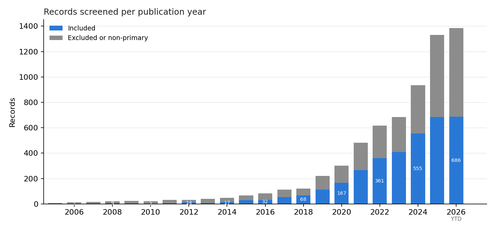
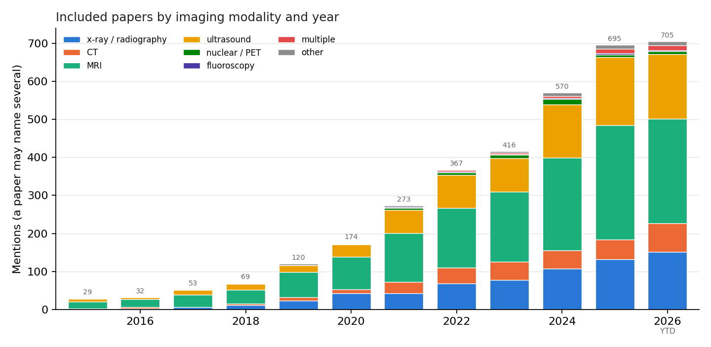
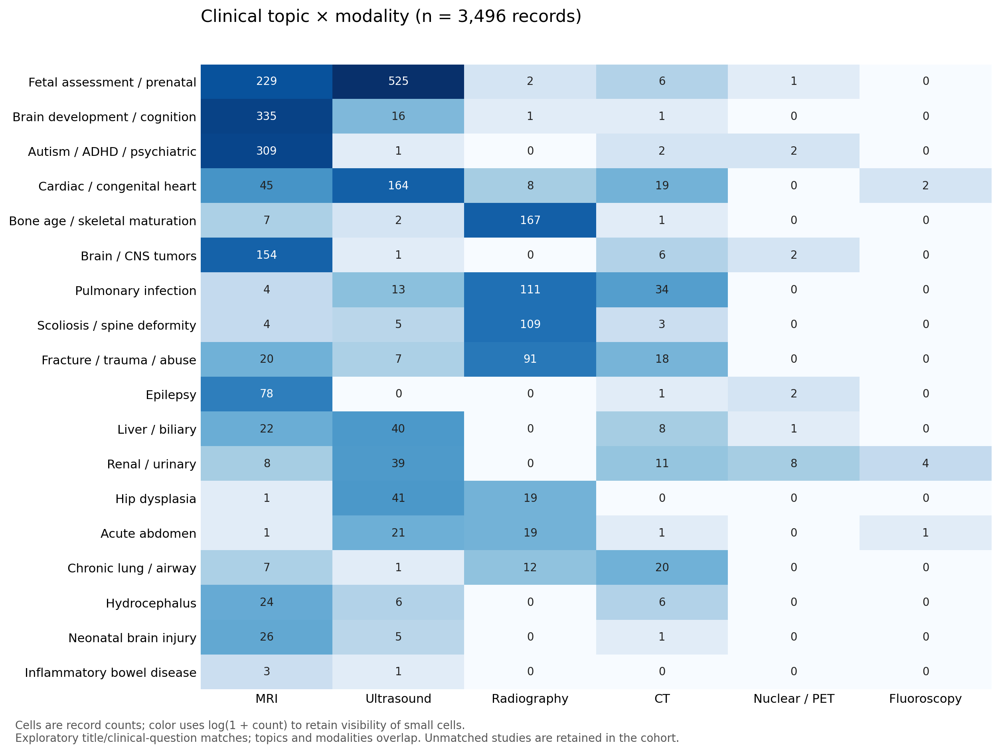
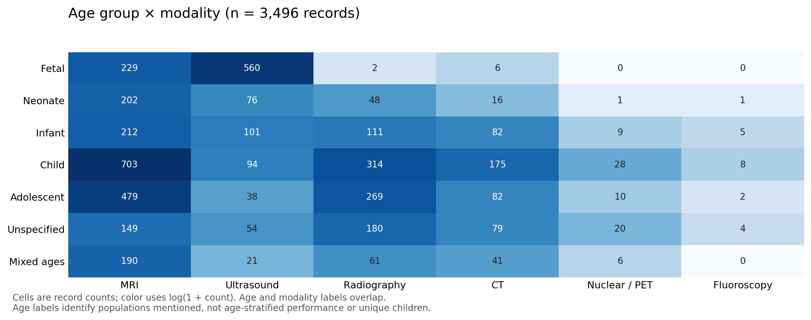
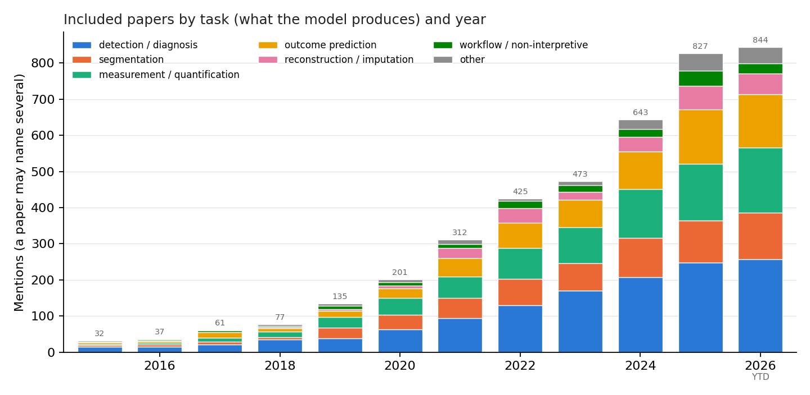
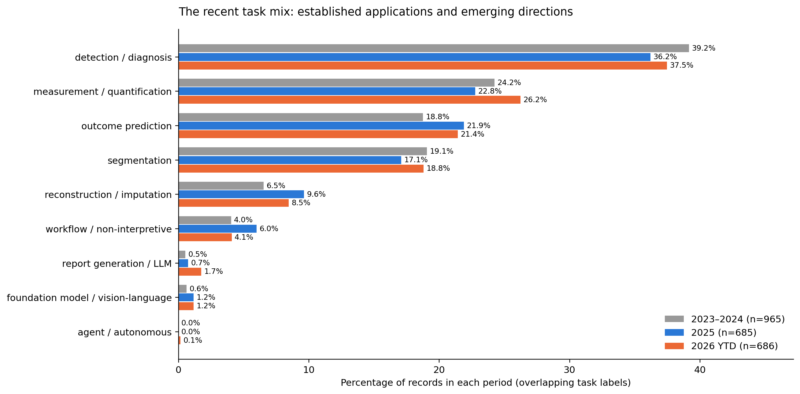

# Artificial intelligence in pediatric radiology: a landscape review of growth, clinical applications, and emerging directions through 2026

**Article type:** Scoping review with bibliometric analysis and narrative synthesis

**Running title:** The pediatric radiology AI landscape

**Authors:** Joseph Rich, Amit Sura

**Affiliations:** [AUTHOR ACTION: add each author's institutional affiliation]

**Corresponding author:** [AUTHOR ACTION: add name, postal address, email address, and telephone number]

**Evidence snapshot:** Search through September 9, 2026; analysis and selected source verification September 11, 2026. Counts describe 3,496 included primary-study records in the current database, with publication-version adjudication still required.

**Tables:** 5

**Figures:** 6 main figures; study selection and methodological detail in the supplement.

**Word counts:** Abstract 211; main text 3,376 (Introduction through Conclusion, excluding headings; whitespace-delimited count, September 11, 2026).

## Abstract

Artificial intelligence (AI) in pediatric radiology has expanded into a large but uneven research field. This scoping review combines bibliometric analysis with a clinical narrative to describe where research is concentrated, which resources support it, and what changed in 2025–2026. The current PubMed/MEDLINE, Embase, and supplementary-source cohort contains 3,496 included primary-study records, including 685 assigned to 2025 and 686 to 2026 through September 9. MRI accounts for 45.5%, ultrasound 23.7%, radiography 19.3%, and CT 9.3%; nuclear imaging and fluoroscopy remain sparsely represented. MRI predominance partly reflects developmental neuroscience: excluding a broad, exploratory neuroscience subset brings MRI and ultrasound to approximately equal shares. Fetal imaging is a major concentration, whereas acute abdominal disease and several non-neurologic neonatal applications have smaller literatures. Named dataset mentions are concentrated in neurodevelopmental resources and established radiographic benchmarks. Recent developments include pediatric image–text models, reusable fetal ultrasound representations, faster reconstruction, and evaluations of AI-assisted clinical decisions. These coexist with continued dominance of detection, measurement, prediction, and segmentation. The synthesis identifies opportunities in age-specific transfer learning, shared datasets beyond existing benchmarks, longitudinal assessment, and prospective clinical evaluation. Automated extraction, incomplete publication-version deduplication, and indexing lag limit precise estimates. The field is best understood as several application-specific trajectories whose clinical value depends on the population, imaging task, and setting.

**Keywords:** Artificial Intelligence; Radiology; Pediatrics; Bibliometrics; Review

## Introduction

A pediatric radiologist following AI now encounters several overlapping literatures: automated bone age and fracture detection, fetal ultrasound, brain development and tumor imaging, reconstruction methods, and increasingly models that learn jointly from images and text. The practical difficulty is understanding how these strands fit together. A large publication count offers little guidance about which applications are established, which resources are reusable, or which clinically important problems receive little attention.

Kamran and colleagues mapped 789 original articles through 2024 and found a concentration in musculoskeletal, neurologic, and chest imaging [1]. Our broader, updated search includes fetal imaging, developmental neuroscience, and preprints. These choices change the apparent landscape and must be considered when comparing reviews. The purpose here is to help clinicians orient themselves and help researchers identify useful next questions.

We therefore ask how pediatric radiology AI has developed over time; where work is concentrated by modality, clinical problem, task, and age; which datasets and open tools support it; and which developments in 2025–2026 indicate plausible future directions. Individual studies illustrate those directions. The review does not attempt to summarize or assess the bias of every model, and it does not pool diagnostic accuracy across unrelated applications.

## Review approach and interpretation

### Evidence base

The systematic search underlying the database covered January 1, 2005, through September 9, 2026, using PubMed/MEDLINE and Embase, with supplementary OpenAlex records. Eligible primary research applied AI to diagnostic radiologic imaging in children or fetal populations; mixed-age studies required pediatric relevance under the recorded eligibility criteria. Journal articles and preprints were eligible. Reviews and non-primary publications were excluded from aggregate counts. Conference abstracts and proceedings were excluded by the existing protocol. Echocardiography was included, so the scope extends beyond services delivered exclusively by radiologists.

The stored selection flow contains 13,510 identified records, 6,602 screened records, and 3,496 included primary-study records. Selection and abstract-based extraction were automated under a structured schema. The existing 150-record rescreening exercise measured agreement between two automated models; independent human validation remains incomplete. Full strategies, eligibility rules, and the selection flow are in the supplement.

An additional audit identified 79 groups with identical normalized titles, involving 161 records, including duplicate database entries and preprint/journal versions. The primary analysis preserves the shared database cohort. A sensitivity analysis retaining one record per normalized title contains 3,414 records and leaves modality rankings unchanged. Accordingly, the unit reported throughout is an included record, not a verified independent investigation. Neither record counts nor repeated publications establish the number of unique patients represented.

### Aggregate mapping and narrative selection

Modality, task, and age labels were summarized as overlapping categories. Clinical-topic maps used explicit keyword rules applied to titles and extracted clinical questions. Dataset-name searches additionally used extracted population, model description, and dataset-size fields. These exploratory counts measure mentions, not adjudicated disease categories or confirmed dataset reuse. They support comparisons among the selected topics, but cannot establish an exhaustive ranking of every pediatric disease. Of the cohort, 973 records did not match a selected topic rule and remained in the overall denominator.

Historical comparisons use 2005–2014, 2015–2019, 2020–2022, and 2023–2024, followed by separate 2025 and 2026 summaries. Percentages use each period's record count. The 2026 interval is incomplete and is not annualized. Annual assignment follows source metadata; online publication, preprint, and journal issue dates are not fully harmonized.

The narrative selects examples for clinical relevance, reusable resources, or a change in research approach, including informative negative findings. Citation thresholds do not determine inclusion or recent-study selection. Dataset descriptions and software availability were checked against selected primary publications and official hosting pages. These targeted checks supplement interpretation without expanding the counted cohort.

This is a scoping and bibliometric synthesis, rather than a statistical meta-analysis. Disease prevalence, reference standards, study populations, outputs, and performance measures are too heterogeneous for a meaningful pooled field-wide effect estimate. Aggregate validation labels provide reporting context, not a formal study-level risk-of-bias assessment.

## How the field developed

The included cohort grew from 71 records across 2005–2014 to 295 in 2015–2019 and 794 in 2020–2022. It then added 965 in 2023–2024, 685 in 2025, and 686 in 2026 year to date (Fig. 1). The last two periods together account for 39.2% of the current cohort. Their weight makes recent work central to the narrative, although incomplete indexing and publication-version overlap preclude a precise estimate of acceleration.

A separate PubMed bibliometric layer places this growth in context. Its broad pediatric radiology AI query increased from 58 records in 2008 to 2,348 in 2025; the corresponding all-radiology AI query increased from 715 to 20,831. AI represented 7.4% of pediatric radiology publishing and 11.4% of radiology publishing in 2025. These are query counts, including material that may fail subsequent screening, and are not interchangeable with the 685 included records assigned to 2025.

The historical trajectory is usefully understood through changing research capabilities. Earlier work established that imaging measurements and patterns could be automated. Shared benchmarks then made model comparison accessible, exemplified by the 2017 RSNA bone-age challenge and subsequent clinical studies [2,3]. During the next phase, segmentation, prediction, and reconstruction broadened the range of outputs. In the current phase, researchers increasingly ask whether learned representations can support several tasks and whether an algorithm changes actual care.

These phases overlap. Detection/diagnosis still accounts for 1,337 records (38.2%), measurement for 838 (24.0%), outcome prediction for 683 (19.5%), and segmentation for 662 (18.9%). Reconstruction/imputation contributes 277 (7.9%) and workflow applications 167 (4.8%) (Fig. 5). The combined report-generation/LLM and foundation/vision-language labels remain uncommon. These task labels describe outputs and broad uses; they should not be read as a clean chronology of model architectures.

## Where research is concentrated

### MRI: a large literature with two distinct clinical meanings

MRI leads the cohort with 1,590 records (45.5%), but its share falls from 58.3% in 2015–2019 to 43.9% in 2025 and 40.1% in 2026 year to date (Table 1; Fig. 2). This is diversification within a growing literature, rather than evidence that MRI research is contracting.

Much MRI work uses imaging to study development, cognition, or neuropsychiatric conditions. The exploratory topic map identifies 355 records mentioning brain development/cognition and 313 mentioning autism, ADHD, or psychiatric disease; these groups overlap. Other strands address tumors, epilepsy, fetal anatomy, tissue segmentation, or image acquisition (Fig. 3). Predicting a behavioral score from a research MRI cohort has a different clinical purpose from identifying a lesion in a referred child.

The distinction narrows the gap between modalities. The corrected broad neuroscience sensitivity rule removes 748 MRI records and leaves MRI at 30.6% and ultrasound at 30.1% of the remaining cohort. A narrower diagnostic rule leaves MRI clearly first at 39.9%. Both analyses are exploratory and retain those records in the main cohort. Together, they show why a broad imaging review can rank MRI first while a review emphasizing direct clinical radiology ranks radiography first [1].

Brain tumor imaging forms a more directly clinical concentration: 162 records match the selected CNS tumor terms. Resources such as the Children's Brain Tumor Network (CBTN) connect repeated clinical MRI examinations with disease context [4]. This creates opportunities for segmentation and longitudinal assessment, but examination counts must not be mistaken for independent patients.

### Ultrasound: fetal imaging drives a substantial part of the field

Ultrasound accounts for 828 records (23.7%). Of 786 records carrying a fetal age label, 560 also carry an ultrasound label and 229 MRI. Thus fetal imaging is a major component of the landscape. Ultrasound studies in children after birth cannot be inferred from the overall ultrasound total.

Fetal research spans standard-plane recognition, biometry, anatomy segmentation, and anomaly assessment. FETAL_PLANES_DB provides a reusable plane-classification resource [5], while congenital heart disease studies illustrate progression from model development to evaluation in community settings [6,7]. These applications tackle different points in the examination: obtaining a usable view, making a measurement, and recognizing disease. Success at one does not establish performance at the others.

Postnatal ultrasound offers a less concentrated set of applications, including cardiac function, hip dysplasia, abdominal pain, and hepatobiliary or urinary disease. The topic map finds 60 hip-dysplasia records and 44 acute-abdomen records across modalities. The Regensburg appendicitis resource illustrates the value of linking ultrasound to clinical and laboratory information [8]. For radiologists, this suggests that acquisition support and integrated diagnostic assessment deserve attention alongside image classification.

### Radiography: recognizable clinical tasks and recurring benchmarks

Radiography contributes 676 records (19.3%). Bone age, pulmonary infection, scoliosis, and fracture/trauma are recurring topics, with 176, 161, 142, and 138 mentions respectively across the full cohort. These counts are overlapping clinical-topic matches rather than modality-specific totals.

Bone age has a comparatively clear output, an established benchmark, and a history of reader comparison [2,3]. The research question has progressed toward performance in children whose skeletal development differs from the training distribution. Fracture detection similarly spans benchmark development and clinical workflow evaluation. GRAZPEDWRI-DX facilitates research on wrist trauma [9], but its anatomy and case distribution do not represent the full range of pediatric emergency radiography.

Chest research also requires attention to benchmark scope. A pneumonia classification dataset and a neonatal chest/abdominal radiograph dataset pose different tasks. PediCXR/VinDr-PCXR extends resource availability to multiple thoracic findings [10], while recent neonatal image–text modeling begins to address devices and several findings together [11]. The clinical importance of this shift lies in broadening what the model is asked to recognize.

### CT, nuclear imaging, and fluoroscopy: smaller literatures, distinct opportunities

CT accounts for 325 records (9.3%), nuclear medicine/PET for 53 (1.5%), and fluoroscopy for 13 (0.4%). Their smaller representation is an observation about this literature, not a measure of clinical importance or unmet need relative to examination volume.

CT combines segmentation and quantitative assessment with reconstruction work. Pediatric-CT-SEG contains 359 patients with expert organ contours, a useful resource whose scale is far smaller than its slice count might suggest [12]. Evaluation of adult-trained TotalSegmentator on this pediatric cohort found lower mean Dice performance than on an external adult cohort; pediatric training and fine-tuning improved performance [13]. The practical research problem is identifying when adult resources transfer, and how much pediatric adaptation is required.

Nuclear imaging provides an example of a small literature pursuing a potentially consequential outcome: reducing acquisition burden while preserving useful information. Fluoroscopy is even less represented in this search. Its dynamic examinations suggest opportunities in sequence interpretation, procedure support, and measurement, although the present data cannot rank these opportunities by clinical benefit.

## Age is a research dimension, not merely an eligibility criterion

Child and adolescent labels occur in 1,301 (37.2%) and 889 (25.4%) records. Fetal imaging accounts for 786 (22.5%), infants for 515 (14.7%), and neonates for 346 (9.9%). Another 498 records (14.2%) specify pediatrics without a narrower age label. These categories overlap and do not indicate how often performance was reported separately by age.

The age–modality map reveals concentrations that aggregate totals conceal (Fig. 4). Neonatal records include 202 MRI studies, 76 ultrasound studies, and 48 radiography studies. Therefore, “neonatal AI is underexplored” is too broad: substantial neonatal MRI activity coexists with a smaller radiographic literature. Similarly, extensive fetal ultrasound work does not establish coverage of infant abdominal ultrasound.

Developmental resources help explain these patterns. ABCD supports longitudinal study from late childhood, ABIDE includes both children and adults, and the developing Human Connectome Project (dHCP) supplies neonatal and fetal MRI [14–16]. These cohorts support valuable research, but differ from children presenting for an acute clinical examination. An age-aware research agenda should test developmental stage, body size, acquisition conditions, and relevant pathology separately, rather than rely on a single pooled “pediatric” performance estimate.

## Datasets and open tools shape what researchers can study

### Resource visibility and the limits of popularity counts

Among the selected resource names searched in the extracted text, ABCD is most frequently mentioned (83 records), followed by ABIDE and RSNA bone age (42 each), dHCP (39), and ADHD-200 (33). CBTN appears in 17 records, GRAZPEDWRI-DX in 15, and BraTS-PEDs in 12. These are auditable indicators of resource visibility, not a complete dataset-usage leaderboard. Abstracts often omit dataset names; mentions can refer to development, evaluation, or context.

The pattern is consistent with research concentrating around reusable neurodevelopmental cohorts and radiographic benchmarks. It does not establish that resource availability caused publication growth. Table 2 gives a practical resource map, including access route, unit of scale, and the question each resource can support.

Three distinctions matter. First, images, studies, and patients are different denominators. CBTN's described release includes 23,101 MRI examinations from 1,526 patients; dHCP similarly contains repeat datasets [4,16]. Second, publicly described resources may require registration, credentialing, or an approved data-use agreement. Third, a released model does not imply access to its training data. Researchers should also track overlap between related resources and separate patients, repeated examinations, and institutions appropriately when designing evaluation.

### Reusable software and pediatric model releases

The open ecosystem has several layers (Table 3). nnU-Net provides a configurable segmentation training framework; MONAI provides broader medical-imaging development infrastructure. MedSAM offers promptable segmentation, while TotalSegmentator supplies pretrained anatomical segmentation [17–20]. These tools can support pediatric research, but their popularity does not demonstrate pediatric suitability.

Pediatric releases provide a more direct connection between a clinical task and reusable weights. Deeplasia addresses bone age; pTBLightNet addresses tuberculosis-compatible pediatric chest radiographs; and FetalCLIP provides fetal ultrasound representations [21–23]. Their availability permits independent experiments, though each release has its own training domain and use conditions.

The stored GitHub snapshot places nnU-Net, MONAI, and MedSAM near the top of the project's selected repository list. That list mixes frameworks, models, and infrastructure and is not an exhaustive adoption survey. Similarly, the cohort's 168 open-source labels (4.8%) and 92 populated code-URL fields (2.6%) indicate documented availability, not an audited census of functioning, permissively licensed models. The more useful question is whether a resource supplies the code, weights, preprocessing, and evaluation information needed to reproduce and extend the relevant result.

## What changed in 2025–2026

### Pediatric representations begin to support several tasks

The most distinctive recent development is the appearance of models trained around pediatric imaging domains rather than a single downstream label. NeoCLIP's 2025 journal report describes learning from 20,154 neonatal radiographs and 15,795 reports from 4,629 infants, targeting 15 radiological features and five devices [11]. This is a concrete neonatal application of image–text learning, although the retrospective institutional cohort does not establish prospective performance elsewhere.

FetalCLIP's June 2026 publication describes pretraining on 210,035 fetal ultrasound images paired with text, followed by evaluation across classification, gestational-age estimation, congenital heart disease detection, and segmentation [23]. Its public code and weight download make it a research resource as well as a paper. The development suggests a move toward reusable representations within a defined clinical domain; it does not establish general competence across pediatric radiology.

This is still a small part of the counted literature. Foundation/vision-language labels occur in eight records in 2025 and eight in 2026 year to date (1.2% in each period). The report-generation/LLM label increases from five (0.7%) to 12 (1.7%). Small counts, combined category definitions, and incomplete retrieval of engineering work make precise growth claims premature (Fig. 6). Established tasks remain numerically dominant.

### Reconstruction brings AI into acquisition decisions

Recent reconstruction studies address the experience of undergoing an examination. Yoo and colleagues studied accelerated pediatric brain MRI in 46 patients and reported shorter 3D T1 acquisitions with improved image-quality measures [24]. A 2026 study of motion-robust single-shot T2 imaging further examines reconstruction in awake and sedated children [25]. Sequence-level image improvement should be distinguished from a demonstrated reduction in sedation or total examination time.

In pediatric PET, Han and colleagues evaluated patch-based denoising using 88 examinations from 64 test patients. Truncating list-mode data from 90 to 20 seconds per bed simulated reduced counts; enhanced images were rated equivalent or superior in overall quality and noise in more than 85% of cases [26]. This supports further investigation of shorter or lower-activity acquisitions. It was not a prospective trial administering the proposed reduced activity.

Together these examples suggest that AI may influence pediatric imaging through acquisition and reconstruction as well as interpretation. Their value should be assessed with task-specific diagnostic endpoints and examination-level outcomes.

### Mature applications face more demanding clinical questions

In 2025, Ziegner and colleagues evaluated fracture detection in a pediatric emergency setting and found a modest improvement in resident accuracy, alongside instances in which readers abandoned a correct diagnosis after viewing AI output [27]. A subsequent 2026 prospective study enrolled 667 children and adolescents with AI support available on alternating days. Diagnostic revisions requiring recall occurred in 8.6% without AI and 5.7% with AI; the risk ratio was 0.66, with a 95% confidence interval of 0.37–1.19 [28]. This leaves the clinical effect uncertain despite high standalone accuracy.

Bone age illustrates another form of progress: testing difficult populations. The 2026 Deeplasia study evaluated rare endocrine, syndromic, and storage disorders against multiple experts, extending the evidence beyond routine skeletal development [21]. Adult-to-child transfer is also being tested directly, as in the TotalSegmentator study published in a 2025 journal issue after online release in 2024 [13].

These developments sharpen the question from whether a model produces a plausible output to whether it helps with the specific children and decisions encountered in practice. Table 4 places these examples in the broader landscape without treating them as a representative sample or a ranking of the “best” papers.

## What remains and where the field may be headed

The evidence suggests several priorities rather than one universal next model (Table 5). Areas with established benchmarks need evaluation that changes the patient mix, institution, acquisition conditions, or clinical endpoint. Areas with fewer resources may benefit more from a carefully designed shared dataset than another architecture comparison.

Abdominal ultrasound, urinary disease, chronic lung/airway assessment, fluoroscopy, and non-neurologic neonatal imaging are reasonable candidates for further mapping and resource development. In the selected topic rules, acute abdomen has 44 matches, renal/urinary disease 70, chronic lung/airway disease 39, and inflammatory bowel disease five. These are comparatively small research signals. They do not establish that no additional work exists, nor do they quantify research effort relative to disease burden.

For AI researchers, a particularly useful direction is to pair reusable representations with explicitly pediatric evaluation. Adult pretraining, self-supervision, and multimodal learning can reduce the amount of task-specific annotation required, but their value should be demonstrated against strong conventional baselines. Longitudinal imaging creates opportunities to assess growth and treatment response, provided repeated observations from the same child do not cross evaluation boundaries.

For pediatric radiologists, the immediate landscape is application-specific. Bone-age assessment, fracture assistance, reconstruction, and selected ultrasound functions have identifiable clinical evaluation pathways. Image–text and foundation models merit attention as emerging research tools. Adoption decisions require evidence for the intended age range, anatomy, workflow, and endpoint; publication volume and a public repository cannot answer those questions alone.

Prospective evaluation is one part of this agenda. The stored schema assigns 654 records (18.7%) to external/multicenter validation, 217 (6.2%) to reader studies, and 115 (3.3%) to prospective evaluation. Because validation is stored as one category per record, these are reporting labels rather than independent, exhaustive measures of each design feature. They nevertheless explain why more publications should not automatically be interpreted as more evidence of clinical benefit.

Our inference is that near-term progress will combine pediatric adaptation, more reusable domain models, and closer integration with acquisition and longitudinal care. Broader autonomous interpretation remains an uncertain direction. A useful landscape review should track whether research expands into new clinical settings and populations, as well as whether familiar benchmark scores improve.

## Limitations

The principal limitations arise from the breadth and construction of the evidence map. Automated abstract-based screening and extraction have not undergone completed independent human validation. The cohort includes unresolved publication versions and duplicate entries. Collapsing identical normalized titles changes MRI from 45.5% to 45.0%, ultrasound from 23.7% to 23.8%, and radiography from 19.3% to 19.5%, supporting the broad modality pattern without resolving all duplication.

Clinical-topic and dataset counts depend on explicit vocabulary and incomplete extracted descriptions. They are exploratory and cannot establish disease burden, dataset independence, or true resource adoption. Developmental neuroscience, fetal imaging, and echocardiography broaden the scope relative to routine radiology practice. Conversely, excluding conference proceedings and omitting dedicated searches of IEEE Xplore, Scopus, and Web of Science may underrepresent technical innovations. The source-year convention, preprint overlap, and 2026 indexing lag complicate historical comparisons.

No formal study-level risk-of-bias assessment or pooled performance analysis was performed. Selected examples are illustrative and cannot support comparative effectiveness rankings. Software releases, access conditions, and model versions change; resource descriptions are a dated snapshot. These limitations favor interpretation of broad concentrations and research directions over fine differences in percentages.

## Conclusion

Pediatric radiology AI has become a substantial, unevenly distributed field. MRI leads a broad imaging cohort, fetal ultrasound is a major concentration, and radiographic benchmarks support recurring work on skeletal development, chest findings, and trauma. Age–modality combinations reveal gaps that total pediatric counts obscure.

The 2025–2026 literature adds reusable pediatric image–text representations, reconstruction applications, and more clinically demanding evaluations of established tools. For clinicians, the useful takeaway is a map of application-specific progress. For researchers, the opportunity is to extend resources and evaluation into populations, workflows, and outcomes that existing benchmarks do not cover.

## Tables

**Table 1. Modality composition and recent publication periods**

| Modality | All records (n=3,496) | 2023–2024 (n=965) | 2025 (n=685) | 2026 YTD (n=686) |
|:--|--:|--:|--:|--:|
| MRI | 1,590 (45.5%) | 428 (44.4%) | 301 (43.9%) | 275 (40.1%) |
| Ultrasound | 828 (23.7%) | 229 (23.7%) | 178 (26.0%) | 170 (24.8%) |
| Radiography | 676 (19.3%) | 186 (19.3%) | 132 (19.3%) | 152 (22.2%) |
| CT | 325 (9.3%) | 94 (9.7%) | 52 (7.6%) | 74 (10.8%) |
| Nuclear medicine/PET | 53 (1.5%) | 23 (2.4%) | 7 (1.0%) | 8 (1.2%) |
| Fluoroscopy | 13 (0.4%) | 4 (0.4%) | 3 (0.4%) | 2 (0.3%) |

Categories overlap; other/multiple labels are omitted here and retained in supplementary Table L1. Counts follow the current cohort and source publication year. YTD ends September 9, 2026.

**Table 2. Selected shared datasets and the research questions they support**

| Resource | Modality / population | Scale of the specified resource | Access / research role |
|:--|:--|:--|:--|
| RSNA bone-age challenge (2017) [2] | Hand radiographs; pediatric skeletal maturation | 14,236 radiographs across challenge partitions | RSNA challenge terms; measurement benchmark |
| GRAZPEDWRI-DX (2022) [9] | Wrist trauma radiographs; includes ages extending to 19 years | 20,327 images from 6,091 patients | Open download; localization and fracture classification |
| PediCXR / VinDr-PCXR [10] | Chest radiographs; children under 10 years | 9,125 studies; multiple finding and diagnosis labels | Credentialed PhysioNet access; broader thoracic interpretation |
| FETAL_PLANES_DB (2020) [5] | Maternal-fetal ultrasound | Standard planes and other views from two hospitals | Open Zenodo release; plane recognition, not a comprehensive anomaly cohort |
| Regensburg appendicitis [8] | Ultrasound with clinical/laboratory information; children and adolescents | Published imaging analysis: 579 patients, 1,709 images | Public dataset; later tabular releases have different denominators |
| ABCD [14] | Longitudinal brain MRI; recruited at 9–10 years | 11,878 baseline participants; available imaging varies by visit | Controlled access through the study's current data-sharing route; development and cognition |
| ABIDE I and II [15] | Structural and resting-state brain MRI; children and adults | Multisite collections; age eligibility must be applied to individual participants | Registered research access; autism and cross-site methods |
| dHCP, fourth release (2024) [16] | Neonatal and fetal brain MRI | 783 neonatal participants / 886 datasets; 273 fetal participants / 297 datasets | Project access process; early development, segmentation, and longitudinal work |
| CBTN, described 2023 release [4] | Clinical brain/spine tumor MRI | 23,101 examinations from 1,526 patients | Governed access; tumor imaging and repeated clinical examinations |
| Pediatric-CT-SEG, version 2 [12] | Pediatric chest/abdomen/pelvis CT; 5 days–16 years | 359 patients; expert contours for up to 29 structures | Open TCIA release; segmentation and dosimetry |

Selected resources overlap the presentation's dataset map; this is not an exhaustive or size-ranked list. Dataset sizes use their original units and specified versions. BraTS-PEDs and FeTA are additional named challenge resources in the cohort's mention table; their release-specific inventories are not conflated with these resources.

**Table 3. Open software and model resources relevant to pediatric imaging research**

| Resource | What is available / purpose | Pediatric interpretation |
|:--|:--|:--|
| [nnU-Net](https://github.com/MIC-DKFZ/nnUNet) [17] | Segmentation training and inference framework | A strong development baseline; requires relevant data and evaluation |
| [MONAI](https://github.com/Project-MONAI/MONAI) [18] | Medical-imaging training and application infrastructure | Enables development; is not itself a pediatric diagnostic model |
| [MedSAM](https://github.com/bowang-lab/MedSAM) [19] | Promptable medical segmentation code and checkpoints | Useful for annotation/adaptation; test developmental anatomy and pathology |
| [TotalSegmentator](https://github.com/wasserth/TotalSegmentator) [20] | Pretrained anatomical segmentation and inference software | Pediatric transfer limitations have been directly studied [13] |
| [Deeplasia](https://github.com/aimi-bonn/Deeplasia) [21] | Pediatric bone-age software and model access | External rare-disorder evaluation extends its evidence base |
| [pTBLightNet](https://github.com/dani-capellan/pTBLightNet) [22] | Multi-view pediatric chest model; repository links weights | TB-compatible findings; applicability depends on age, setting, and reference standard |
| [FetalCLIP](https://github.com/biomedia-mbzuai/fetalclip) [23] | Fetal ultrasound representation model; code and weight download | Supports several downstream research tasks; model release does not imply training-data release |

Availability checked against project sources on September 11, 2026. “Open” here identifies accessible research software/model resources, not a uniform license or authorization for clinical use. NeoCLIP is discussed as a published model; its appearance in the narrative does not imply a verified public weight release.

**Table 4. Selected 2025–2026 developments and their significance**

| Development | Example | What it adds to the landscape | What remains unresolved |
|:--|:--|:--|:--|
| Neonatal image–text learning | NeoCLIP, 2025 [11] | Several findings and devices in one domain model | Prospective and external clinical utility |
| Reusable fetal representations | FetalCLIP, 2026 [23] | Transfer across ultrasound tasks with released weights | Performance across acquisition settings and rare anomalies |
| Faster reconstruction | Pediatric MRI, 2025–2026 [24,25]; PET, 2026 [26] | AI targets acquisition burden as well as interpretation | Examination-level benefit and diagnostic preservation |
| Clinical decision evaluation | Pediatric fracture studies, 2025–2026 [27,28] | Reader behavior and recall outcomes enter evaluation | Magnitude and consistency of benefit |
| Testing developmental differences | Adult-to-pediatric CT segmentation, 2025 issue [13] | Direct evidence about transfer and adaptation | Age-, organ-, and setting-specific generalization |
| Testing rare populations | Deeplasia, 2026 [21] | Established measurement task evaluated in difficult disorders | Broader population and workflow applicability |

Examples were selected for their contribution to the narrative, not citation rank. Publication date is distinct from data-acquisition date and may follow an earlier online or preprint version.

**Table 5. A research agenda grounded in the landscape**

| Area | What the map shows | Useful next research question |
|:--|:--|:--|
| Established radiographic benchmarks | Recurring bone-age, chest, wrist, and spine applications | Does performance transfer to different anatomy, age, institution, and decisions? |
| Abdominal and urinary imaging | Smaller selected-topic literatures | Can shared imaging-plus-clinical cohorts support useful diagnostic pathways? |
| Neonatal imaging | MRI concentration alongside smaller non-MRI groups | Can models handle devices, serial examinations, and acute findings across NICUs? |
| Fetal ultrasound | Substantial activity and emerging reusable representations | Does assistance improve complete examinations across operators and settings? |
| CT, nuclear imaging, fluoroscopy | Smaller modalities with distinct acquisition constraints | Can AI reduce examination burden while preserving the information needed for care? |
| Pediatric foundation models | Small but concrete recent literature | When does domain pretraining improve on task-specific baselines with limited labels? |
| Clinical implementation | Relatively few prospective and reader-study labels | Which patients and workflows gain measurable benefit, and at what cost? |

Priorities are the authors' interpretation of the evidence map. Research volume was not normalized to disease burden, examination volume, or funding.

## Figure legends

**Fig. 1. Included records by publication year.** Annual screened records, 2005 through September 9, 2026. Blue bars indicate included records; gray bars indicate excluded or non-primary records. The final year is incomplete. Source-year assignment and unresolved publication versions limit interpretation of year-to-year growth. Shared with the presentation: `figures/review_by_year.png`.

**Fig. 2. Modality composition over time.** Annual counts by extracted modality; categories overlap. MRI's broad scope includes developmental neuroscience. This figure shows absolute counts; Table 1 and supplementary Table L1 provide within-period shares. Shared with the presentation: `figures/review_modality_year.png`.

**Fig. 3. Clinical topic by modality.** Counts of included records matching selected title/clinical-question rules, crossed with extracted modality. These are exploratory, overlapping topic mentions; 973 records match none of the selected rules. Color uses log(1 + count) so small cells remain visible, while printed values are raw counts. Source: `figures/review_topic_modality.png`.

**Fig. 4. Age group by modality.** Counts of records carrying each age and modality label. Labels overlap and indicate populations, not age-stratified performance or unique patients. Color uses log(1 + count); printed values are raw counts. Source: `figures/review_age_modality.png`.

**Fig. 5. What the models produce.** Annual counts by task. The shared presentation figure folds report-generation/LLM, foundation/vision-language, and agent/autonomous labels into “other”; Fig. 6 shows those recent categories separately. Task labels overlap and are not architecture categories. Shared with the presentation: `figures/review_task_year.png`.

**Fig. 6. Recent task composition.** Within-period percentages for 2023–2024, 2025, and 2026 year to date, including the small language, foundation-model, and agent categories. The denominators are 965, 685, and 686 included records. Percentages describe the retrieved snapshot; they do not correct for indexing delay or publication-version overlap. Source: `figures/review_recent_tasks.png`.

## Declarations

**Data availability.** Queries, code, extracted records, figures, and reports will be available at [AUTHOR ACTION: repository URL] and archived at [AUTHOR ACTION: version-specific DOI]. The included-record table and screening store preserve the evidence snapshot. The landscape analysis exports its source fingerprint, explicit rules, record-level matches, and sensitivity analyses.

**Funding.** Not applicable.

**Conflicts of interest.** No conflicts of interests to disclose.

**Ethics approval.** Not applicable; this review analyzed published literature and did not collect patient data.

**Informed consent.** Not applicable.

**Author contributions.** [AUTHOR ACTION: provide a CRediT contribution statement.]

**Acknowledgments.** None.

## References

1. Kamran R, Widjaja E, Sy A, et al. The current state of artificial intelligence research in pediatric radiology and recommendations for the future: a scoping review. Pediatric Radiology. 2026. [doi:10.1007/s00247-025-06462-5](https://link.springer.com/article/10.1007/s00247-025-06462-5).
2. Halabi SS, Prevedello LM, Kalpathy-Cramer J, et al. The RSNA Pediatric Bone Age Machine Learning Challenge. Radiology. 2019. [doi:10.1148/radiol.2018180736](https://pubs.rsna.org/doi/10.1148/radiol.2018180736).
3. Larson DB, Chen MC, Lungren MP, et al. Performance of a Deep-Learning Neural Network Model in Assessing Skeletal Maturity on Pediatric Hand Radiographs. Radiology. 2018. [doi:10.1148/radiol.2017170236](https://doi.org/10.1148/radiol.2017170236).
4. Familiar AM, Fathi Kazerooni A, Anderson H, et al. A multi-institutional pediatric dataset of clinical radiology MRIs by the Children's Brain Tumor Network. 2023 preprint describing the resource. [arXiv:2310.01413](https://arxiv.org/abs/2310.01413).
5. Burgos-Artizzu XP, Coronado-Gutierrez D, Valenzuela-Alcaraz B, et al. FETAL_PLANES_DB: Common maternal-fetal ultrasound images. 2020. [Zenodo dataset](https://zenodo.org/records/3904280).
6. Arnaout R, Curran L, Zhao Y, et al. An ensemble of neural networks provides expert-level prenatal detection of complex congenital heart disease. Nature Medicine. 2021. [doi:10.1038/s41591-021-01342-5](https://doi.org/10.1038/s41591-021-01342-5).
7. Athalye C, van Nisselrooij A, Rizvi S, et al. Deep-learning model for prenatal congenital heart disease screening generalizes to community setting and outperforms clinical detection. Ultrasound in Obstetrics & Gynecology. 2024. [doi:10.1002/uog.27503](https://doi.org/10.1002/uog.27503).
8. Marcinkevičs R, et al. Interpretable and intervenable ultrasonography-based machine learning models for pediatric appendicitis. Medical Image Analysis. 2024;91:103042. [Author manuscript](https://rmarcinkevics.github.io/files/2024-01-01-ml-app-us.pdf); [dataset](https://zenodo.org/records/7669442).
9. Nagy E, Janisch M, Hržić F, Sorantin E, Tschauner S. A pediatric wrist trauma X-ray dataset (GRAZPEDWRI-DX) for machine learning. Scientific Data. 2022;9:222. [doi:10.1038/s41597-022-01328-z](https://www.nature.com/articles/s41597-022-01328-z).
10. Pham HH, Tran TT, Nguyen HQ. VinDr-PCXR: An open, large-scale pediatric chest X-ray dataset for interpretation of common thoracic diseases. PhysioNet, version 1.0.0. 2022. [Dataset and access terms](https://physionet.org/content/vindr-pcxr/1.0.0/).
11. Huang Y, Sharma P, Palepu A, et al. NeoCLIP: a self-supervised foundation model for the interpretation of neonatal radiographs. npj Digital Medicine. 2025;8:570. [doi:10.1038/s41746-025-01922-6](https://pubmed.ncbi.nlm.nih.gov/40993183/).
12. Jordan P, Adamson PM, Bhattbhatt V, et al. Pediatric Chest/Abdomen/Pelvic CT Exams with Expert Organ Contours (Pediatric-CT-SEG). Version 2, updated 2022. [TCIA collection](https://www.cancerimagingarchive.net/collection/pediatric-ct-seg/).
13. Chatterjee D, Kanhere A, Doo FX, et al. Children Are Not Small Adults: Addressing Limited Generalizability of an Adult Deep Learning CT Organ Segmentation Model to the Pediatric Population. Journal of Imaging Informatics in Medicine. 2025;38:1628–1641. Online September 2024. [doi:10.1007/s10278-024-01273-w](https://pubmed.ncbi.nlm.nih.gov/39299957/).
14. ABCD Study. Data sharing and release information. [Official data-sharing page](https://abcdstudy.org/scientists/data-sharing/). Accessed September 11, 2026.
15. Autism Brain Imaging Data Exchange. ABIDE I and ABIDE II. [Official collections and access information](https://fcon_1000.projects.nitrc.org/indi/abide/). Accessed September 11, 2026.
16. Developing Human Connectome Project. Fourth data release, May 2024. [Release notes](https://biomedia.github.io/dHCP-release-notes/). Accessed September 11, 2026.
17. Isensee F, Jaeger PF, Kohl SAA, Petersen J, Maier-Hein KH. nnU-Net: a self-configuring method for deep learning-based biomedical image segmentation. Nature Methods. 2021;18:203–211. [Official implementation and citation](https://github.com/MIC-DKFZ/nnUNet).
18. Project MONAI. MONAI: AI Toolkit for Healthcare Imaging. [Official repository](https://github.com/Project-MONAI/MONAI). Accessed September 11, 2026.
19. Ma J, He Y, Li F, et al. Segment anything in medical images. Nature Communications. 2024. [doi:10.1038/s41467-024-44824-z](https://doi.org/10.1038/s41467-024-44824-z); [official repository](https://github.com/bowang-lab/MedSAM).
20. Wasserthal J, Breit HC, Meyer MT, et al. TotalSegmentator: robust segmentation of 104 anatomic structures in CT images. Radiology: Artificial Intelligence. 2023. [doi:10.1148/ryai.230024](https://doi.org/10.1148/ryai.230024).
21. Skaf K, Fardipour M, Schmidt P, et al. Automated bone age assessment in rare pediatric growth disorders: a comparative study using Deeplasia. Frontiers in Endocrinology. 2026;17:1741927. [doi:10.3389/fendo.2026.1741927](https://www.frontiersin.org/journals/endocrinology/articles/10.3389/fendo.2026.1741927/full); [model repository](https://github.com/aimi-bonn/Deeplasia).
22. Capellán-Martín D, et al. Multi-view deep learning framework for the detection of chest X-rays compatible with pediatric pulmonary tuberculosis. Nature Communications. 2025. [doi:10.1038/s41467-025-64391-1](https://www.nature.com/articles/s41467-025-64391-1); [code and weights](https://github.com/dani-capellan/pTBLightNet).
23. Maani F, Saeed N, Saleem TJ, et al. FetalCLIP: a visual-language foundation model for fetal ultrasound image analysis. npj Digital Medicine. 2026. [doi:10.1038/s41746-026-02907-9](https://pubmed.ncbi.nlm.nih.gov/42321373/); [code and weights](https://github.com/biomedia-mbzuai/fetalclip).
24. Yoo H, Moon HE, Kim S, et al. Evaluation of Image Quality and Scan Time Efficiency in Accelerated 3D T1-Weighted Pediatric Brain MRI Using Deep Learning-Based Reconstruction. Korean Journal of Radiology. 2025;26:180–192. [doi:10.3348/kjr.2024.0701](https://pmc.ncbi.nlm.nih.gov/articles/PMC11794287/).
25. Baz AM, et al. Deep learning improves image quality in motion-robust and sedation-free pediatric brain MRI. European Radiology. 2026. [doi:10.1007/s00330-026-12482-y](https://link.springer.com/article/10.1007/s00330-026-12482-y).
26. Han C, Trout AT, Li A, et al. Acquisition time/dose reduction in pediatric PET imaging using patch-based deep learning. EJNMMI Physics. 2026;13:75. [doi:10.1186/s40658-026-00876-2](https://link.springer.com/article/10.1186/s40658-026-00876-2).
27. Ziegner M, Pape J, Lacher M, et al. Real-life benefit of artificial intelligence-based fracture detection in a pediatric emergency department. European Radiology. 2025. [doi:10.1007/s00330-025-11554-9](https://link.springer.com/article/10.1007/s00330-025-11554-9).
28. Deffaa OJ, Pape J, Schlösser D, et al. Artificial intelligence for pediatric fracture detection: impact on diagnostic revisions and patient recall rates in a tertiary emergency setting. BMC Emergency Medicine. 2026;26:204. [doi:10.1186/s12873-026-01697-3](https://pubmed.ncbi.nlm.nih.gov/42527905/).
