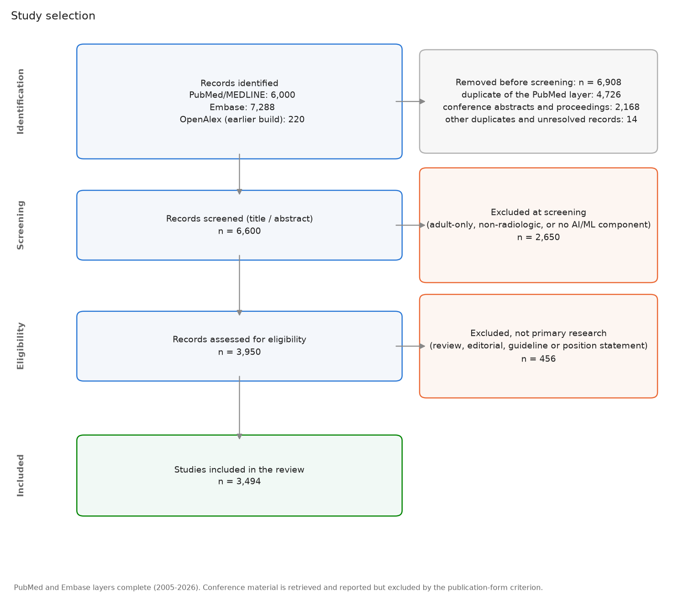
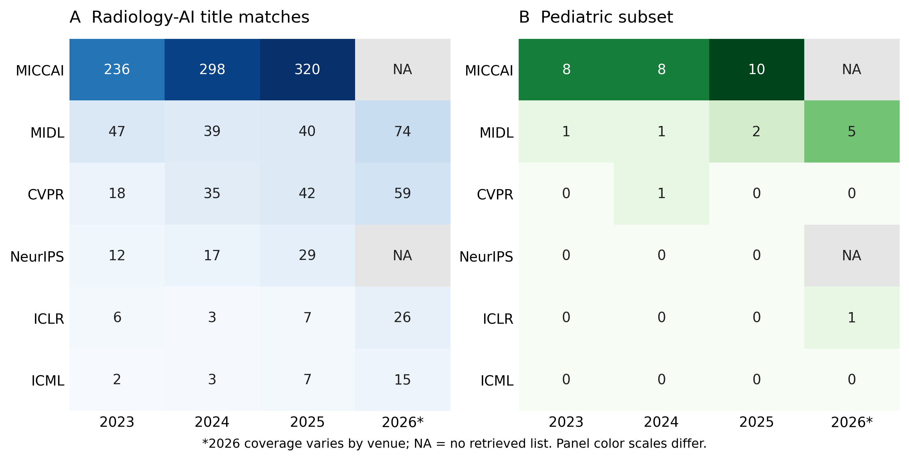
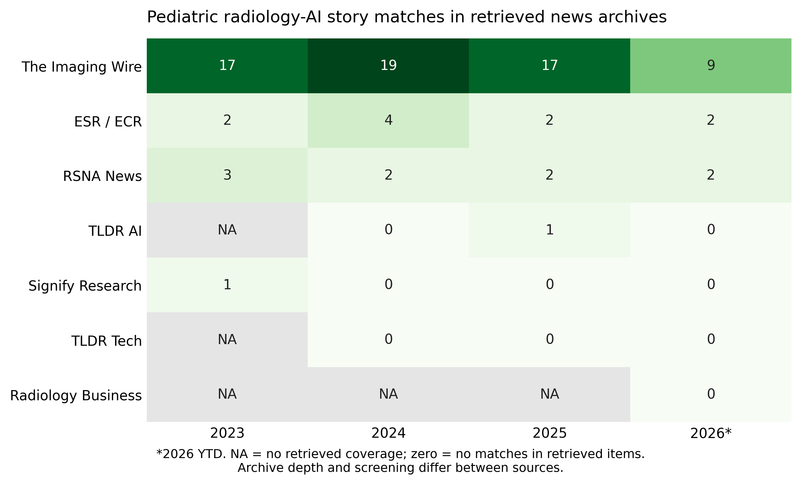

# Supplementary material

## Artificial intelligence in pediatric radiology: a landscape review of growth, clinical applications, and emerging directions through 2026

**Authors:** Joseph Rich, Amit Sura

**Scope of this supplement:** The existing search and eligibility protocol supports the landscape synthesis. The September 11, 2026 analysis preserves the current 3,496 included-record cohort. Unresolved duplicate entries and publication versions prevent interpreting this as a verified count of independent studies. The complete era, topic, dataset-mention, and duplicate-audit tables are in [Landscape analysis, Tables L1–L6](05_landscape_analysis.md). Separate contextual analyses added September 16, 2026 describe publication sources, journals, conference acceptance lists, and news archives; they do not change cohort eligibility or membership. Their numerical tables, queries, classification rules, and source-file fingerprints are in [Dissemination analysis, Tables D1–D4](05_dissemination_analysis.md).

## Supplementary Table S1. Information sources and complete search strategies

Searches covered January 1, 2005, through September 9, 2026. All concept terms were limited to titles and abstracts. No topic exclusions, publication-type filters, or language restrictions were applied at the search stage.

### PubMed/MEDLINE

**Date searched:** September 9, 2026  
**Records retrieved:** 6,000

The following three blocks were combined with `AND`, followed by `AND 2005:2026[pdat]`.

**Imaging block**

```text
(radiology[tiab] OR radiological[tiab] OR radiograph*[tiab] OR "medical imaging"[tiab]
 OR "diagnostic imaging"[tiab] OR tomography[tiab] OR "magnetic resonance"[tiab]
 OR MRI[tiab] OR "MR imaging"[tiab] OR "MR images"[tiab] OR MRIs[tiab]
 OR "MR image"[tiab] OR "MR scan"[tiab] OR "MR scans"[tiab]
 OR "computed tomography"[tiab] OR CT[tiab] OR ultrasound[tiab]
 OR ultrasonograph*[tiab] OR sonograph*[tiab] OR echocardiograph*[tiab]
 OR mammograph*[tiab] OR "chest x-ray"[tiab] OR "x-ray"[tiab]
 OR fluoroscop*[tiab] OR scintigraph*[tiab] OR "positron emission"[tiab]
 OR PET[tiab] OR SPECT[tiab] OR angiograph*[tiab] OR neuroimaging[tiab]
 OR tractograph*[tiab] OR elastograph*[tiab] OR "fMRI"[tiab]
 OR "functional MRI"[tiab] OR "functional magnetic resonance"[tiab]
 OR connectome*[tiab] OR "diffusion tensor"[tiab] OR DTI[tiab]
 OR "bone age"[tiab] OR "skeletal age"[tiab] OR "skeletal maturity"[tiab]
 OR "barium enema"[tiab])
```

**Artificial-intelligence block**

```text
("artificial intelligence"[tiab] OR "machine learning"[tiab] OR "deep learning"[tiab]
 OR "convolutional neural network"[tiab] OR "convolutional neural networks"[tiab]
 OR "neural network"[tiab] OR "neural networks"[tiab]
 OR "computer-aided diagnosis"[tiab] OR "computer aided diagnosis"[tiab]
 OR "computer-aided detection"[tiab] OR radiomic*[tiab] OR "computer vision"[tiab]
 OR "large language model"[tiab] OR "large language models"[tiab]
 OR "foundation model"[tiab] OR "foundation models"[tiab]
 OR "transfer learning"[tiab] OR "vision transformer"[tiab]
 OR "self-supervised"[tiab] OR "random forest"[tiab]
 OR "support vector machine"[tiab] OR "gradient boosting"[tiab]
 OR "natural language processing"[tiab])
```

**Pediatric-population block**

```text
(pediatric*[tiab] OR paediatric*[tiab] OR child*[tiab] OR infant*[tiab]
 OR neonat*[tiab] OR adolescen*[tiab] OR fetal[tiab] OR foetal[tiab]
 OR fetus*[tiab] OR foetus*[tiab] OR newborn*[tiab] OR preterm[tiab]
 OR "premature infant"[tiab] OR "premature infants"[tiab]
 OR "premature birth"[tiab] OR "premature neonate"[tiab]
 OR "premature neonates"[tiab] OR prenatal[tiab] OR antenatal[tiab]
 OR perinatal[tiab] OR youth[tiab] OR juvenile[tiab]
 OR "children's hospital"[tiab] OR schoolchild*[tiab] OR toddler*[tiab])
```

### Embase (Embase.com)

**Date searched:** September 9, 2026  
**Records retrieved:** 7,288

The PubMed concepts were translated term for term to Embase title/abstract syntax. The following lines were entered in Advanced Search.

```text
#1 (radiology:ti,ab OR radiological:ti,ab OR radiograph*:ti,ab
    OR 'medical imaging':ti,ab OR 'diagnostic imaging':ti,ab OR tomography:ti,ab
    OR 'magnetic resonance':ti,ab OR MRI:ti,ab OR 'mr imaging':ti,ab
    OR 'mr images':ti,ab OR 'computed tomography':ti,ab OR CT:ti,ab
    OR ultrasound:ti,ab OR ultrasonograph*:ti,ab OR sonograph*:ti,ab
    OR echocardiograph*:ti,ab OR mammograph*:ti,ab OR 'chest x ray':ti,ab
    OR 'x ray':ti,ab OR fluoroscop*:ti,ab OR scintigraph*:ti,ab
    OR 'positron emission':ti,ab OR PET:ti,ab OR SPECT:ti,ab
    OR angiograph*:ti,ab OR neuroimaging:ti,ab OR tractograph*:ti,ab
    OR elastograph*:ti,ab OR fMRI:ti,ab OR 'functional MRI':ti,ab
    OR 'functional magnetic resonance':ti,ab OR connectome*:ti,ab
    OR 'diffusion tensor':ti,ab OR DTI:ti,ab OR 'bone age':ti,ab
    OR 'skeletal age':ti,ab OR 'skeletal maturity':ti,ab OR 'barium enema':ti,ab)

#2 ('artificial intelligence':ti,ab OR 'machine learning':ti,ab
    OR 'deep learning':ti,ab OR 'convolutional neural network*':ti,ab
    OR 'neural network*':ti,ab OR 'computer aided diagnosis':ti,ab
    OR 'computer aided detection':ti,ab OR radiomic*:ti,ab
    OR 'computer vision':ti,ab OR 'large language model*':ti,ab
    OR 'foundation model*':ti,ab OR 'transfer learning':ti,ab
    OR 'vision transformer':ti,ab OR 'self supervised':ti,ab
    OR 'random forest':ti,ab OR 'support vector machine':ti,ab
    OR 'gradient boosting':ti,ab OR 'natural language processing':ti,ab)

#3 (pediatric*:ti,ab OR paediatric*:ti,ab OR child*:ti,ab OR infant*:ti,ab
    OR neonat*:ti,ab OR adolescen*:ti,ab OR fetal:ti,ab OR foetal:ti,ab
    OR fetus*:ti,ab OR foetus*:ti,ab OR newborn*:ti,ab OR preterm:ti,ab
    OR 'premature infant*':ti,ab OR 'premature birth':ti,ab
    OR 'premature neonate*':ti,ab OR prenatal:ti,ab OR antenatal:ti,ab
    OR perinatal:ti,ab OR youth:ti,ab OR juvenile:ti,ab
    OR 'children s hospital':ti,ab OR schoolchild*:ti,ab OR toddler*:ti,ab)

#4 #1 AND #2 AND #3 AND [2005-2026]/py
#5 #4 NOT [medline]/lim
#6 #4 AND [medline]/lim
```

Line 5 was exported to identify records outside the MEDLINE-indexed Embase subset, then deduplicated against the complete PubMed corpus by DOI, PMID, and normalized title. The `[medline]/lim` flag was not treated as equivalent to presence in PubMed because PubMed also contains PubMed Central-only records.

### Other information sources

OpenAlex records typed as preprints and the arXiv API were used to supplement the most recent literature. Reference lists of included reviews and the supplementary article list from Kamran et al. [1] were checked. Web of Science, Scopus, IEEE Xplore, and the Cochrane Library were not searched.

### Search-validation results

| Validation set | Retrieved | Denominator | Recall |
|:--|--:|--:|--:|
| Prespecified pediatric landmark papers | 26 | 26 | 100% |
| Articles from Kamran et al. resolved to PubMed | 639 | 663 | 96.4% |
| MEDLINE-indexed records returned by the Embase translation | 3,715 | 3,728 | 99.7% |

## Supplementary Table S2. Eligibility criteria

| Domain | Include | Exclude |
|:--|:--|:--|
| Population | Humans younger than 18 years at imaging; fetal or prenatal imaging; mixed-age cohorts if a pediatric subgroup was analyzed separately or the model was pediatric-specific | Adult-only cohorts; animal- or phantom-only studies without human pediatric data; mixed cohorts without pediatric subgroup analysis |
| Intervention/index test | AI or machine-learning methods developed, trained, fine-tuned, applied, validated, or clinically evaluated, including deep learning, classical machine learning, radiomics with a machine-learning classifier, foundation models, and large language models | Incidental mention of AI; conventional statistical modeling without a machine-learning component; rule-based software |
| Imaging | Diagnostic radiology: radiography, fluoroscopy, CT, MRI, ultrasound, echocardiography, nuclear medicine/PET/SPECT, angiography, and radiology reports or worklists derived from these modalities | Ophthalmic, dental, endoscopic, dermoscopic, histopathologic, whole-slide, or microscopic imaging; EEG, ECG, and other non-imaging signals |
| Study type | Primary model development or validation; reader, prospective, clinical, or implementation studies; dataset descriptors; challenge reports; primary regulatory-database analyses | Narrative or systematic reviews; editorials; letters; comments; case reports; errata; retractions; protocol-only papers |
| Publication form | Journal articles and preprints; the protocol intends to retain the journal version when identified, but the current cohort still contains unresolved version pairs (Table L5) | Conference abstracts and proceedings |
| Outcome | Any model performance, clinical, workflow, implementation, dataset, education, policy, or stakeholder outcome | No relevant outcome |
| Language | No restriction; non-English records were eligible | None based on language |
| Date | January 1, 2005, to September 9, 2026 | Outside the date range |

## Supplementary Table S3. Operational definitions for principal methodological outcomes

| Outcome | Operational definition |
|:--|:--|
| Internal validation only | Evaluation used data from the same source population or institution as model development, including internal holdout or cross-validation |
| External/multicenter validation | Evaluation used an independent institution, geography, acquisition environment, or multicenter cohort |
| Reader study | Human readers interpreted cases with and/or without the model and reader performance or behavior was measured |
| Prospective evaluation | Data collection, model use, or outcome assessment occurred prospectively after protocol initiation |
| Populated code or model URL | The exported code_url field is nonempty; the aggregate counter does not test URL resolution, weights, licensing, or runnable code |
| Open-source classification | The abstract or cross-check identified publicly available code or model weights; this broader classification can exceed the count of URLs documented directly in abstracts |
| Commercial product | A named commercial tool was evaluated or cross-linked to regulatory or vendor evidence |
| Release status unclear | The abstract did not establish public or commercial availability; this does not mean that the model was unavailable |
| Citations and citations per year | NIH iCite citation count for records with a PubMed identifier, and OpenAlex citation count matched by DOI for records without one; citations per year is the count divided by years since publication, counting the current year as a whole year |
| Citation-based selection | Citation measures remain available in the database and presentation but do not determine eligibility or example selection in this landscape manuscript |
| Developmental-neuroscience MRI sensitivity analyses (post hoc) | Two keyword rules over the extracted clinical problem, body region, population, description, and title, applied only to studies labelled MRI. **Narrow (diagnosis):** autism, ADHD/attention deficit, psychiatric, depressive, anxiety, schizophrenia, bipolar, internalizing, externalizing, substance use, addiction, gaming disorder, neurodevelopmental disorder. **Wide (diagnosis or neuroscience):** the narrow terms plus neurodevelopment, depression, cognitive, behavioral, intelligence quotient/score, language development, brain age, brain development, connectome, functional connectivity, fMRI/functional magnetic resonance, resting-state, executive function, emotion, temperament, reward, ABCD study, brain-behavior, neurocognitive, developmental outcome, psychopathology, puberty, graph theory, social. Both rules were written after the corpus was assembled. These studies remain in the corpus; the analyses report composition with them removed |

The validation field assigns one category per record. A prospective investigation can also involve readers and an external dataset, so these labels are not exhaustive independent indicators. No formal study-level risk-of-bias assessment was undertaken for this landscape synthesis.

The September 11 analysis corrected a keyword false positive: bare “intelligence” matched “artificial intelligence” in non-neuroscience titles. The broad MRI sensitivity rule now uses “intelligence quotient” and “intelligence score”; it removes 748 records, leaving MRI at 30.6% and ultrasound at 30.1%. The new topic map uses the same safeguard. The broad sensitivity rule searches more fields and includes more concepts than the topic map, so their neuroscience counts are not interchangeable.

## Supplementary methods: screening and analysis provenance

The stored screening flow identifies 13,510 records (6,000 PubMed/MEDLINE, 7,288 Embase, and 222 from an earlier OpenAlex build). It records 6,602 screened, 2,650 excluded at screening, 456 non-primary publications excluded, and 3,496 included primary-study records. The removal boxes are derived from source-layer counts and include a remainder of 14 other duplicates/unresolved records. These arithmetic flow boxes do not prove complete deduplication: the additional audit identified 79 repeated-title groups involving 161 included records.

The existing screening reliability file reports a second automated review of 150 records, with 94.7% agreement and Cohen's κ=0.885. This measures inter-model agreement, not accuracy against independent human screening. Human validation of eligibility and extraction is outstanding. Aggregate claims are consequently provisional.

The landscape analysis reads the corrected corpus CSV and verifies its exact record-ID membership against the shared cohort definition in `pedrad_ai/corpus.py`. No additional topic or citation filter is applied to membership. Topic rules search titles and extracted clinical questions. Dataset rules additionally search the extracted patient population, model description, and dataset-size fields. Each record contributes at most once to each label. The explicit regular expressions and source-file SHA-256 are retained in `data/processed/review_landscape_stats.json`; row-level matches are in `data/processed/review_landscape_audit.csv`. A dataset-name match is not confirmation of training or test use.

For publication-version sensitivity, titles are lowercased and stripped of non-alphanumeric characters. Groups with identical normalized titles are listed for adjudication. The sensitivity analysis retains one record per title, preferring a non-preprint record, then PubMed provenance, then the latest assigned publication year. This reduces the set to 3,414 records, with modality proportions of 45.0% MRI, 23.8% ultrasound, 19.5% radiography, 9.4% CT, 1.6% nuclear/PET, and 0.4% fluoroscopy. This heuristic does not resolve versions with changed titles, nor adjudicate conflicting extractions.

## Supplementary figure S1. Recorded study selection



The shared selection figure displays the existing pipeline flow. The final box should be interpreted as included records pending publication-version reconciliation, as described above.

## Supplementary methods: publication and dissemination context

These post hoc descriptive analyses address where the field publishes and attracts attention. They are separate from the primary-study evidence map and were not used to select studies or establish clinical effectiveness. Existing archived data were analyzed offline on September 16, 2026; no new primary-study screening was performed.

**Publication sources (main Fig. 2; Table D1).** Broad PubMed queries for radiology, AI, and pediatric populations were evaluated by publication year from 2008. These queries include PubMed's term mapping and differ from the title/abstract-only review search above. Approximate translations were queried through the arXiv API (`all:` fields; submission year) and Europe PMC (`SRC:PPR AND PUBLISHER:"medRxiv"`; title or abstract terms; publication year). bioRxiv was not searched. Query translations cannot reproduce MeSH expansion or identical field behavior. PubMed's companion summary records September 7, 2026, and the preprint aggregate records September 16, 2026; these dates do not establish when every cached response was collected. Sources are plotted separately because PubMed, preprints, and later journal versions have not been linked and deduplicated. Counts include publication types excluded from the main cohort. The full queries and current translation definitions are retained in the dissemination analysis.

**Journal output (main Fig. 3; Table D2).** A separate, narrower title/abstract query retrieved PubMed records by year from 2015 through 2026, excluding retraction publication types. It did not apply the primary-study screening criteria. Journal titles and ISSNs were extracted from PubMed metadata. Aliases matched to the same OpenAlex source identifier were merged by the collector; unmatched source labels can remain distinct. The stored inventory contains 5,099 records across 1,061 source labels, including some proceedings and preprint sources. The figure shows the twelve journals with the largest record totals, ordered by descending count with alphabetical tie-breaking; it separates 2026 from earlier years. All twelve are journals. OpenAlex citedness values used in the presentation were omitted from the manuscript figure because journal-level metrics do not appraise individual studies. The journal aggregate has no recorded collection timestamp; its file fingerprint identifies the exact snapshot analyzed.

**Conference context (Fig. S2; Table D3).** We used the stored counts from accepted-paper lists for NeurIPS, ICLR, ICML, CVPR, MICCAI, and MIDL, 2023–2026. Source sites were the meetings' official lists, CVF Open Access for CVPR, and PMLR for MIDL. Title rules require medical, imaging, and AI signals and exclude specified non-radiologic domains; a further title rule identifies pediatric or fetal terms. This is not an abstract-screened census of pediatric investigations. Generic method titles and titles omitting patient age can be missed, while keyword matches may be ineligible under the review criteria. Missing lists are unavailable rather than zero; 2026 coverage differs across meetings. These counts are distinct from the project's older DBLP samples and citation-ranked Semantic Scholar examples. RSNA and SPR journal proxies were not included as conference observations. The conference aggregate lacks an explicit collection timestamp. Proceedings remain excluded from the main review cohort, and a conference paper may overlap a preprint or later journal publication.

**News context (Fig. S3; Table D4).** Seven accessible news archives were retrieved using WordPress APIs, an archive-page adapter, dated daily pages, or RSS. Issues were split at story boundaries; pediatric and AI terms had to co-occur within a story, with imaging terms additionally required for sources not specific to imaging. Repeated titles were deduplicated by the collector, but different coverage of the same study or product can remain. The stored snapshot is dated September 9, 2026. Matches were not independently adjudicated for this analysis and can reflect incidental population references, sponsor text, or a story covering several subjects. Counts therefore describe automated matches in retrieved archives, not verified news events, uptake, readership, or market share.

| News source | Retrieved archive dates | Important coverage constraint |
|:--|:--|:--|
| The Imaging Wire | March 22, 2018–September 2, 2026 | Digest-story segmentation and keyword matches; sponsor text can contribute false positives |
| RSNA News | January 1, 2014–September 1, 2026 | Bodies retrieved only when titles already contain pediatric or AI terms |
| TLDR AI | January 2, 2024–September 9, 2026 | Daily-page enumeration begins in 2024; earlier years unavailable |
| TLDR Tech | January 2, 2024–September 9, 2026 | Same enumeration limit; zero pediatric matches in retrieved items |
| Signify Research | May 16, 2017–August 10, 2026 | Retrieved public archive only |
| ESR / ECR | February 14, 2019–August 31, 2026 | Public society news and blog coverage |
| Radiology Business | August 11–September 9, 2026 | Recent RSS items only; no historical comparison |

AuntMinnie and Diagnostic Imaging blocked automated access; Health Imaging's RSS feed exposed no items; RSNA email-only AI newsletters had no public archive. Zero denotes no matches among retrieved items, not absence of coverage in the wider outlet. Available archive start and end dates do not prove complete retrieval between those dates. Source coverage and editorial selection prevent comparing annual totals as if they were a stable surveillance panel.

**Interpretation of prominent sources.** Journal volume, conference title matches, and news matches were summarized within their respective sources and periods. Citation and field-normalized-impact leaderboards, GitHub-star rankings, and company-level device totals from the presentation were not added as effectiveness rankings. Existing manuscript Tables 2–4 instead identify resources and illustrative studies by their purpose and evidence. The analyses do not test whether dissemination predicts subsequent clinical use.

## Supplementary figure S2. Radiology-AI title matches at selected conferences



Panel A shows radiology-AI title matches in retrieved accepted-paper lists; panel B shows the pediatric subset, 2023–2026. Each cell displays a raw count; panel color scales differ. NA denotes no retrieved acceptance list, including 2026 NeurIPS and MICCAI in this snapshot. Zero denotes no title matches within an available list. Counts are neither a complete census of pediatric research nor part of the screened primary-study denominator. The lists and title rules differ from PubMed retrieval and do not establish comparative research quality. Exact counts and retrieved-list denominators are in Table D3.

## Supplementary figure S3. Pediatric radiology-AI matches in news archives



Raw automated story matches by source, 2023 through the September 9, 2026 news snapshot. NA denotes no retrieved source-year coverage; zero denotes no matches in retrieved items. Archive depth and screening vary substantially; Radiology Business contributes recent RSS items only. Matches may include incidental pediatric references and sponsor material and were not independently adjudicated. Neither between-source counts nor year-to-year totals establish readership, market share, clinical adoption, or a trend in the entire trade press. Coverage details and counts are in Table D4.

## Reproducing the landscape outputs

From the repository root, using the committed data and installed project dependencies:

```bash
PYTHONPATH=. python scripts/review_stats.py
PYTHONPATH=. python scripts/make_review_figures.py
PYTHONPATH=. python scripts/build_landscape_review.py
PYTHONPATH=. python scripts/build_review_context.py
pandoc --resource-path=reports reports/05_review_manuscript.md -o reports/05_review_manuscript_european_radiology.docx
pandoc --resource-path=reports reports/05_review_supplement.md -o reports/05_review_supplement_european_radiology.docx
pandoc reports/05_landscape_analysis.md -o reports/05_landscape_analysis.docx
```

These commands perform no new literature search or model extraction. The landscape script creates topic–modality, age–modality, and recent-task figures as PNG and vector PDF, as well as Tables L1–L6. The context script creates four additional PNG/PDF figures, Tables D1–D4, query and classification-rule documentation, and `data/processed/review_context_manifest.json` with source-file SHA-256 fingerprints. The narrative is an authored snapshot and needs editorial review after a data refresh; regenerating statistics does not rewrite it automatically.
